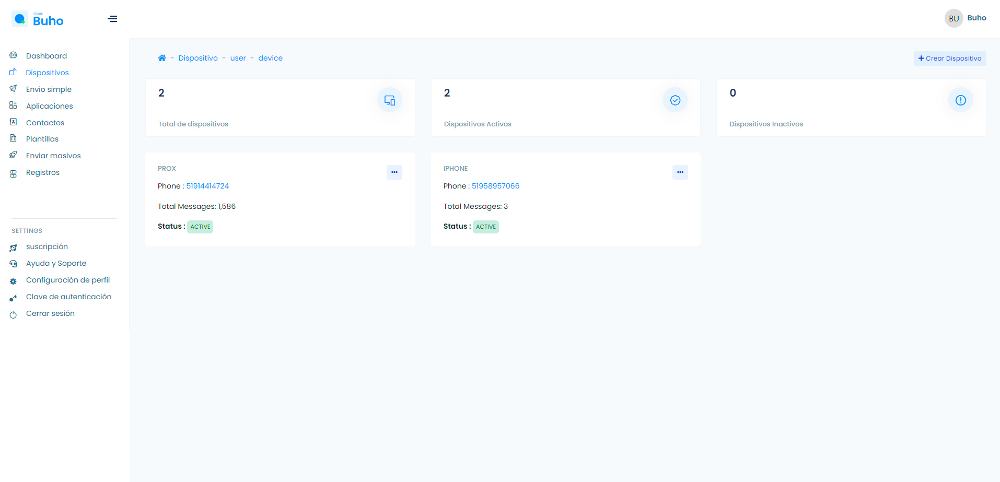
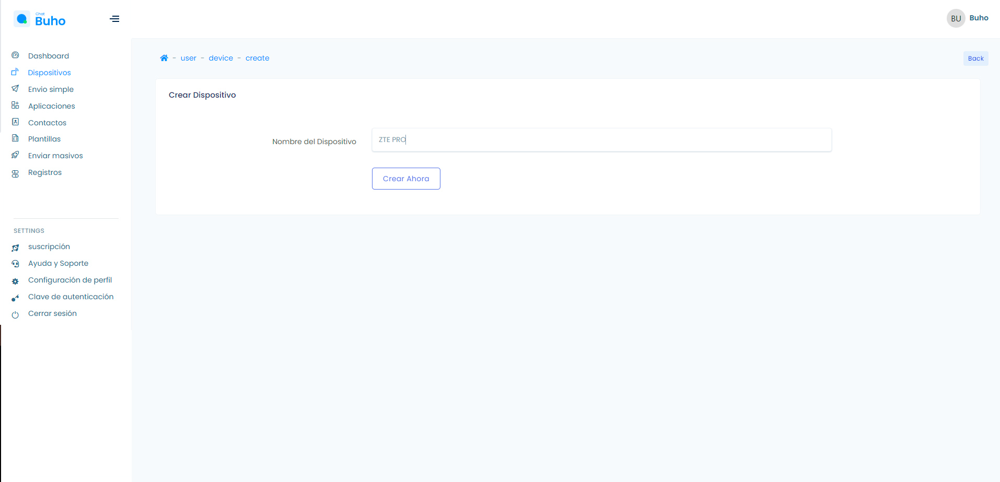
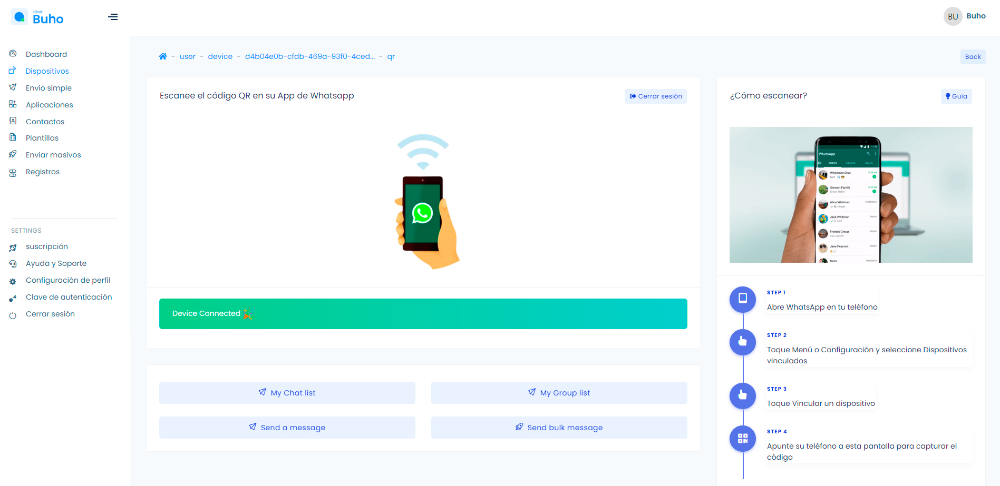

# Dispositivos

### Añadir un nuevo dispositivo

<iframe width="100%" height="505" src="https://www.youtube.com/embed/B6-iLxxCrcs" title="YouTube video player" frameborder="0" allow="accelerometer; autoplay; clipboard-write; encrypted-media; gyroscope; picture-in-picture; web-share" allowfullscreen></iframe>

Inicia sesión en tu plataforma Qr ingresando a **[qr.chat.buho.la](https://qr.chat.buho.la/)**

Luego ingresa a el módulo **Dispositivos**, luego selecciona el botón **Crear Dispositivo**

Después ingresa el nombre del dispositivo y selecciona el botón **Crear Ahora**

Una vez creado el nombre del dispositivo, escanea el **código Qr** y listo el dispositivo ya esta **Conectado!**

