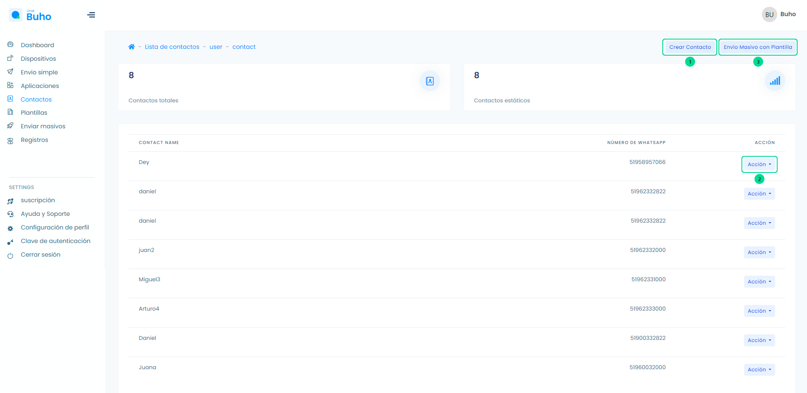
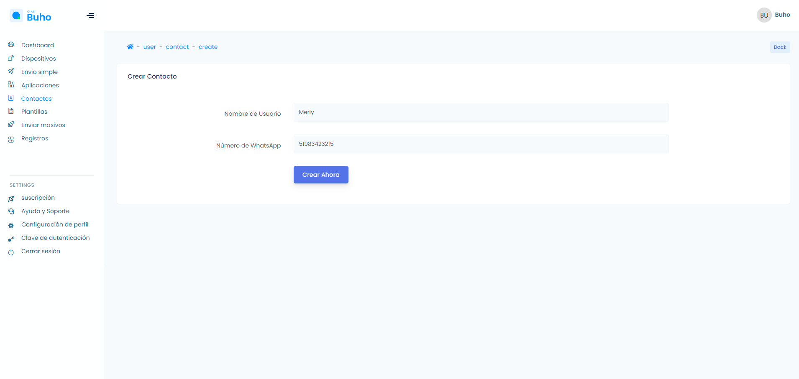
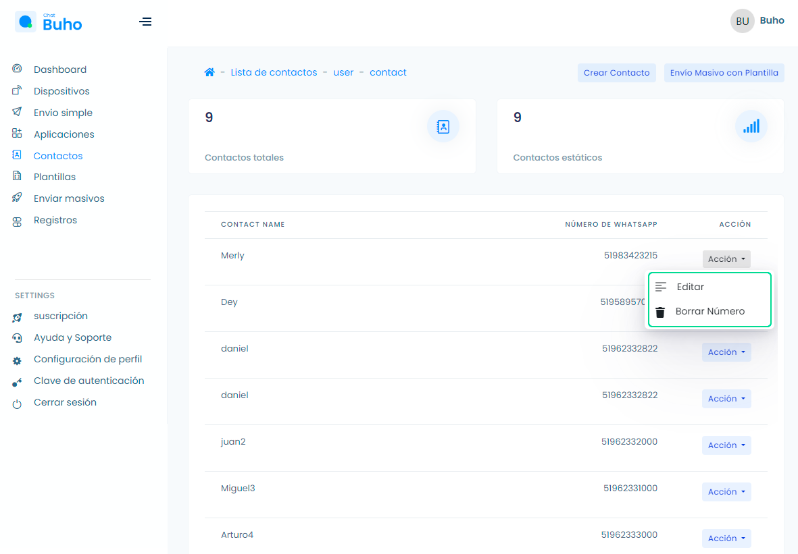
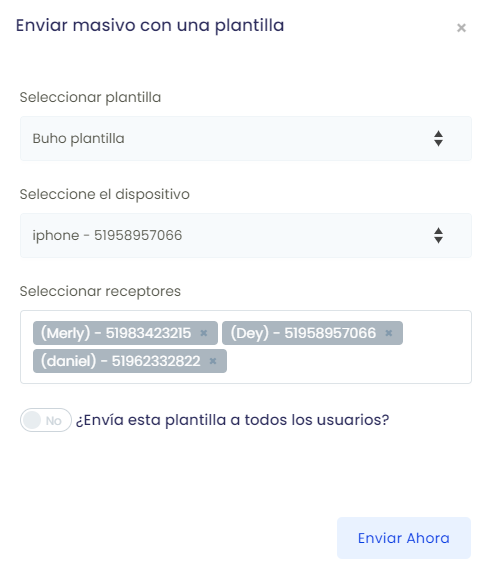

# Contactos

### Añadir un nuevo contacto

<iframe width="100%" height="505" src="https://www.youtube.com/embed/3CbGoghtsxs" title="YouTube video player" frameborder="0" allow="accelerometer; autoplay; clipboard-write; encrypted-media; gyroscope; picture-in-picture; web-share" allowfullscreen></iframe>

Ingresa a el módulo **Contactos**, en este modulo visualizarás las siguientes funciones:

1. **Crear Contacto:** Selecciona el botón **Crear contacto**.

2. **Acción:** Selecciona el botón **Acción** y podrás editar los datos del contacto o eliminarlo.

3. **Envío masivo con plantilla:** Envía mensajes con plantilla, selecciona la plantilla que creaste previamente, el dispositivo origen y los contactos receptores. Asimismo puedes usar el botón deslizante **Yes/No**, para enviar la plantilla a todos los contactos/usuarios.
   
 
