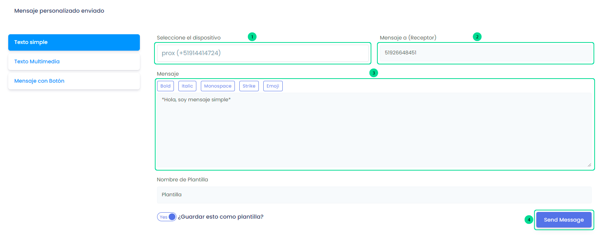
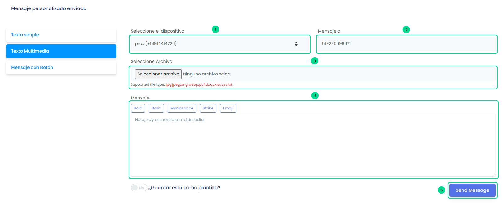

# Envíos Simples

### Haz envíos individuales a cualquier número

<iframe width="100%" height="505" src="https://www.youtube.com/embed/_VyiLs_9ZGM" title="YouTube video player" frameborder="0" allow="accelerometer; autoplay; clipboard-write; encrypted-media; gyroscope; picture-in-picture; web-share" allowfullscreen></iframe>

Ingresa a el módulo **Envío Simple**, y visualizarás las diferentes opciones de envio de mensajes personalizados.

 **1. Texto Simple:**

Selecciona el botón **Texto Simple** y aparecerá un formulario. Sigue estos pasos:

      1. Seleccione el dispositivo.
      2. Añada el contacto/Receptor.
      3. Escriba el mensaje, puede añadirle formato y emojis.
      4. Envía el mensaje.

:::info NOTA:
Selecciona el botón deslizable **¿Guardar esto como plantilla?**, en caso de que desees volver a usar el mensaje.
:::

**2. Texto Multimedia:**

Selecciona el botón **Texto Multimedia** y aparecerá un formulario. Sigue estos pasos:

      1. Seleccione el dispositivo.
      2. Añada el contacto/Receptor.
      3. Seleccione el archivo multimedia (imagen/video)
      4. Escriba el mensaje, puede añadirle formato y emojis.
      5. Envía el mensaje.

**3. Mensaje con Botón:**

Selecciona el botón **Mensaje con Botón** y aparecerá un formulario. Sigue estos pasos:
      1. Seleccione el dispositivo.
      2. Añada el contacto/Receptor.
      3. Escriba el mensaje, puede añadirle formato y emojis.
      4. Escriba un pie de página.
      5. Añada botones o respuestas rápidas.
      6. Envía el mensaje.

:::danger IMPORTANTE:
El mensaje con botón solo funciona solo para **IOS y Whatsapp Web**.
:::

