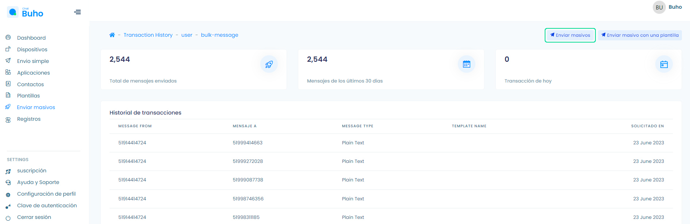
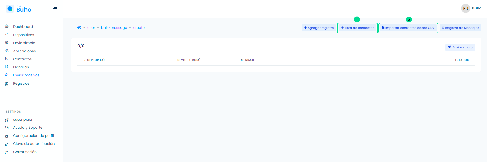
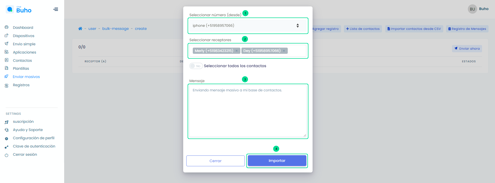
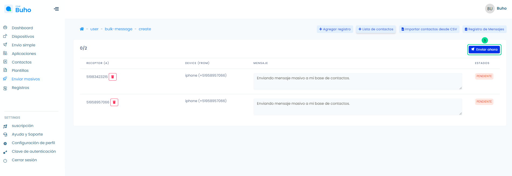
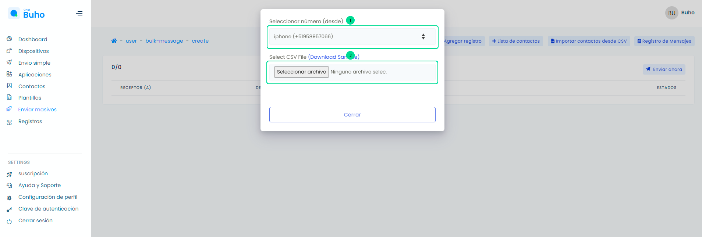

# Envíos masivos

### Realiza envíos masivos por WhatsApp

<iframe width="100%" height="505" src="https://www.youtube.com/embed/APGcqsObfdU" title="YouTube video player" frameborder="0" allow="accelerometer; autoplay; clipboard-write; encrypted-media; gyroscope; picture-in-picture; web-share" allowfullscreen></iframe>

Ingresa a el módulo **Envíos masivos**, selecciona el botón **Enviar masivos**.

Luego visualizarás las siguientes opciones para enviar mensajes masivos:

**1. Lista de contactos**

Selecciona el botón **Lista de contactos** y  aparecerá un formulario. Sigue estos pasos:

    1. Selecciona el dispositivo.
    2. Selecciona a los contactos/receptores.
    3. Escribe el mensaje.
    4. Seleccione el botón Importar.
    5. Finalmente seleccione el botón Enviar Ahora.

:::info NOTA:
Selecciona el botón deslizable **Seleccionar todos los contactos,** para importar a todos tus contactos añadidos en el módulo de contactos.
:::

Finalmente selecciona el botón **Enviar ahora** y lo mensajes cambiarán de estado **Pendiente** a **Enviado**.

**2. Importar contactos desde CSV**

Selecciona el botón **Importar contactos desde CSV** y  aparecerá un formulario. Sigue estos pasos:

    1. Selecciona el dispositivo.
    2. Descarga el CSV ejemplo (Importar Contactos), donde llenarás 2 campos phone_number,message.
    3. Luego Sube tu archivo excel y aparecerán en la plataforma.
    4. Finalmente selecciona el botón Enviar Ahora.

Finalmente, selecciona el botón **Enviar ahora** y lo mensajes cambiarán de estado **Pendiente** a **Enviado**.

   

