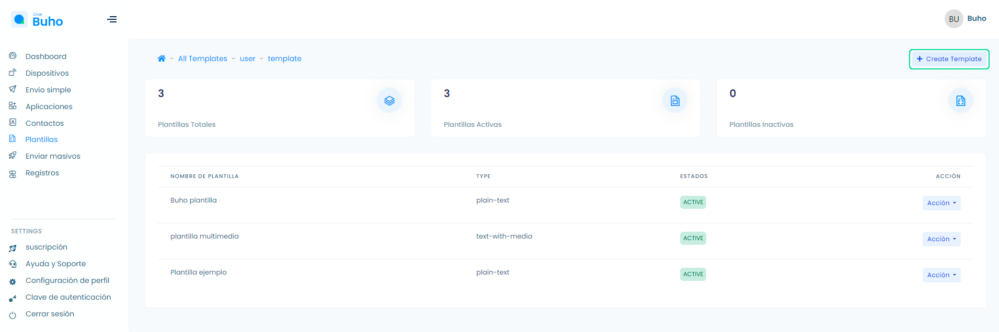
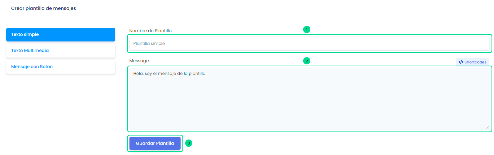
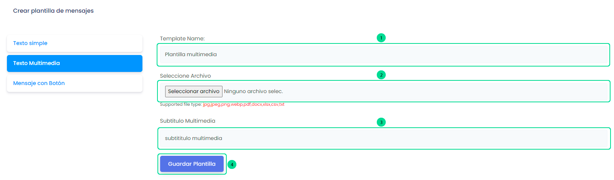
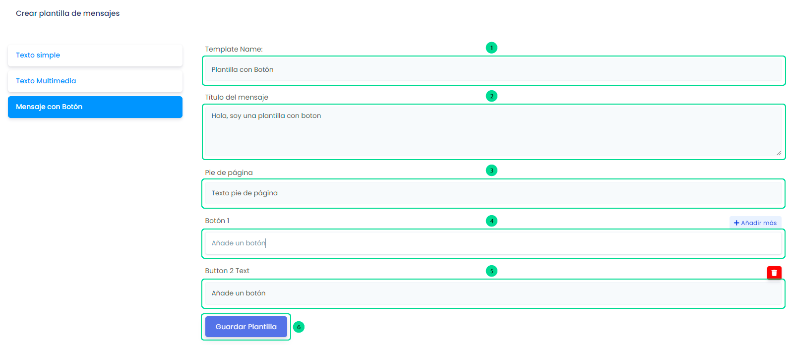

# Crear plantillas

### Crea plantillas con mensajes predefinidos

<iframe width="100%" height="505" src="https://www.youtube.com/embed/fWjz0nln7QI" title="YouTube video player" frameborder="0" allow="accelerometer; autoplay; clipboard-write; encrypted-media; gyroscope; picture-in-picture; web-share" allowfullscreen></iframe>

Ingresa a el módulo **Plantillas** y selecciona el botón **Crear plantilla**.

Visualizarás 3 formas para crear plantillas:

**1. Texto Simple:**

Selecciona el botón **Texto Simple** y aparecerá un formulario. Sigue estos pasos:

        1. Añada nombre de la plantilla.
        2. Escriba el mensaje.
        3. Seleccione el botón Guardar Plantilla.

        

**2. Texto Multimedia:**

Selecciona el botón **Texto Multimedia** y aparecerá un formulario. Sigue estos pasos:

         1. Añada nombre de la plantilla.
         2. Seleccione el Archivo.
         3. Escribe el texto en subtítulo Multimedia.
         4. Seleccione el botón Guardar Plantilla.

         

**3. Mensaje con Botón:**

Selecciona el botón **Mensaje con Botón** y aparecerá un formulario. Sigue estos pasos:
        1. Añada nombre de la plantilla.
        2. Escribe el título del mensaje.
        3. Escribe el pie de página.
        4. Escribe el nombre del botón, 
        5. También puedes añadir más botones.
        6. Seleccione el botón Guardar Plantilla.

        
