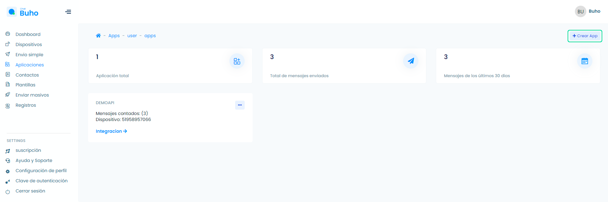
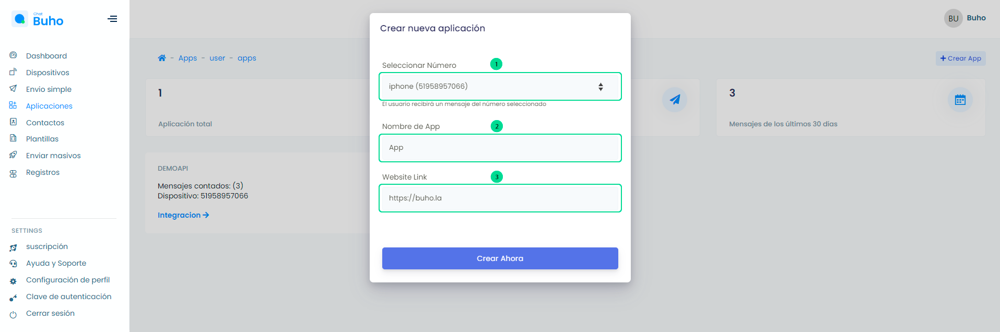
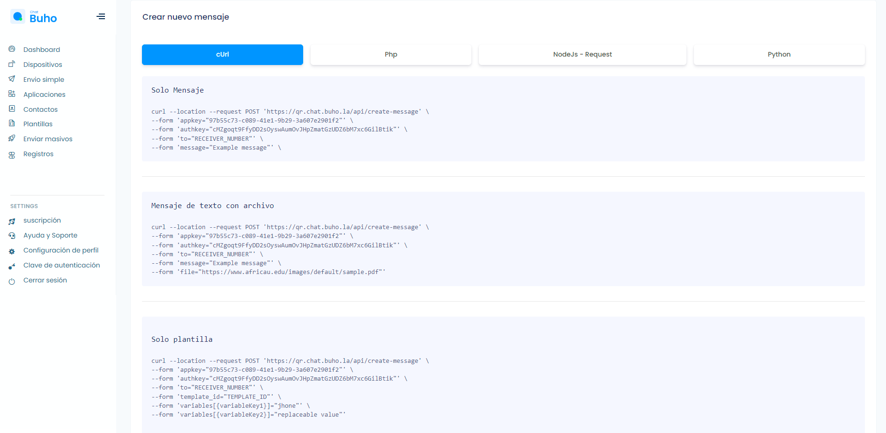

# Aplicaciones

### API para integrar WhatsApp a cualquier aplicación o sistema

<iframe width="100%" height="505" src="https://www.youtube.com/embed/aALbSPeBPUk" title="YouTube video player" frameborder="0" allow="accelerometer; autoplay; clipboard-write; encrypted-media; gyroscope; picture-in-picture; web-share" allowfullscreen></iframe>

Ingresa a el módulo **Aplicaciones**, selecciona el botón **Crear App**.

Visualizarás un formulario a llenar. Sigue los pasos para crear la aplicación:

    1. Selecciona el número del dispositivo.
    2. Añada el nombre del App.
    3. Añada Website Url.
    4. Selecciona el botón Crear Ahora.

Posteriormente, visualizarás las secciones de código en diferentes lenguajes de programación **CuRL / Php / NodeJs - Request / Python** que podrás utilizar para integrar** WhatsApp API**.

   

