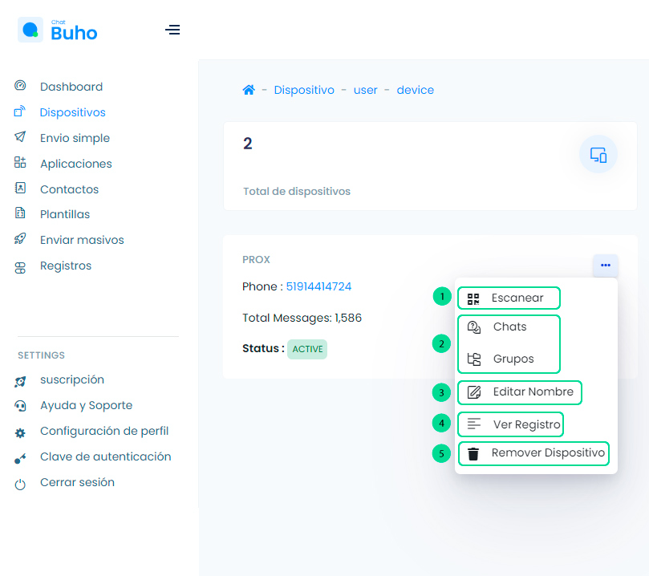

# Funciones extra en dispositivos

<iframe width="100%" height="505" src="https://www.youtube.com/embed/v6xc18d5UPI" title="YouTube video player" frameborder="0" allow="accelerometer; autoplay; clipboard-write; encrypted-media; gyroscope; picture-in-picture; web-share" allowfullscreen></iframe>

Una vez creado el dispositivo, selecciona los **3 puntos** al lado del nombre y visualizarás las funciones extras.

1. **Escanear:** Escanear código Qr para conectar dispositivo.
2. **Chats y Grupos:** Es el historial de chats.
3. **Editar Nombre:** Modificar nombre del dispositivo.
4. **Ver registro:** Es el registro a detalle del historial de mensajes enviados
5. **Remover Dispositivo:** Eliminar dispositivo.

