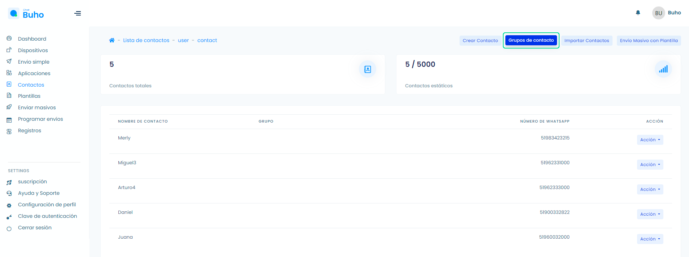
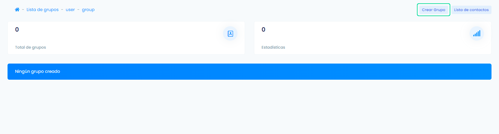
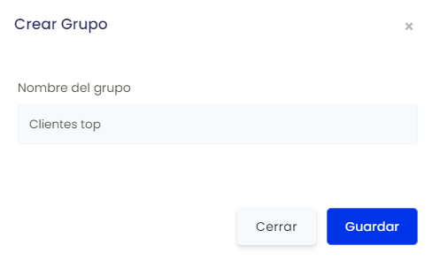
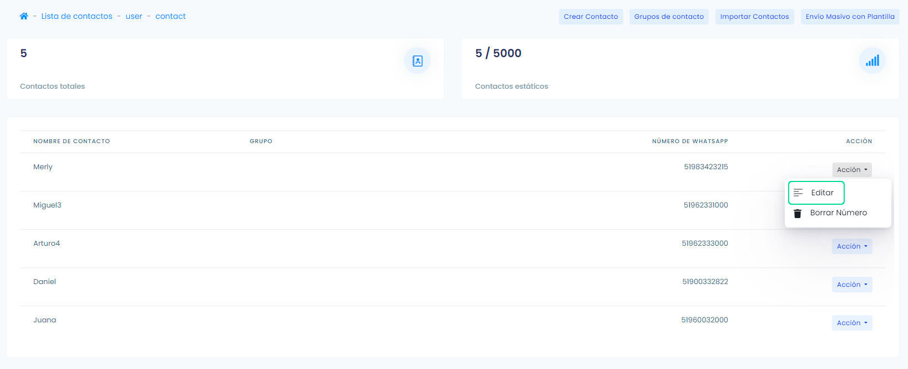
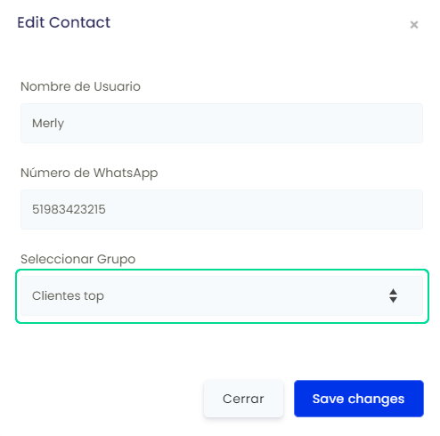
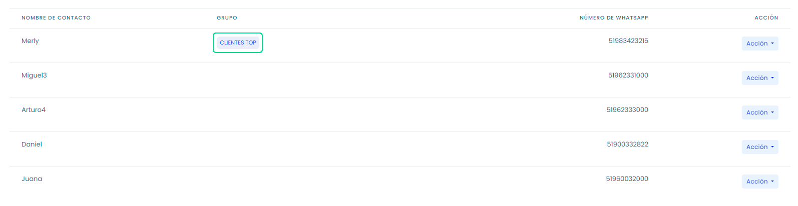

# Grupos de contactos
### Crea grupos de contactos

<iframe width="100%" height="505" src="https://www.youtube.com/embed/tmfhNAbO5v0" title="YouTube video player" frameborder="0" allow="accelerometer; autoplay; clipboard-write; encrypted-media; gyroscope; picture-in-picture; web-share" allowfullscreen></iframe>

Ingresa a el módulo **Contactos** y selecciona el botón **Grupos de contacto**.

Luego selecciona el botón **Crear Grupo**.

Ingresa el nombre del grupo y selecciona el botón **Guardar** para crear el grupo.

Posteriormente para asignar a los contactos dentro de un grupo, dirígete a el módulo de **Contactos** Y selecciona el botón de **Acción** y **Editar**.

Te aparecerá un formulario **Editar contacto**, sólo deberás asignar en el campo **Seleccionar Grupo** y selecciona el botón **Guardar**.

**Listo**, finalmente se visualizará así, tu lista de contactos.

