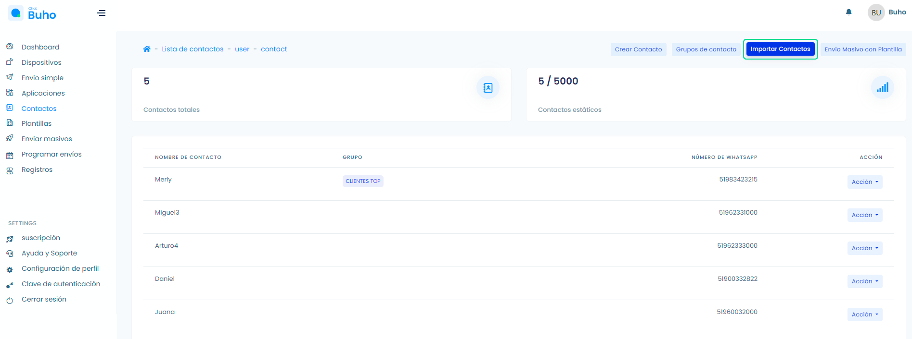
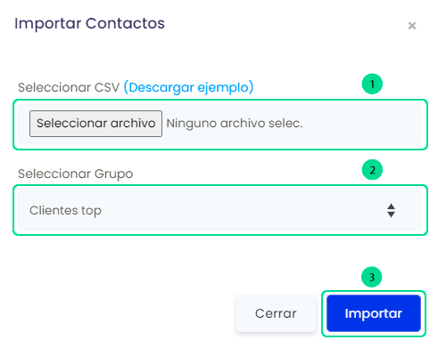

# Importar contactos
### Importa contactos de forma masiva

<iframe width="100%" height="505" src="https://www.youtube.com/embed/3Tx6pYSvYdg" title="YouTube video player" frameborder="0" allow="accelerometer; autoplay; clipboard-write; encrypted-media; gyroscope; picture-in-picture; web-share" allowfullscreen></iframe>

Ingresa a el módulo **Contactos** y selecciona el botón **Importar Contactos**.

Te aparecerá un formulario, sigue los pasos:

    1. Descarga el CSV ejemplo (Importar Contactos), donde llenarás 2 campos contact_name y number.
    2. Selecciona el Grupo en donde pertenecerá el contacto.
    3. Finalmente selecciona Importar y aparecerán los nuevos contactos.

**Listo!**, tus contactos ya han sido agregados de forma masiva.

