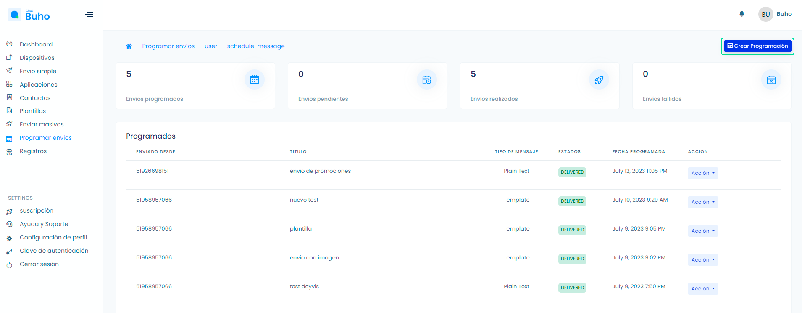
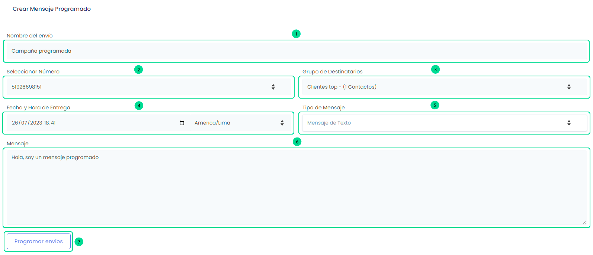
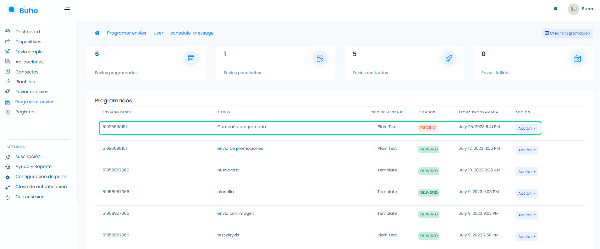

# Programar envíos 
### Programa tus mensajes masivos

<iframe width="100%" height="505" src="https://www.youtube.com/embed/o6Uvee_sP4k" title="YouTube video player" frameborder="0" allow="accelerometer; autoplay; clipboard-write; encrypted-media; gyroscope; picture-in-picture; web-share" allowfullscreen></iframe>

Ingresa a el módulo **Programar envíos** y selecciona el botón **Crear programación**.

Te aparecerá un formulario, sigue los pasos:

1. Añada el nombre de envío programado.
2. Selecciona el dispositivo.
3. Añada el Grupo de destinatarios.
4. Selecciona la hora/fecha de entrega/zona horaria(America/Lima).
5. Selecciona el tipo de Mensaje(Mensaje de texto/Plantilla).
6. Si utilizas un mensaje de texto, añade el texto.
7. Finalmente, selecciona el botón **Programar envíos**.

Para visualizar tus mensajes programados, selecciona el módulo **Programar envíos**.

