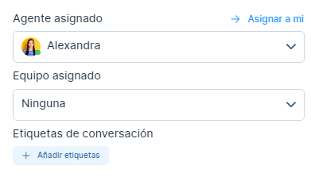

# Asignar conversaciones
Cada conversación en Chat Búho puede tener un asignado. Un asignado puede ser añadido manualmente a la conversación a través de la consola web o la API, o las organizaciones pueden optar por el sistema de asignación round-robin **"Asignación equitativa grupal"**. Este documento explica cómo se puede asignar un agente a la conversación.

## Asignación manual

Una conversación puede ser asignada manualmente a 2 usuarios.

1. Agentes que tienen acceso a la bandeja de entrada en la que se crea la conversación.
2. Los administradores, que pueden acceder a todas las conversaciones del sistema.
Para asignar un agente o administrador a una conversación, un **administrador/agente** puede seleccionar al asignado en el desplegable denominado **"Agente asignado"* de la sección **"Detalles de la conversación"** en la barra lateral derecha, como se muestra a continuación.

## Auto asignación
Chat Búho ofrece un sistema de auto-asignación de conversaciones. La asignación sigue la lógica mencionada a continuación.

:::info NOTA:

La asignación round robin **"Asignación equitativa"** está activada por defecto.

:::

1. Si hay agentes en línea que tienen acceso a la bandeja de entrada en la que se crea una conversación, el sistema distribuirá las conversaciones por igual entre los agentes en línea.
2. Si todos los agentes están desconectados, el sistema mantendrá las conversaciones como no asignadas.

## Activar la asignación round-robin

Para habilitar la asignación round-robin en su bandeja de entrada, siga los siguientes pasos.

1. Vaya a **Configuración ->** Bandejas de entrada.
2. Haga clic en el enlace de **configuración de la bandeja de entrada** que desee **habilitar** la asignación de round-robin.
3. Desplázate hacia abajo para ver la configuración de Round-robin, como se muestra a continuación.

4. Cámbialo a **"Activado"** y haz clic en **"Actualizar".**