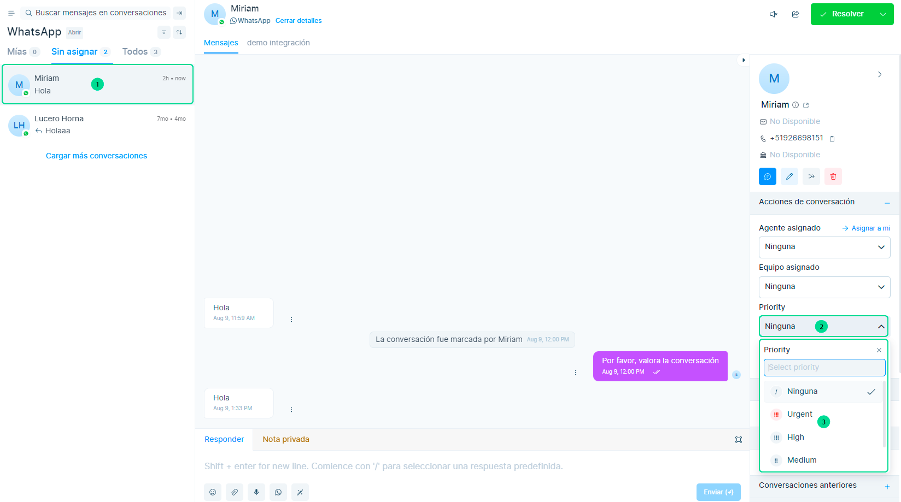
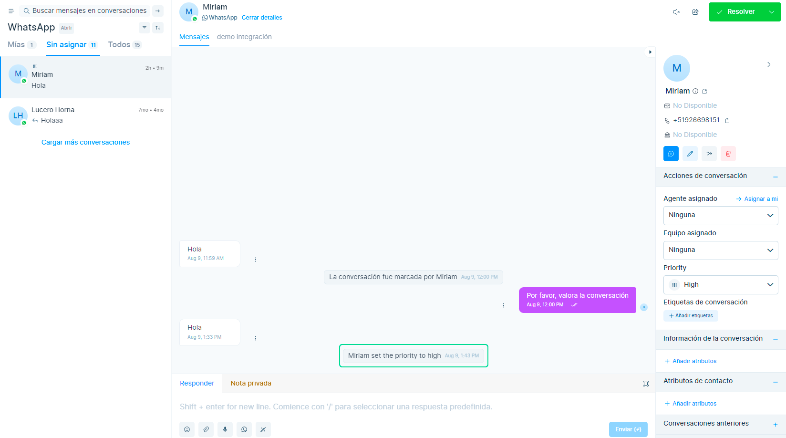
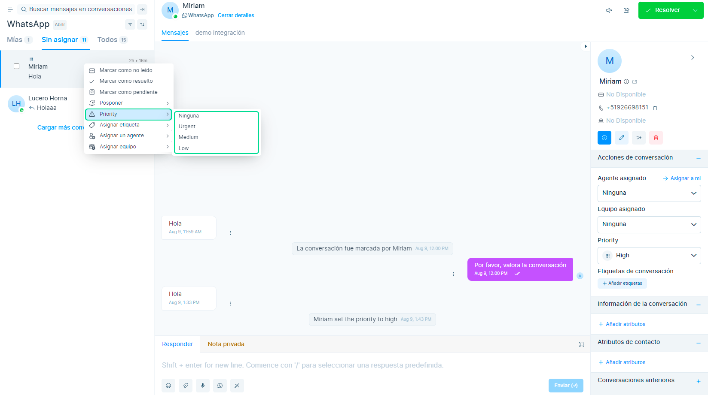

# Asignar prioridad

Dar prioridad a las conversaciones es esencial para **administrar su carga de trabajo de manera efectiva**, asegurando que aborde los problemas urgentes con prontitud mientras maneja los asuntos menos críticos de manera eficiente. La función de prioridad de le permite **asignar un nivel de prioridad a cada conversación**, lo que facilita identificar qué conversaciones requieren atención inmediata y cuáles pueden esperar.

Hay cuatro opciones disponibles para usted:

* **Bajo**
* **Medio**
* **Alto**
* **Urgente**

Puede asignar rápidamente una prioridad a cada conversación en función de su **importancia y urgencia**.

## Estableciendo una prioridad

Para asignar una prioridad ubícate en la barra lateral, en la misma sección donde puedes añadir equipos y etiquetas, visualice los siguientes pasos enumerados.

**1.** Selecciona la conversación.

**2.** Seleccione el menú desplegable de prioridad.

**3.** Seleccione la prioridad.

Una vez asignada, puede ver la prioridad en la lista de conversaciones, y tambien se **visualizará como una actividad en la conversación**.

Asimismo, puede establecer la prioridad desde el menú contextual, simplemente **haga clic derecho en la conversación** y establezca la prioridad.

:::info CONSEJO:
### **¿Cómo aprovechar al máximo la función?** 

Use la prioridad **"Urgente"** juiciosamente. Debe asignarse a los problemas más apremiantes en los que se supone que debe manejarse por encima de todo lo demás.

Utilice reglas de automatización para asignar prioridad en función de las condiciones. Por ejemplo, puede marcar automáticamente cualquier conversación como urgente si el asunto de un correo electrónico contiene la palabra seguridad.

:::

