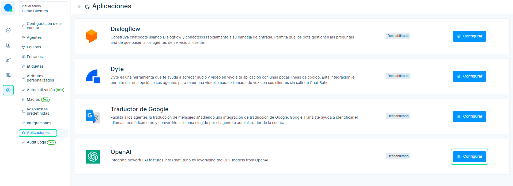
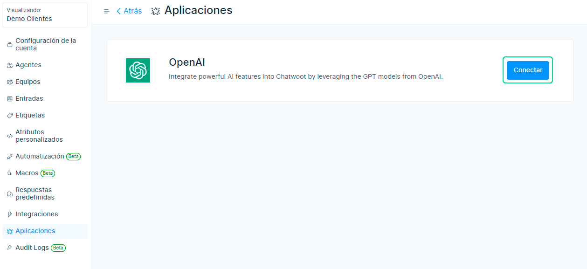
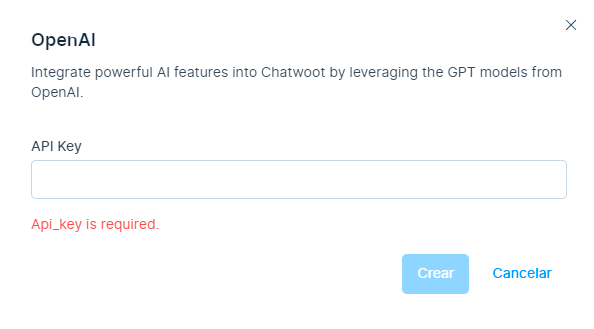
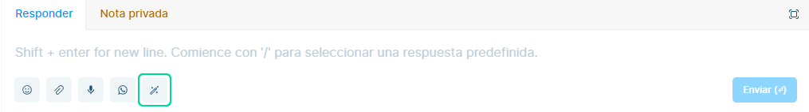
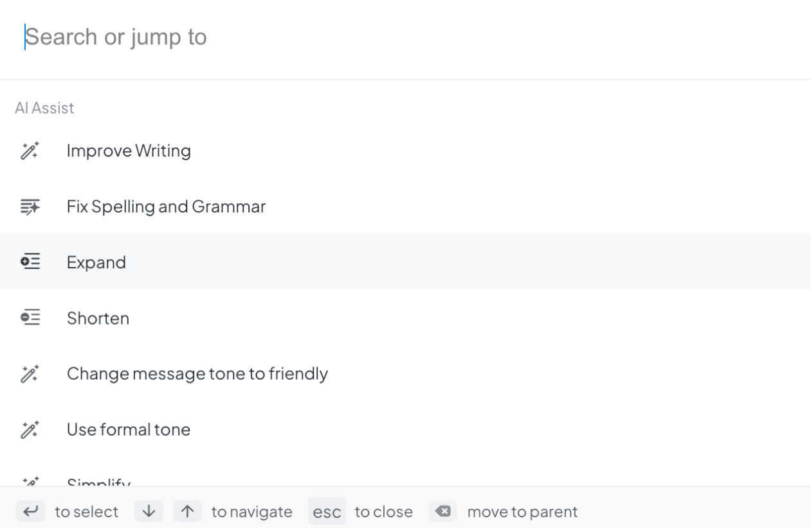
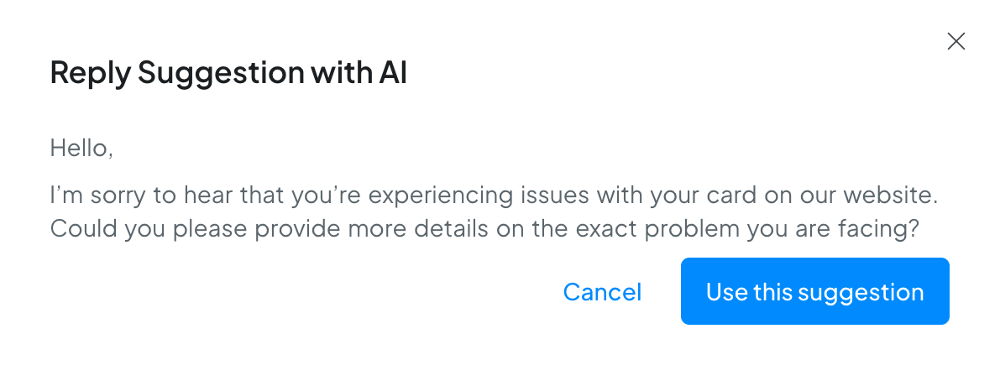

# Asistencia de la AI

AI Assist está diseñado para que los agentes generen sugerencias de respuesta, mejoren el contenido del borrador y corrijan la gramática, entre otras cosas. En general, AI Assist permite a los agentes manejar consultas de clientes más complejas, brindar un soporte más personalizado y, en última instancia, mejorar la satisfacción del cliente.

:::info NOTA:

Actualmente, estamos utilizando OpenAI como nuestro proveedor de IA, específicamente el modelo gpt-3.5-turbo. Sin embargo, tenemos planes para apoyar a más proveedores en el futuro.
:::

## ¿Cómo configurar AI Assist?
Dirígete a tu plataforma de Chatbúho, e ingresa a **Ajustes ⚙️ > Aplicaciones**, luego selecciona **Configurar**.

Cree una nueva clave de **OpenAI** (podrá crear una clave desde su cuenta de **[OpenAI](https://platform.openai.com/account/api-keys)** ) y seleccione en el botón **Conectar cuenta**

Inserte la clave **OpenAI** y seleccione  en el botón **Crear**.

## Funciones admitidas por el AI Assist

### Sugerencias de respuesta

Las sugerencias de respuesta proporcionan a los agentes respuestas sugeridas basadas en el historial de conversaciones. Estas sugerencias pueden ayudar a los agentes a responder con rapidez y precisión a las consultas de los clientes.

### Corregir la ortografía y la gramática

AI Assist puede corregir errores ortográficos y gramaticales en el borrador actual del agente, asegurando que el cliente reciba un mensaje profesional y preciso.

### Ampliar

AI Assist puede ampliar el borrador actual del agente, brindando información adicional y contexto al cliente.

### Acortar

AI Assist puede acortar el borrador actual del agente, simplificando el mensaje y haciéndolo más fácil de entender para el cliente.

### Tono amistoso

AI Assist puede cambiar el tono del borrador actual del agente para hacerlo más amigable y accesible.

### Tono formal

Alternativamente, AI Assist puede ajustar el tono del borrador actual del agente para hacerlo más formal y profesional.

### Resumir

AI Assist puede resumir mensajes largos del cliente, proporcionando un resumen breve y conciso para que el agente lo revise. Esta función solo está disponible en el editor privado.

## ¿Cómo usar AI Assist?

Seleccione el ícono de IA dentro del editor del contacto donde enviará el mensaje.

Para seleccionar una función deseada, simplemente haga clic en ella.

Una vez que haya hecho clic en una opción, se abrirá el modal de **Sugerencia de respuesta con IA** , que muestra contenido generado por IA. Para insertar el contenido en el editor, haga clic en el botón **Usar esta sugerencia**.

