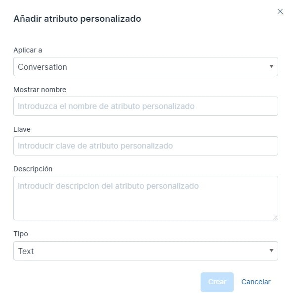
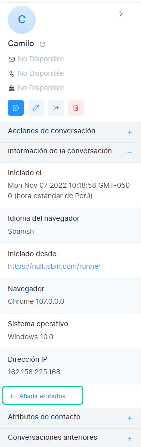
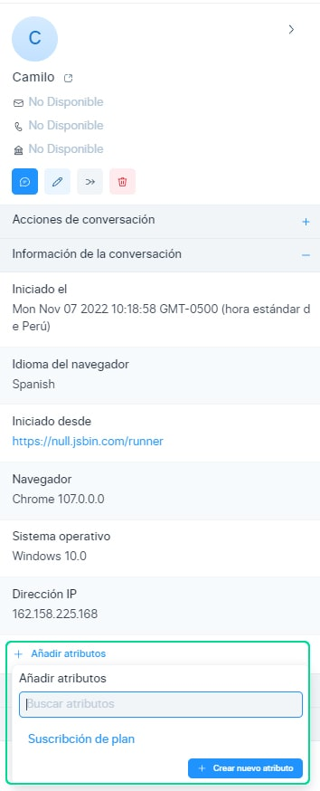
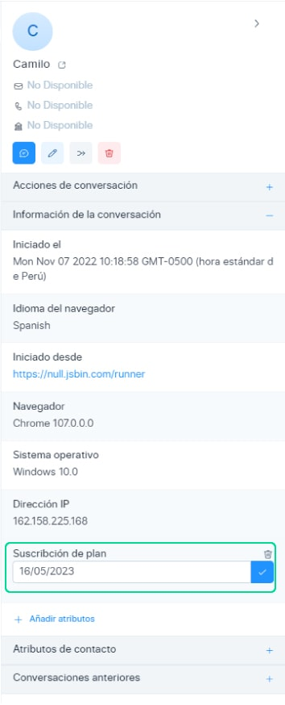
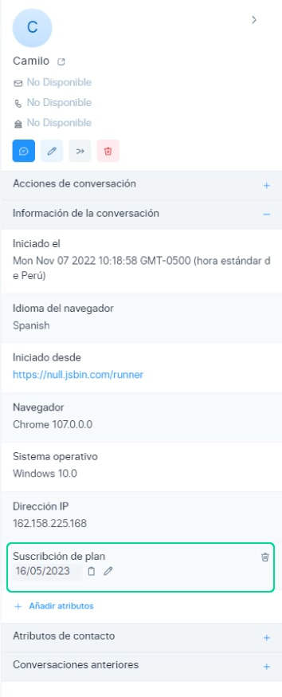

# Atributos personalizados

Chat Búho permite atributos personalizados distintos de los atributos de datos estándar (un conjunto predeterminado de datos sobre sus conversaciones/contactos como el nombre, el correo electrónico, la ubicación, etc.). Un atributo personalizado registra datos sobre sus contactos/conversaciones. El atributo personalizado puede ser cualquier cosa, por ejemplo:
* Plan de suscripción
* Fecha de suscripción
* Fecha de registro
* Artículo más ordenado
* Enlace al producto solicitado
* Fecha de la última transacción

:::info RECUERDA:
La única diferencia entre los atributos personalizados y estándar es que los atributos de datos estándar se actualizan automáticamente.

:::

Los atributos de datos personalizados son la información que adjuntó a la *conversación/clientes**, como cuántas veces han pedido un producto, cuándo se registran o en qué plan están.Por lo tanto, puede establecer los atributos que desee para comprender mejor a su cliente/conversación, y todo se mostrará en **Chat Búho.**

## Agregar un nuevo atributo personalizado
Para agregar un nuevo atributo personalizado, navegue hasta Atributos personalizados haciendo clic en **Configuración ->**  Atributos personalizados en la barra lateral.

Haga clic en el botón **Añadir atributos personalizados** disponible en la esquina superior derecha de la página, que abrirá un modal como se muestra a continuación.

Estas son las entradas necesarias para crear el atributo personalizado:

|     Entrada    	|                                   Descripción                                  	|
|:--------------:	|:------------------------------------------------------------------------------:	|
| **Aplicar a**      	| Tipo de atributo (Conversación/Contacto)                                       	|
| **Mostrar nombre** 	| Actuar como una etiqueta al representar el atributo personalizado              	|
| **Llave**          	| Identificador único adjunto al atributo personalizado                          	|
| **Descripción**    	| Descripción sobre el atributo personalizado                                    	|
| **Tipo**           	| Tipo de datos que almacenará. Actualmente admite texto, número, enlace y fecha 	|

:::danger IMPORTANTE:
No puede crear un atributo personalizado con la misma clave dos veces en la cuenta.

:::

Una vez que ingrese los detalles, haga clic en el botón **Crear.** Si la solicitud se realiza correctamente, se mostrará el mensaje **"Atributo personalizado agregado correctamente".**

## Atributos personalizados de conversación
Después de crear el atributo personalizado de conversación, podrá agregar estos atributos a la conversación a través de la barra lateral de conversación.

Se abrirá un selector desplegable de atributos, luego seleccionará el atributo que desea agregar.

Introduzca un valor válido, haga clic en el botón **Crear.** Si la solicitud se realiza correctamente, se mostrará el mensaje **"Atributo agregado correctamente".**

También puede ver las acciones como **editar / eliminar / copiar** al pasar el cursor sobre el atributo.

