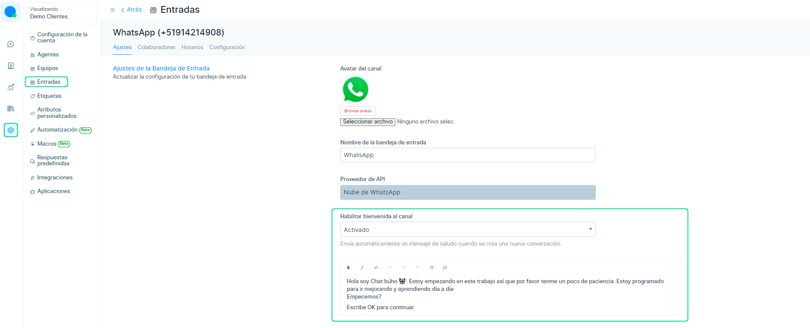
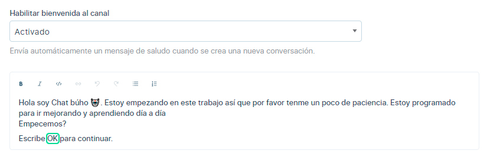
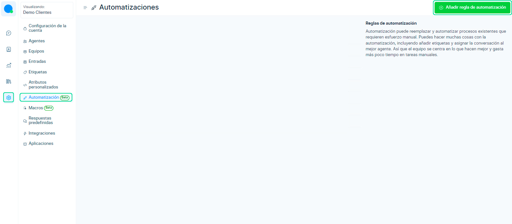
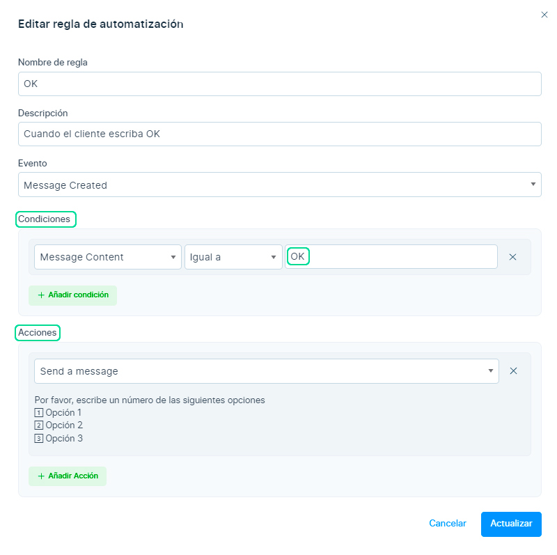
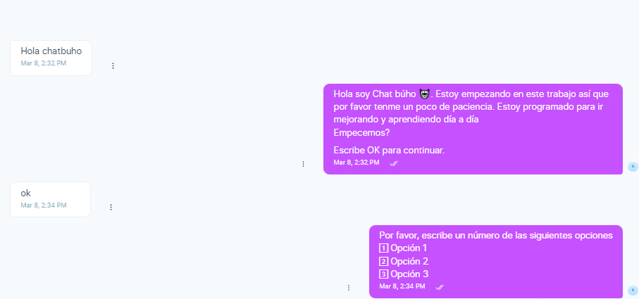
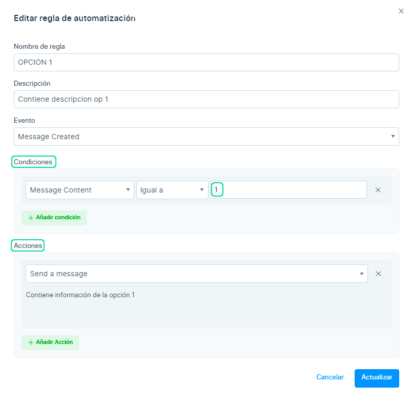
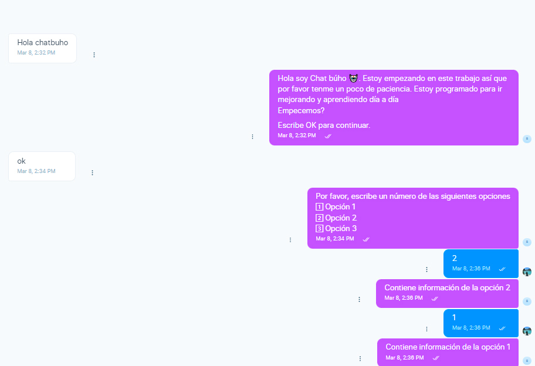

# Automatización: Crear flujo de chat con opciones

En este artículo te enseñaremos a cómo crear un flujo de chat basado en opciones con números y texto, utilizando las automatizaciones.

## Configurar saludo en bandeja de entrada
Primero ingresamos al módulo **Ajustes** ⚙️ luego a **Entradas** y selecciona el canal de chat.

Luego dentro del canal del chat y en la sección **"Habilitar bienvenida del canal"**, deberás seleccionar la opción **Activado**.

Después ingresa un **mensaje de bienvenida**, que se enviará automáticamente cuando se crea una nueva conversación.

## Crea las opciones automatizadas
En la sección anterior se creó el **mensaje de bienvenida** y se colocó "Escribe **OK** para continuar."

Entonces **"OK"** se convertirá en una **condición**, eso quiere decir que cuando el usuario escriba OK, **recibirá un mensaje** a consecuencia de esa acción.

Para crear esta condición, debemos dirigirnos a **Ajustes** ⚙️, luego a **Automatizaciones** y selecciona el botón **Añadir regla de Automatización**.

Luego aparecerá el formulario para crear la automatización y llenaremos los siguientes campos:

* **Nombre de regla:** Coloca el título de la regla.
* **Descripción:** Coloca para que sirve la creación de la regla.
* **Evento:** Coloca Message Created (Se activará cuando se cree un nuevo mensaje dentro de una conversación).
* **Condiciones:** Son una lista de criterios que se comprobarán antes de ejecutar la acción. Selecciona Message Content(Contenido del mensaje)**/ Igual a / OK*** (Puedes colocar número o texto).
* **Acciones:** Son una lista de tareas que se ejecutarán cuando se cumplan las condiciones. Selecciona Send a Message (Enviar mensaje) y escribe el mensaje que recibirá el usuario al escribir **"OK".**

Se visualizaría de esta forma cuando el cliente nos escriba a la plataforma de **ChatBúho.**

Posteriormente, para que las opciones 1️⃣|2️⃣|3️⃣ se conviertan en una condición y **ejecuten un mensaje**, se debe realizar la misma configuración en la sección de **Automatizaciones**, como se visualiza en la siguiente imagen.

Finalmente, se visualizaría de esta forma cuando el usuario escriba las opciones del flujo de chat que configuremos.

