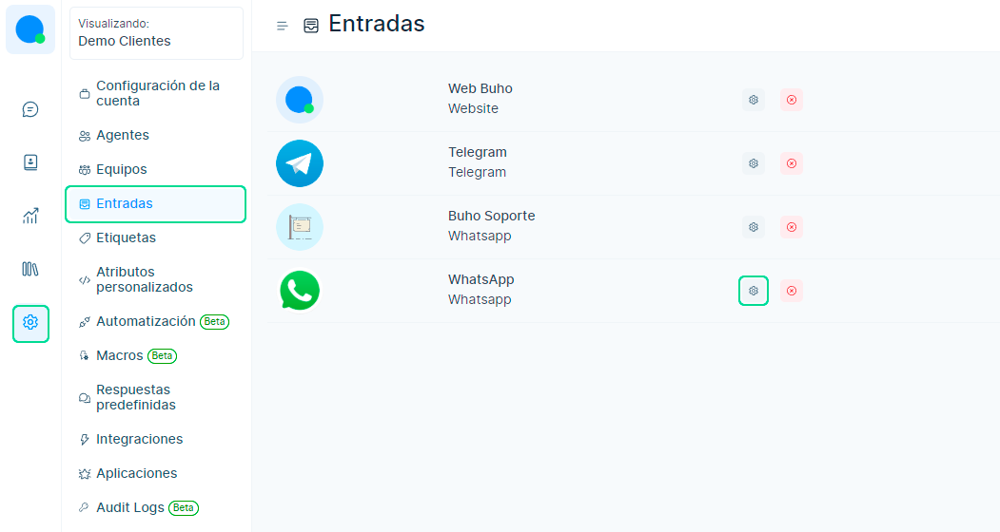
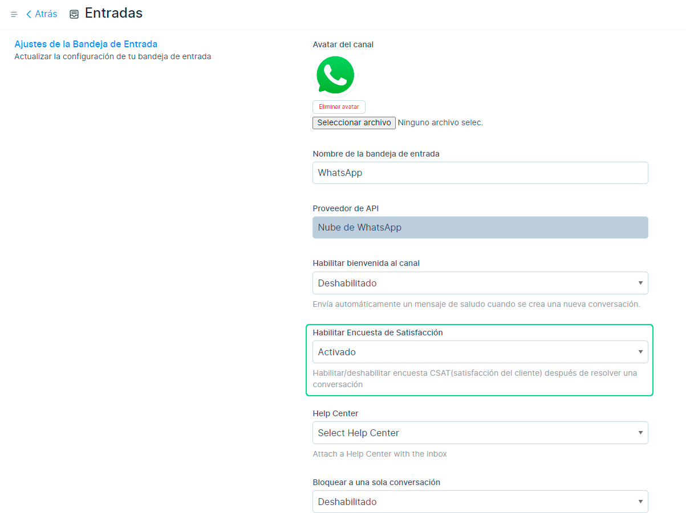

# Puntaje de satisfacción del cliente

El **CSAT (puntaje de satisfacción del cliente)** generalmente representa qué tan felices están los clientes con su producto o servicio o experiencia específica. CSAT es una de las métricas críticas de satisfacción del cliente  que cualquier negocio orientado al cliente debe monitorear. Cuando un agente resuelve la conversación, se envía una encuesta a sus clientes para calificar y recibir comentarios.

Se calcula haciendo una pregunta, como "Califica tu conversación". Hay una escala de emoji de encuesta correspondiente. Después de enviar la calificación, el cliente puede dar más comentarios, lo cual es opcional.

## CSAT en la bandeja de entrada

## Habilitar CSAT

Para **habilitar/deshabilitar CSAT**, ingresamos al módulo **Ajustes** ⚙️ luego vaya a la **configuración de la bandeja de entrada**.

Y finalmente deberá **activar la encuesta de satisfacción** (CSAT está deshabilitado de forma predeterminada).

:::info NOTA

También puede ver un **[informe](/reportes/CSAT)** de las calificaciones de sus conversaciones para monitorear el desempeño de su equipo de soporte.

:::

