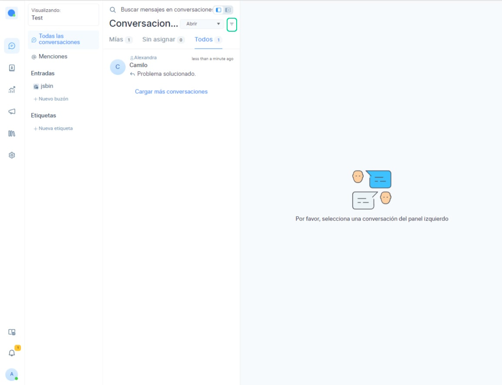
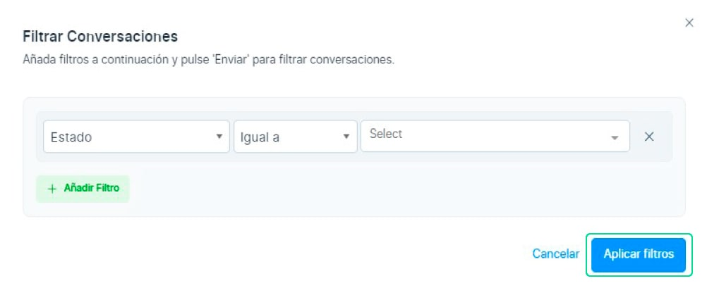
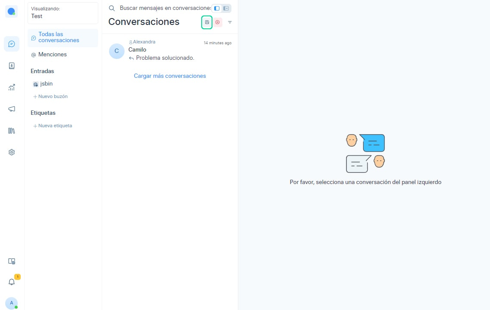
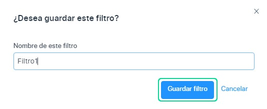
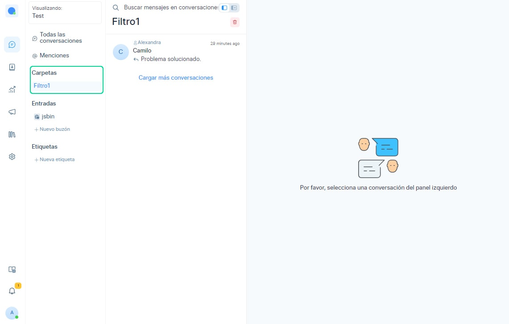
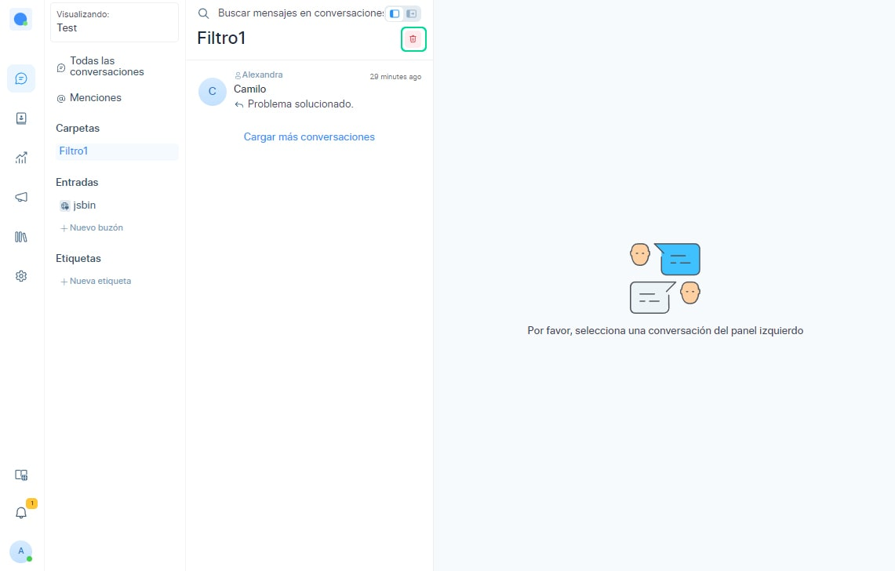
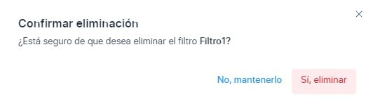

# Carpetas

Chat Búho permite a los usuarios ordenar y filtrar conversaciones basadas en diferentes categorías utilizando filtros avanzados.Y ahora, podemos guardarlos como carpetas, que se mostrarán en la barra lateral secundaria. Esta función ayudará a los usuarios a guardar diferentes conversaciones personalizadas.

Primero selecciona en el icono del **embudo de filtro** en la parte superior del panel de la lista de conversaciones.

Ahora puede visualizar la ventana emergente de filtros, que le permite seleccionar el **tipo de filtro**, el **operador** (igual a, no igual a, presente, no presente) y **el valor.**

## Guardar una nueva carpeta
Después de aplicar el filtro, buscará todas las conversaciones basadas en los valores aplicados

Luego deberá seleccionar el ícono del botón **Guardar**  ubicado en la parte superior del panel de la lista de conversaciones, como en la imagen adjunta a continuación.

Posteriormente podrá podrá visualizar la ventana emergente, con la pregunta **¿Desea guardar este filtro?.**

Para ello deberá asignar un nombre al filtro y haga clic en el botón **Guardar filtro.** Este botón guardará y creará una carpeta del filtro.

## Seleccionar una carpeta guardada
El nombre de la carpeta que ha guardado anteriormente se mostrará en la barra lateral secundaria como en la imagen de abajo.

Al seleccionar la **carpeta del filtro**, obtendrá todas las conversaciones guardadas anteriormente.

## Eliminar una carpeta guardada
Si desea eliminar la carpeta guardada, puede realizarlo seleccionando el botón borrar en la parte superior del panel de lista de conversación se abrirá una ventana emergente.

Por consiguiente, observará una ventana emergente de **Confirmar eliminación**:

- Si hace clic en el botón **No, Mantenerlo:** cerrará la ventana emergente y volverá a la vista de carpeta.
- Si hace clic en el botón **Sí, Eliminar:** eliminará la vista.
Después de eliminar, Si la carpeta está vacía, volverá a todas las conversaciones o vistas filtradas, o si la carpeta tiene longitud, se abrirá la siguiente carpeta cerca de la eliminada.

