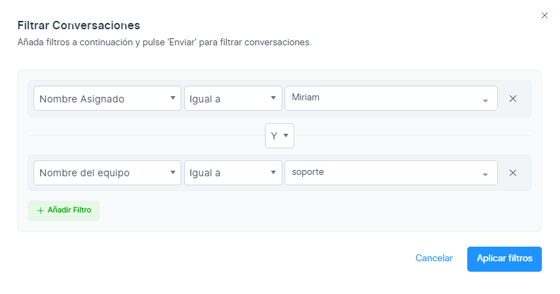
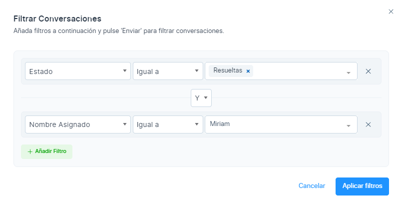
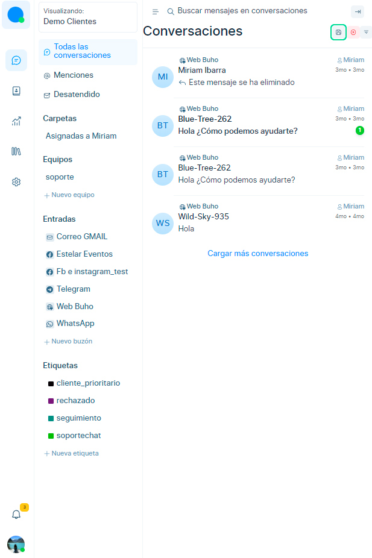
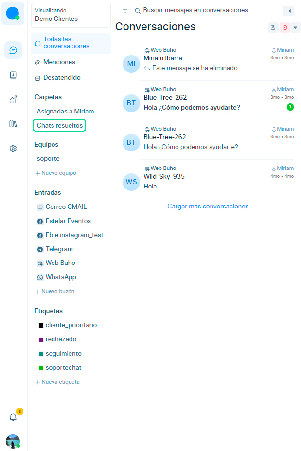
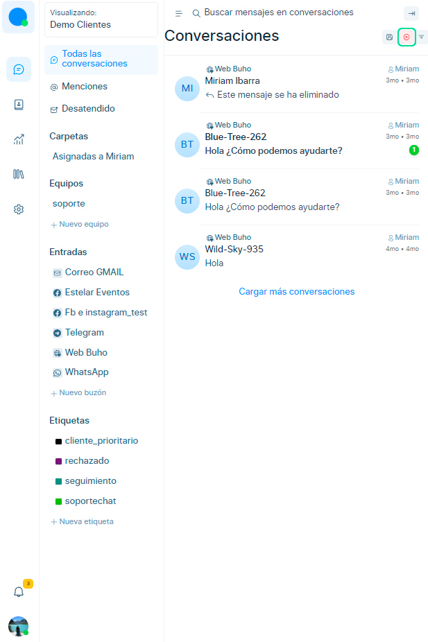

# Filtros de conversación

En este artículo aprenderás a como aplicar filtros avanzados para tus conversaciones. Al terminar de leer este artículo tendrás la capacidad de filtrar conversaciones con múltiples atributos a la vez e incluso consultarlas con operadores **AND(Y)** y **OR(O).**

## Atributos de filtro
Chatbúho ofrece filtrar conversaciones por los siguientes atributos:

* **Estado de la conversación:** Selecciona el estado del chat (Abiertas/Resueltas/Pendientes/Postpuestas/Todos).
* **Agente asignado:** Sirve para mostrar todas las conversaciones asignadas a un agente.
* **Bandeja de entrada:** Sirve para mostrar todas las conversaciones que pertenezcan a la bandeja o canal
* **Equipo:** Sirve para mostrar todas las conversaciones que pertenezcan a un equipo.
* **Etiquetas:** Sirve para mostrar todas las conversaciones que pertenezcan a una etiqueta.
* **Idioma del navegador:** Sirve para mostrar todas las conversaciones que pertenezcan a un idioma.
* **Creado el:** Sirve para mostrar todas las conversaciones creadas en una fecha específica.
* **Ultima actividad:** Sirve para mostrar todas las conversaciones realizadas en un periodo de tiempo.
* **País:** Sirve para mostrar todas las conversaciones que pertenezcan a País.
* **Enlaces de referencia:** Sirve para mostrar todas las conversaciones que contengan una ruta o link de página.

## Seleccione el ícono de filtro
Primero seleccione el ícono de filtro.

Ahora visualizará la ventana emergente de filtros, que le permitirá seleccionar el tipo de filtro, el operador (igual a, no igual a, presente, no presente) y el valor.

## Ejemplo de filtro
Para obtener todas las conversaciones **"Resueltas"** por el agente **"Miriam"**, configure los filtros de la siguiente manera.

1. Establezca el tipo de filtro como **"Estado"**, el operador como **"Igual a"** y el valor como **"Resuelto"**
2. Establezca el "Nombre del asignado" como el tipo de filtro, **"Igual a"** como el operador y **"Miriam"** como el valor.
3. Presione **Aplicar filtros** y la lista de conversaciones ahora se filtrará según los **criterios anteriores**.

:::info NOTA:

Puede aplicar tantos filtros como desee combinándolos con los operadores AND(Y) y OR(O) para crear consultas complejas y canalizar su lista a necesidades específicas.

:::

## Guardar Filtros
Para guardar el filtro creado, seleccione el botón **"Guardar Filtros".**

Ingrese el **nombre del filtro** y se ubicará en la sección derecha de **Carpetas.**

## Borrar Filtros
Para borrar los filtros y volver a la lista original, simplemente seleccione el botón **"Eliminar filtros".**

