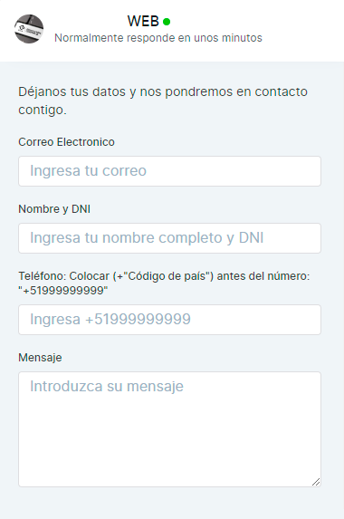

# Formulario Website

El formulario previo al chat se utiliza para recopilar información sobre **contacto/conversación** antes de iniciar una conversación. El formulario website está disponible solo en el chat en vivo del sitio web.

Hay dos tipos de campos que se incluyen en el formulario previo al chat.

**1.Campos estándar:** Estos son los campos de contacto principales. Por ejemplo, correo electrónico, número de teléfono y nombre completo.

**2.Campos personalizados**: estos son los campos que se crean a través de [atributos personalizados](/docs/configuracion-adicional/Atributos-personalizados.md).

Todos los campos se mostrarían en la configuración del formulario website de forma predeterminada. El administrador podrá hacer lo siguiente.

**1.** Habilitar/deshabilitar campos.

**2.** Cambiar el orden de los campos.

**3.** Actualizar etiqueta/marca de posición.

**4.** Activar/Desactivar requerimiento.

Los campos que se muestran en la tabla se describen a continuación.

|   **Nombre del campo**   |                           **Descripción**                          |
|:--------------------:|:--------------------------------------------------------------:|
| Llave                | Identificador único de campo                                   |
| Tipo                 | Tipo del campo (Texto, Lista, Número, Fecha, Enlace, Booleano) |
| Requerido            | ¿El campo es obligatorio o no?                                 |
| Etiqueta             | La etiqueta que se mostrará al visitante en el widget          |
| Marcador de posición | El valor del marcador de posición                              |

Una vez que el formulario website esté habilitado, mostrará un formulario como el que se muestra a continuación cuando alguien inicie una conversación.

