# Módulo de contactos

La sección de contactos en Chat Búho contiene los detalles de los usuarios finales/clientes con los que ha interactuado usando la plataforma de mensajería de Chat Búho. Puede considerarlo como una base de datos de clientes.

Haga clic en módulo **Contactos** en la pantalla de inicio.

Se abrirá una pantalla que tendrá los contactos (si ya están añadidos). O bien una pantalla en blanco donde se pueden añadir los contactos.

Los contactos pueden añadirse a la lista de tres maneras. Una de ellas es añadir el contacto tú mismo haciendo clic en el botón de **Nuevo Contacto** en la parte derecha.

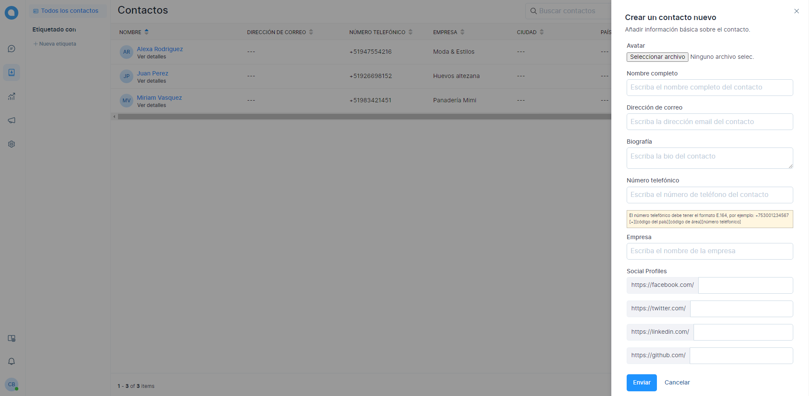

La segunda forma es recoger la información de contacto a través de los formularios de **Pre chat.**

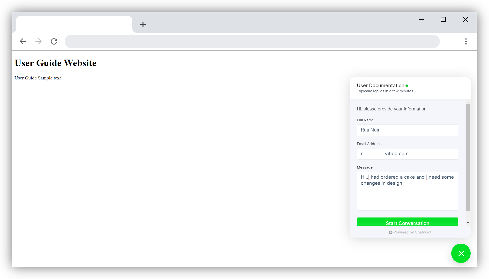

La tercera forma es cuando el cliente introduce el **ID de correo electrónico** en el mensaje de saludo del canal.

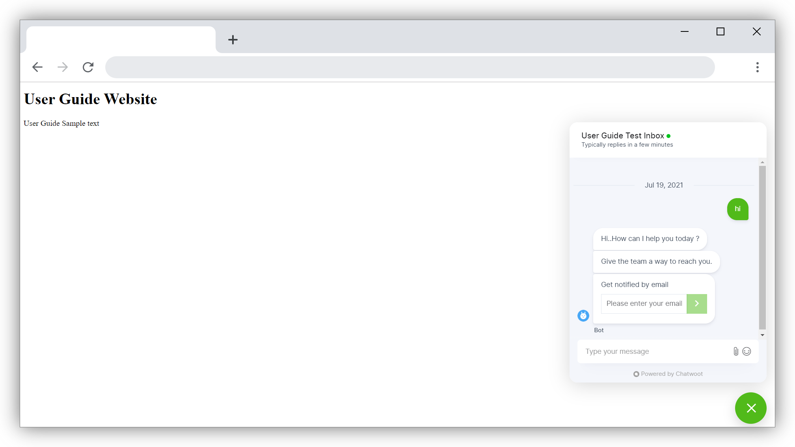

Una vez que los contactos están disponibles en su lista de contactos, puede editar los detalles como y cuando sea necesario.

## Conversaciones salientes

Puede enviar conversaciones salientes desde su página de contacto a los siguientes canales de conversación.

* Sitio web ( sólo para los contactos identificados por HMAC )
* Correo electrónico
* SMS
* Whatsapp
  
**¿Cómo enviar una conversación saliente?**

1. Haga clic en el icono de conversación saliente en la página de contacto
2. Seleccione la bandeja de entrada de la conversación
3. Ingrese el contenido del mensaje
4. Haga clic en **Enviar**

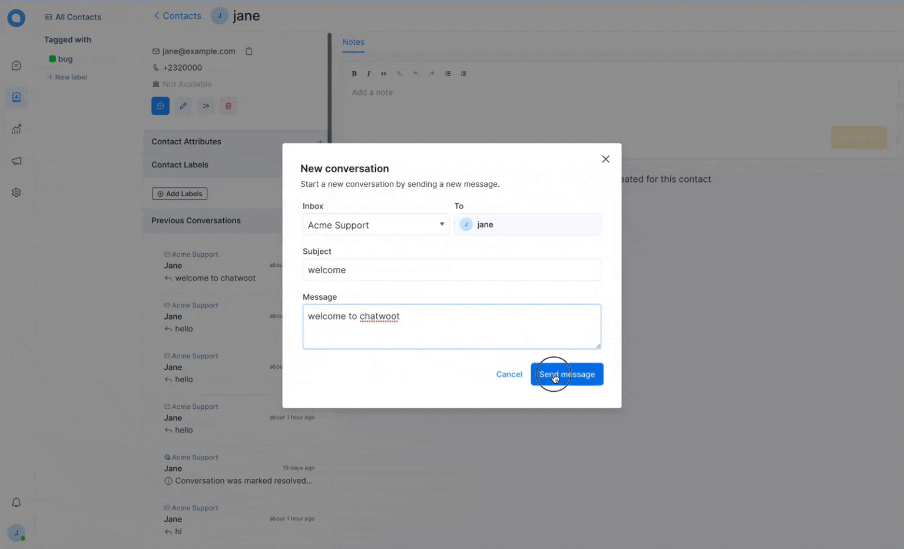

Y se visualizará el mensaje enviado.

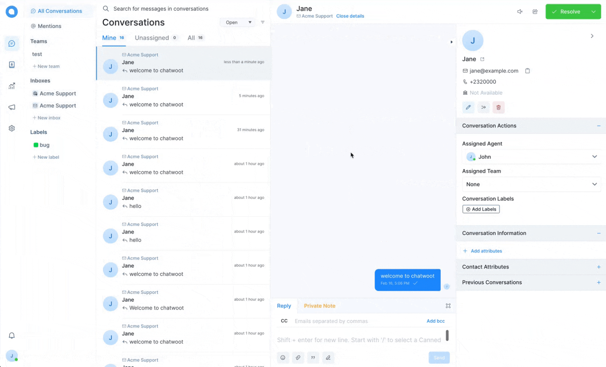

:::info NOTA:
Cuando un agente crea la conversación de salida, la conversación se asignará automáticamente a ese agente.

:::

## Notas de los contactos

Chat Búho tiene una página dedicada a añadir notas a cada contacto de su directorio. Esto le permite añadir notas e información importante a un contacto específico. Puede utilizarlo para registrar manualmente una llamada, un correo electrónico o una reunión que haya tenido con el cliente.

**¿Cómo agregar una nota a un contacto?**

1. Haga clic en la opción de menú Contactos del panel de control de Chat Búho.
2. Seleccione un contacto de la lista. (Haga clic en el nombre del contacto)
3. Escriba su nota.
4. Haga clic en el botón **"Añadir"** o pulse **Cmd +Enter**

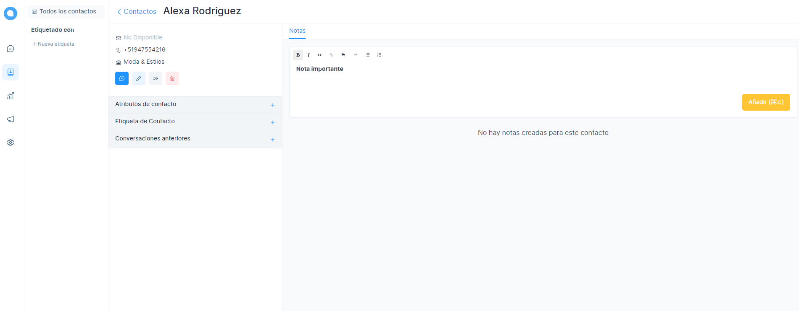

Chat Búho le permite formatear y resaltar sus notas con negrita, cursiva y todas las demás opciones básicas de formato. Incluso puede añadir listas numeradas o desordenadas.

**¿Cómo borrar una nota de contacto?**
Basta con hacer clic en el icono de la papelera situado a la derecha de la nota.

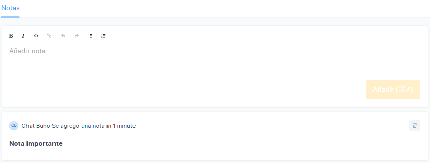

## Importar contactos

:::danger NOTA:
Por el momento la función de importar contactos guarda los campos de correo electrónico y nombres. En desarrollo funcionalidad completa.

:::

Chat Búho permite la importación masiva de contactos desde un archivo CSV. Para importar contactos:

1. Vaya a la página de Contactos desde la barra lateral.
2. Haga clic en el botón **Importar** en la esquina superior derecha.
3. Seleccione el archivo CSV que desea importar a Chat Búho, aquí tiene un archivo CSV de ejemplo como referencia.
4. Haga clic en el botón **Importar.**

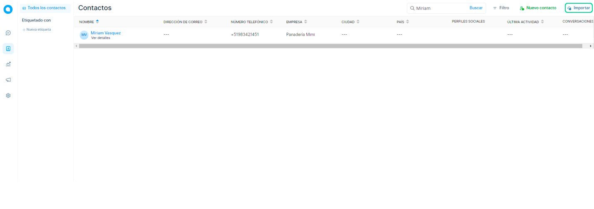

Luego seleccione el archivo csv, botón **Importar** y luego se completará el proceso el proceso.

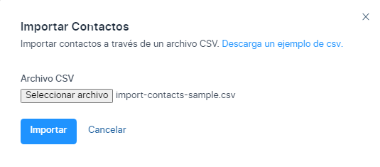

## Buscar contactos

Puede buscar todos los contactos introduciendo el **nombre**, el **ID de correo electrónico** o el **número de teléfono** en la búsqueda de la parte superior de la pantalla de contactos de Chat Búho.

La búsqueda actualmente filtra los contactos basados en el nombre, el ID de correo electrónico o el número de teléfono.

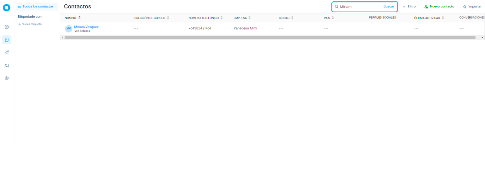

## Filtrar contactos

Chat Búho le permite aplicar filtros avanzados para sus contactos. Tendrá la posibilidad de filtrar los contactos con múltiples atributos a la vez e incluso consultarlos con operadores **Y / O.**

Chat Búho ofrece filtrar los contactos por los siguientes atributos:

1. Nombre del contacto
2. Correo electrónico de contacto
3. Número de teléfono
4. Identificador de contacto
5. País
6. Ciudad
Para filtrar los contactos, haga clic en el botón **Filtro** situado en la esquina superior derecha de la pantalla de contactos de Chat Búho.

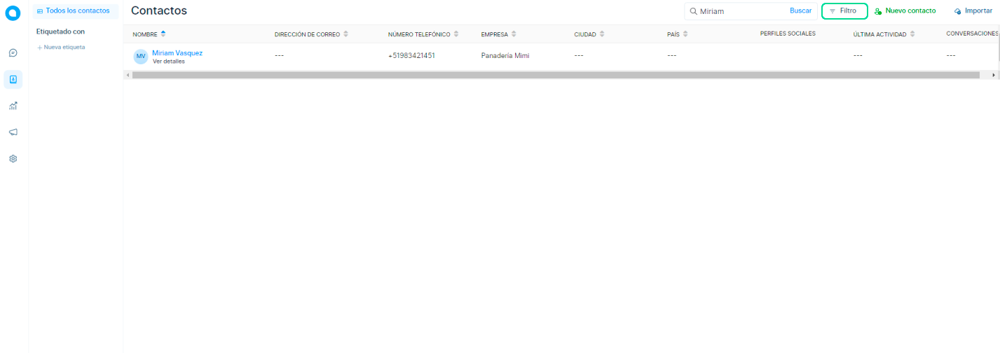

**Ejemplo**
Para obtener todos los contactos que no son de "Perú" y tienen un nombre que contiene "Miriam". Sigue estos pasos:

1. Establezca el primer tipo de filtro como "Nombre", el operador como "Contiene" y el valor como "Miriam".
2. Haga clic en el botón **"Añadir filtro".**
3. Establece el segundo tipo de filtro como "País", "No igual a" como operador y "Perú" como valor.
4. Pulsa **"Enviar"** y la lista de contactos se filtrará según los criterios anteriores.

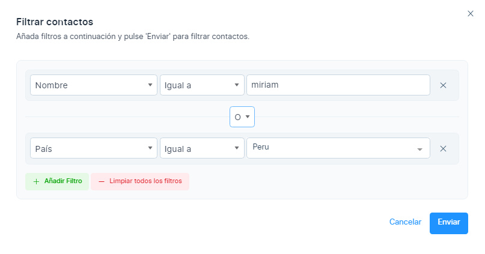

Puedes aplicar tantos filtros como quieras, combinándolos con los operadores  **Y / O** para crear consultas complejas y dirigir tu lista a necesidades específicas.

Para borrar los filtros y volver a la lista original, basta con hacer clic en el botón **"Borrar filtros"** de la ventana emergente de filtros.