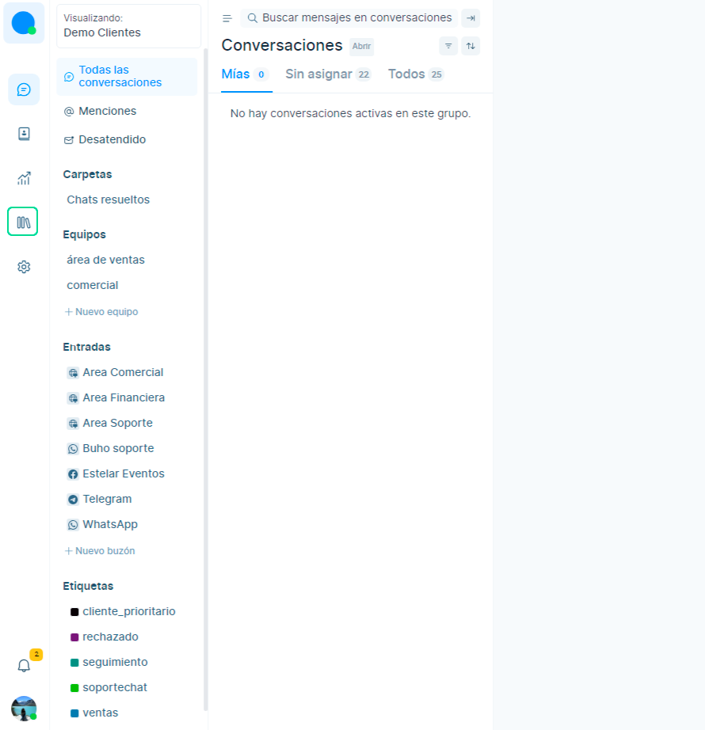
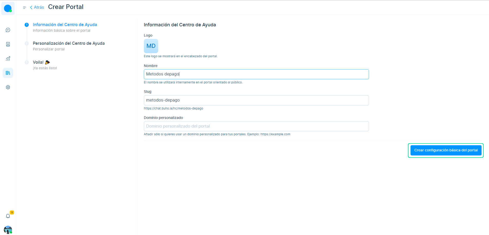
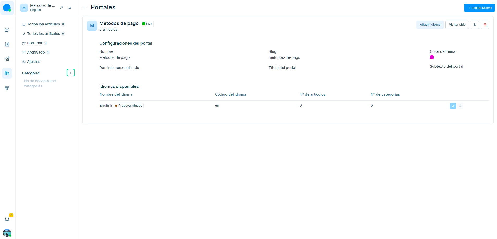
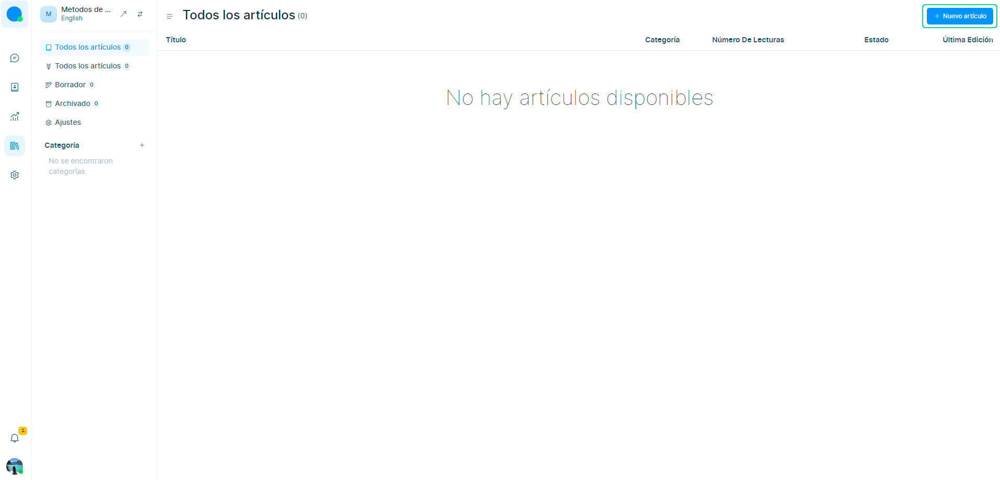
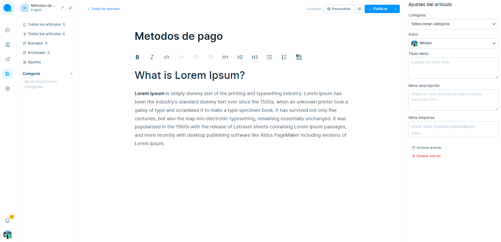

# Módulo Help Center 
En este artículo te enseñaremos  a crear fácilmente un portal de autoservicio para que sus clientes accedan a artículos e información. En esta guía, lo guiamos a través de los pasos para configurar un Centro de ayuda, incluida la creación de un portal y la adición de artículos.

Tenga en cuenta que esta es una función beta que se actualizará constantemente con cada versión. Puede configurar su Centro de ayuda en tres partes, como se explica a continuación.

### 1. Creando un portal
Seleccione el ícono de **Centro de ayuda** en la sección izquierda y haga clic en el botón **Nuevo portal**.

Verás una página de configuración básica. Comience a completar los campos.

Estos campos se explican a continuación:

**1. Logo**

Cargue el logotipo de su organización.

**2. Nombre**

Asigne un nombre a su portal para hacer referencia a él internamente.

**3. Slug**

Esto se generará automáticamente.

**4. Dominio personalizado (opcional)**

Puede agregar el dominio que desea que sirva a su portal en un dominio personalizado. Por ejemplo, si su sitio web **yourdomain.com** y desea que se pueda acceder a su portal en docs.yourdomain.com, escríbalo en este campo.

Posteriormente haga clic en **Crear configuración básica del portal.**

Tu portal está listo. Puede comenzar a agregar categorías y artículos dentro de estas categorías.

### 2. Creando categorías

Existen categorías para estructurar su portal y organizar sus artículos. Sigue estos pasos:

Haga clic en el [+] letrero junto a la sección **Categoría** en la barra lateral secundaria para crear una nueva categoría.
Luego se abrirá un modal. Llene los campos.

Estos campos se describen a continuación:

**1. Nombre**

Nombra tu categoría. Este nombre se utilizará en el portal público.

**2. Slug**

Esto se generará automáticamente.

**3. Descripción (opcional)**

Describe tu categoría.

Haga clic en el botón **Crear categoría**.

### 3.Creando artículos

Finalmente, comience a escribir sus artículos. Siga los pasos a continuación.

1. Selecciona  el botón **Nuevo artículo** en casi todas las páginas. 
   
 

2. Utilice **el editor de texto para escribir su artículo**. Utilice la barra lateral para seleccionar la categoría y el autor de su artículo y actualice el metacontenido. Aquí hay un ejemplo:

