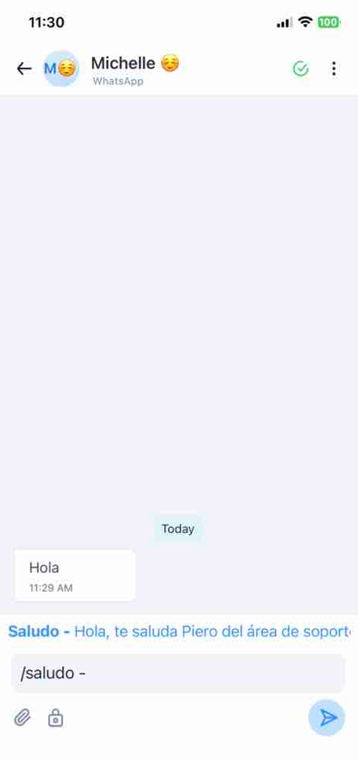
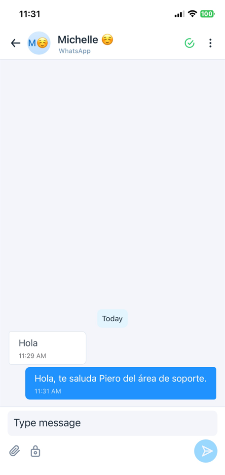
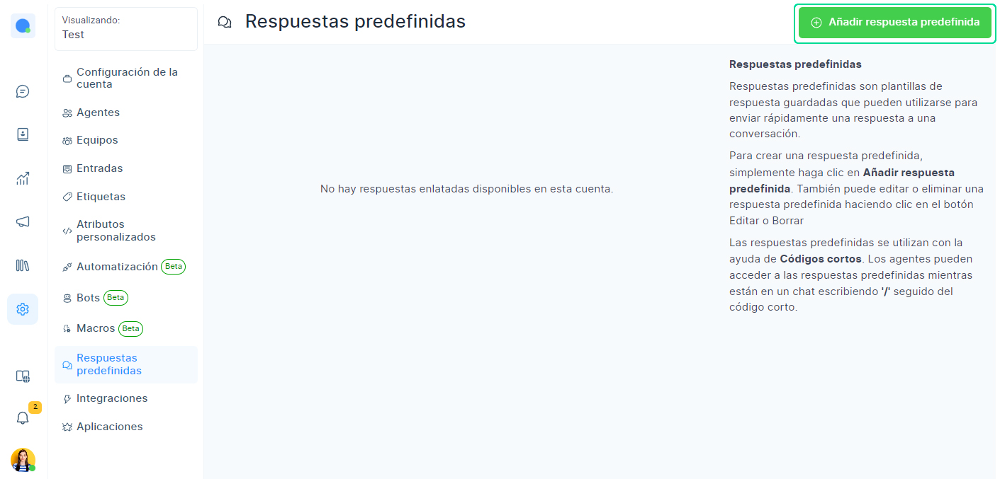
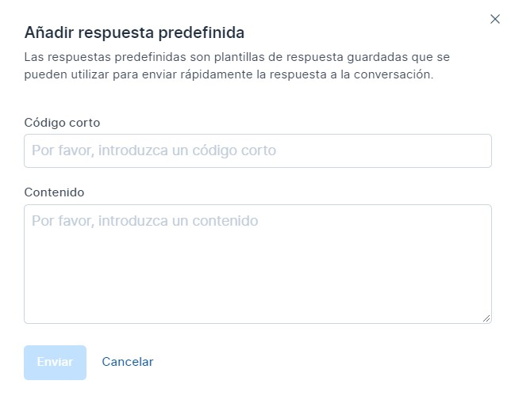
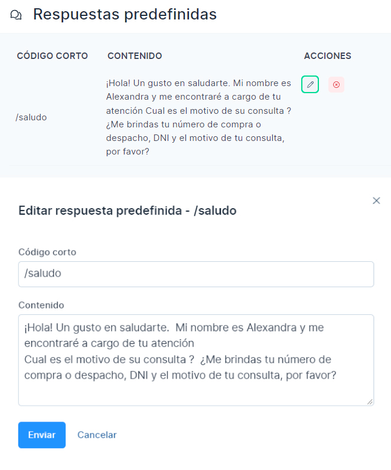
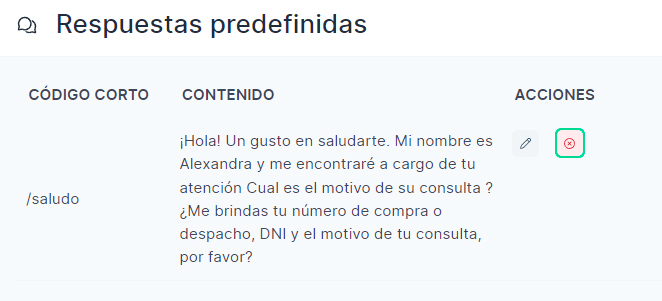

# Respuestas predefinidas

Las respuestas predefinidas son plantillas de respuesta guardadas que se utilizan para enviar un mensaje a una conversación rápidamente. Puede utilizar las respuestas predefinidas para guardar las respuestas a las preguntas más frecuentes, lo que ayudará a reducir el tiempo de respuesta y la productividad de un agente. Un agente puede acceder a las respuestas predefinidas en el chat escribiendo **"/"** seguido por la palabra clave.

## Usar una respuesta predefinida en una conversación
Todas las respuestas predefinidas están disponibles para todos los agentes de la cuenta.

Para acceder a las respuestas predefinidas mientras chatea con un cliente, introduzca **"/"** seguido de la palabra clave en el editor de texto que se muestra a continuación, que resaltará la respuesta predefinidas con la palabra clave. Entonces, presione enter y se actualizará el editor con la respuesta.

## Añadir una nueva respuesta predefinida
Cualquier agente/administrador en la cuenta puede **crear/modificar** una respuesta predefinida.

Para agregar una nueva respuesta predefinidas, vaya a la configuración de respuesta predefinidas haciendo clic en **Configuración →**  Respuestas predefinidas desde la barra lateral. Por defecto, no hay respuestas predefinidas disponibles en la cuenta.

Haga clic en el botón **Agregar respuesta predefinida** disponible en la esquina superior derecha de la página, que abrirá una ventana emergente como se muestra a continuación.

Los campos mostrados en la ventana emergente se describen a continuación.

| Nombre del campo 	| Descripción                                                                                                                                                                         	|
|------------------	|-------------------------------------------------------------------------------------------------------------------------------------------------------------------------------------	|
| **Palabra clave**    	| Introduzca una palabra clave - longitud mínima de 2 caracteres. La palabra clave es único. No se puede crear una respuesta predefinida con la misma palabra dos veces en la cuenta. 	|
| **Contenido**        	| Escriba el mensaje que desea enviar cuando la palabra clave se introduce en el chat.                                                                                                	|

Una vez que ingrese los detalles, haga clic en el botón **Enviar**. Si la solicitud es correcta, se mostrará un mensaje **"Respuesta predefinidas agregada correctamente".**

:::info IMPORTANTE:
Las respuestas predefinidas son creadas por un agente que está disponible para todos los agentes/administradores de la cuenta.

:::

## Modificar respuesta predefinida
Para actualizar una respuesta predefinida, abra la lista de respuestas predefinidas:

* **Configuración** →  Respuestas predefinidas. Todas las respuestas predefinidas en su cuenta estarán disponibles allí.
* Haga clic en el botón de edición como se muestra a continuación, que abrirá una ventana emergente con información prefijada.
* Puede editar tanto la palabra clave como el mensaje.
* Haga clic en **Enviar** para guardar los cambios.
* Y clic en **Cancelar** si desea descartar los cambios.

## Eliminar respuesta predefinida
Para eliminar una respuesta predefinida:

* Seleccione el **botón borrar** como se muestra a continuación. Se mostrará una ventana emergente de confirmación.
* Haga clic en **Sí**, para eliminar la respuesta predefinida.

