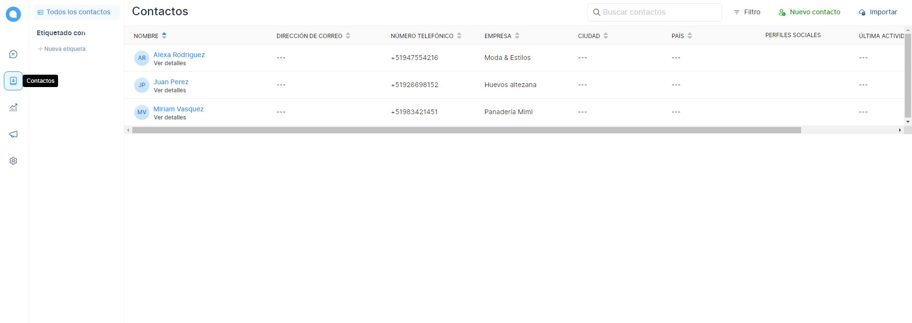
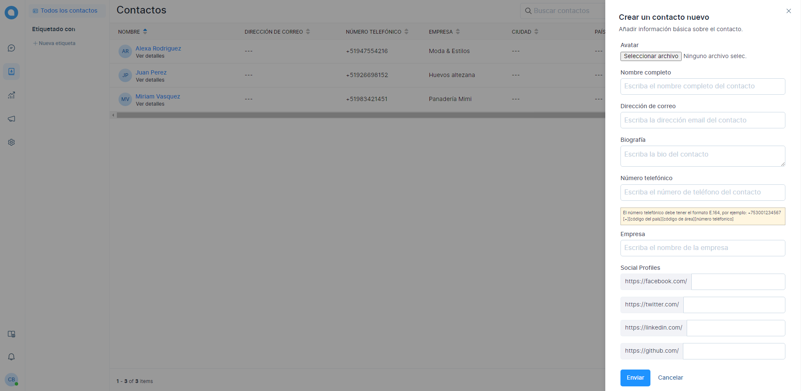

# Contactos

La sección de contactos en Chat Búho contiene los detalles de los usuarios finales/clientes con los que ha interactuado usando la plataforma de mensajería de Chat Búho. Puede considerarlo como una base de datos de clientes.

Selecciona el módulo **Contactos** en la pantalla de inicio.

Se abrirá una pantalla que tendrá los contactos (si ya están añadidos). Puedes crear un contacto nuevo, seleccionando el botón de **Nuevo Contacto**, ubicado en la parte superior derecha.

Se abrirá un formulario para **crear el nuevo contacto**, se deberán llenar los siguientes campos:

* **Avatar:** Permite subir una imagen.
* **Nombre completo:** Añade el nombre del contacto.
* **Dirección de correo:** Añade el correo o email.
* **Biografía:** Descripción del contacto. Opcional
* **Número telefónico:** Añade un número telefónico
* **Redes sociales:** Redes del contacto. Opcional

Luego selecciona el botón de **Enviar** para guardar y finalmente dirígete al módulo de **Contacto** donde verás todos los contactos añadidos.
