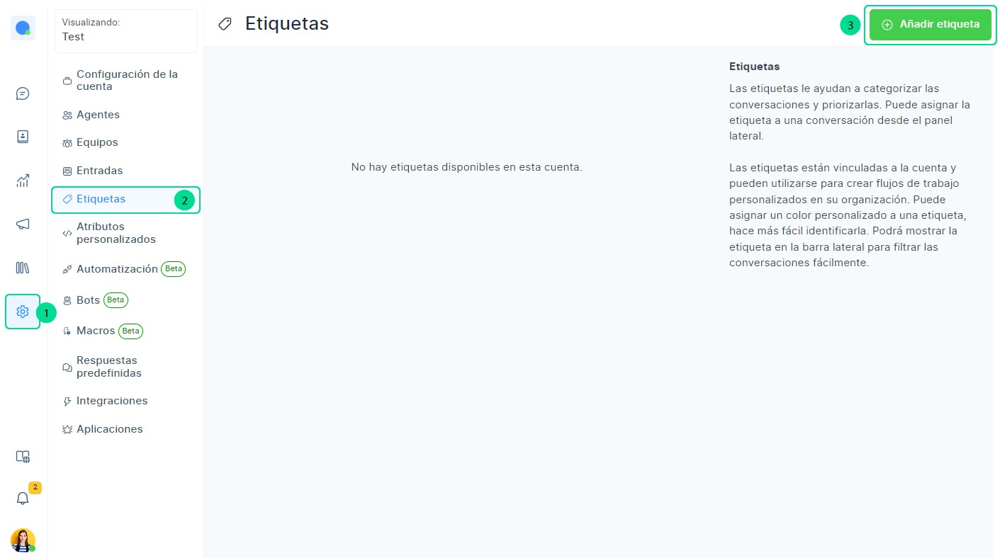
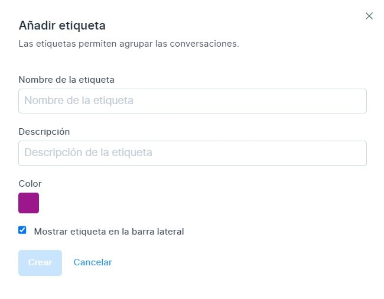
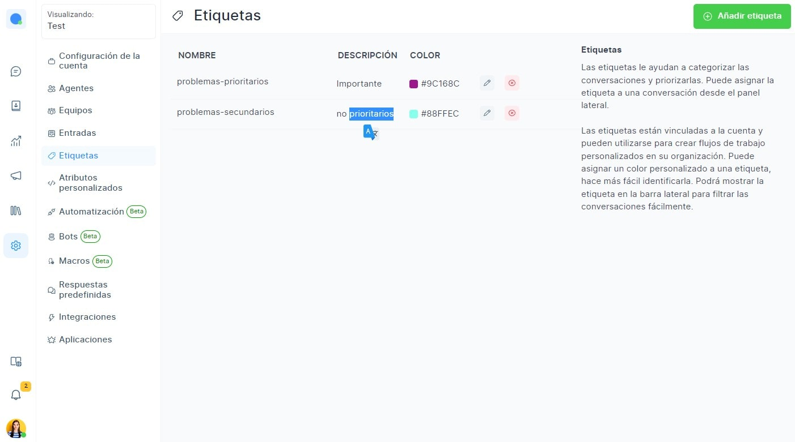

# Etiquetas

Las etiquetas te ayudan a **clasificar las conversaciones y a priorizarlas**. Puedes asignar la etiqueta a una conversación desde el panel lateral del chat.

Las etiquetas están vinculadas a la cuenta y se pueden usar para crear flujos de trabajo personalizados en su organización. Puede asignar colores personalizados a una etiqueta, lo que facilita la identificación de la etiqueta. Usted será capaz de mostrar la etiqueta en la barra lateral para filtrar las conversaciones rápidamente.

Para añadir etiquetas, haga clic en **Configuración** en la pantalla de inicio de Chat Búho. Posteriormente a **Etiquetas** y luego seleccionar el botón **Añadir Etiqueta.**

Visualizará en la imágen donde puede diseñar su propia etiqueta.

Al agregar más etiquetas, trate de darles nombres significativos, así como diferentes colores para mantener la distinción y la claridad.

|           Nombre del campo           	|                                      Valor                                      	|                                              Observaciones                                             	|
|:------------------------------------:	|:-------------------------------------------------------------------------------:	|:------------------------------------------------------------------------------------------------------:	|
| **Nombre de etiqueta**                   	| Asignar un nombre para la etiqueta para identificar la categoría.               	| Por ejemplo: Problemas-prioritarios solo alfabetos, números, guiones y guiones bajos están permitidos. 	|
| **Descripción**                          	| Dar una breve descripción de lo que representa la etiqueta.                     	| Por ejemplo: Este problema del cliente debe resolverse con prioridad.                                  	|
| **Color**                                	| Seleccione un color para la etiqueta para una fácil identificación.             	| Después de la selección haga clic en el cuadrado pequeño de nuevo.                                     	|
| **Mostrar etiqueta en la barra lateral** 	| Seleccione esta opción si desea que la etiqueta se muestre en la barra lateral. 	| Esto ayudará en la identificación fácil de las conversaciones                                          	|

Después selecciona el botón **Crear** y se mostrará el mensaje **etiqueta agregada correctamente.**

Tener en cuenta que puede crear tantas etiquetas como requiera y también lo pueden utilizar todos los equipos.

