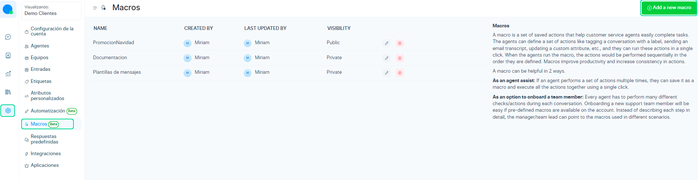
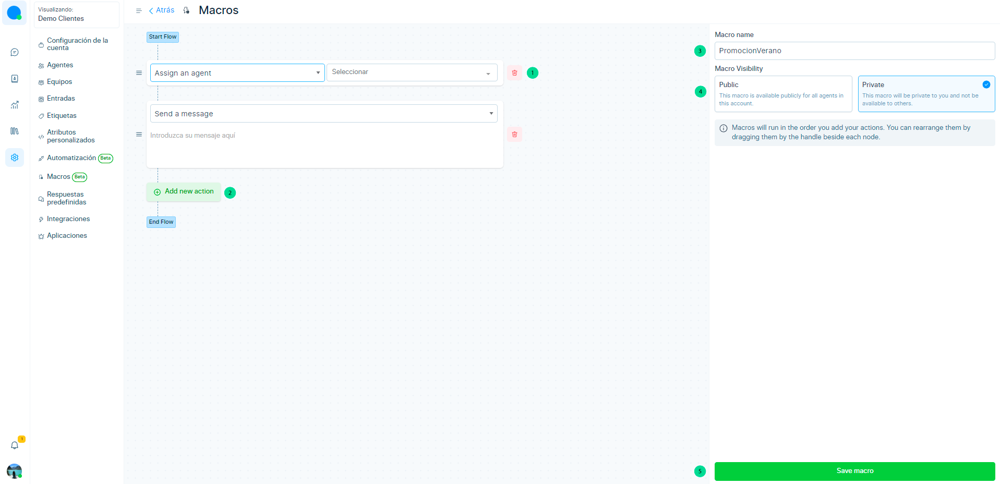
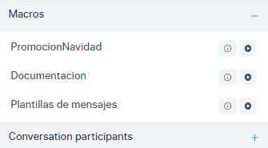

# Macros

En este artículo aprenderás a como utilizar la función de macros.

El macro es similar a respuestas predefinidas, en excepción que se pueden crear mensajes guardados de forma privada y tenerlos más accesibles ejecutandolo con un sólo click en play. ▶️

Para empezar a utilizarlo, tenemos que ingresar a **Ajustes > Macros > Add a new Macro**

Luego de seleccionar el botón de añadir **Nuevo macro**, se abrirá el siguiente formulario.

1.  Puedes iniciar seleccionando un primera acción, entre ellas tienes:

| Actions                 	| Acciones                                     	|
|-------------------------	|----------------------------------------------	|
| Assign a Team           	| Asignar a un equipo                          	|
| Assign a Agent          	| Asignar a un agente                          	|
| Add  a label            	| Añadir etiqueta                              	|
| Removed Assigned  Team  	| Remover asignación a equipo                  	|
| Send a email Transcript 	| Enviar una transacción de correo electrónico 	|
| Mute conversation       	| Mutear conversación                          	|
| Snooze conversation     	| Posponer conversación                        	|
| Resolve conversation    	| Resolver conversación                        	|
| Send Attachment         	| Enviar archivo adjunto                       	|
| Send a message          	| Enviar un mensaje                            	|
| Add private note        	| Enviar nota privada                          	|

2.  Además puedes añadir más acciones e ir construyendo el flujo del macro.

3.  Luego añade el nombre del macro.

4.  Selecciona si el macro será público o privado.

5.  Después selecciona el botón de Guardar Macro.

6.  Finalmente abré el chat del cliente y aparecerá la lista macros creados. Sólo deberás darle play y listo.

