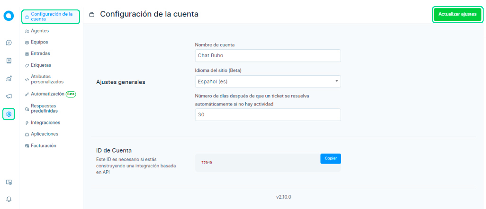

# Datos generales

En esta pantalla puede actualizar la información de su organización. Puede actualizar el nombre o el idioma utilizado en la cuenta cambiando la configuración como se muestra a continuación.

## Ajustes Generales
Para actualizar los detalles de la cuenta haga clic en **Configuración**,luego en **Configuración de la cuenta.**

Los ajustes disponibles se muestran a continuación.

| Nombre del campo                                                                            	| Descripción                                                                                                                                                                                                            	|
|---------------------------------------------------------------------------------------------	|------------------------------------------------------------------------------------------------------------------------------------------------------------------------------------------------------------------------	|
| Nombre de la cuenta                                                                         	| Introduzca el nombre de su cuenta, por ejemplo: Hopkins Inc.                                                                                                                                                           	|
| Idioma del sitio                                                                            	| Seleccione el idioma en el que deben producirse las conversaciones: Español (es) Selecciona el idioma Español si quieres que tus conversaciones sean en español                                                        	|
| Número de días después de que un ticket debe resolverse automáticamente si no hay actividad 	| Proporcione el número de días después de los cuales el ticket o la conversación se marcarán como resueltas, por ejemplo: 30: esto se da en caso de que el cliente no tenga más consultas pero no haya cerrado también. 	|
| Tu dirección de correo                                                                      	| Esta dirección de correo electrónico se utilizará para enviar notificaciones, usted estará utilizando esta dirección de correo electrónico para iniciar sesión en Chat Búho.                                           	|                                     	|   	|   	|   	|

Posteriormente seleccione el botón de **Actualizar ajustes** de la configuración en la parte superior derecha de la pantalla. Espere a que aparezca el mensaje **"Configuración de la cuenta actualizada con éxito".**