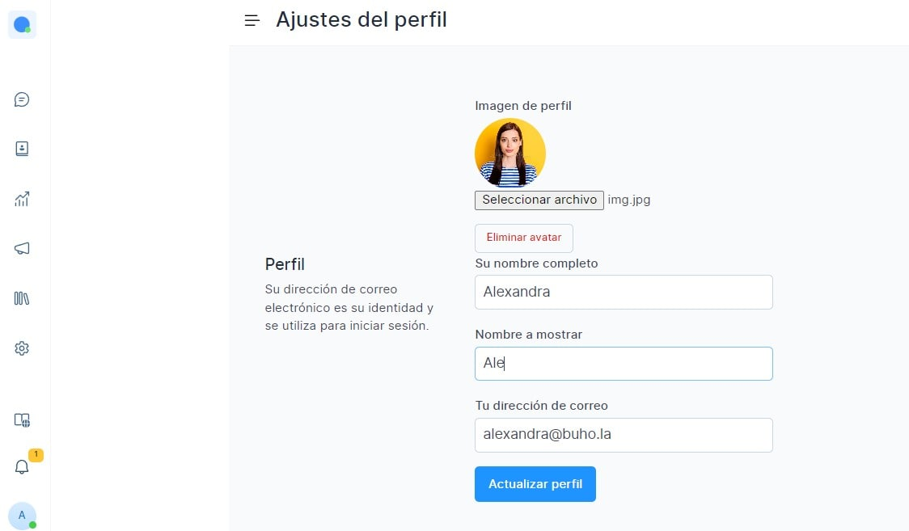

# Perfil de usuario

Asimismo puede cambiar su contraseña en esta página.

Puede encontrar en la sección **Ajustes del perfil**, ubicado en la esquina inferior izquierda de su tablero.

## Actualizar su perfil
Esta sección le ayudará a actualizar su perfil de agente en Chat Búho. Esta información actualizada se utilizará en el panel de control, en el widget de chat en vivo y en todos los correos electrónicos de comunicación externos.

Los campos del formulario se describen a continuación.

|    Nombre del campo    	|                                                                                  Descripción                                                                                 	|
|:----------------------:	|:----------------------------------------------------------------------------------------------------------------------------------------------------------------------------:	|
| Imagen de perfil       	| Una imagen cuadrada que se adapte a su perfil. Si no se proporciona ninguna imagen, entonces el sistema tomara avatar si está disponible.                                    	|
| Su nombre completo     	| Indique su nombre completo, por ejemplo: Alexandra Sanjines.                                                                                                                 	|
| Nombre a mostrar       	| Proporcione un nombre que desea que se muestre en el chat/ correos electrónicos, por ejemplo: Ale                                                                            	|
| Tu dirección de correo 	| Esta dirección de correo electrónico se utilizará para enviar notificaciones, usted estará utilizando esta dirección de correo electrónico para iniciar sesión en Chat Búho. 	|

:::danger IMPORTANTE:
Si actualiza su dirección de correo electrónico, el sistema cerrará la sesión. Debe volver a iniciar sesión con la dirección de correo electrónico actualizada y la contraseña.
:::