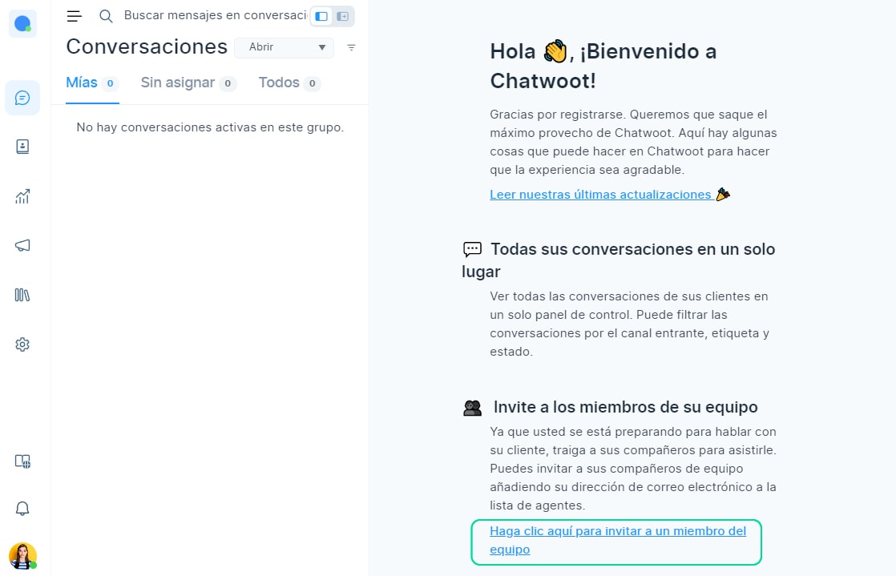
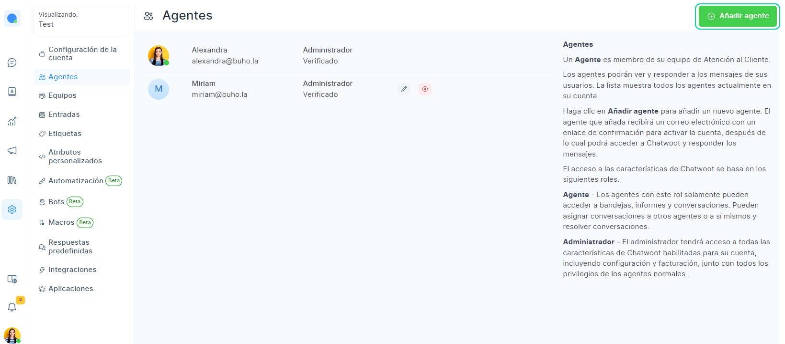
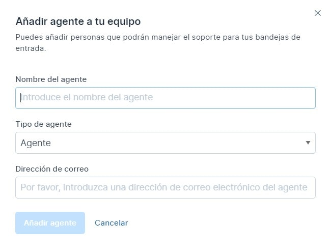
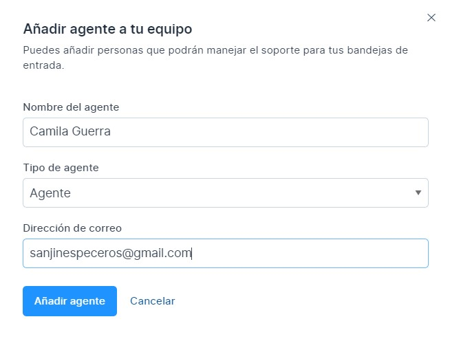

# Agentes
Un agente es miembro de su equipo de atención al cliente. Los agentes podrán ver y responder a los mensajes de sus usuarios.

Para agregar agentes a tu cuenta de Chat Búho, puedes usar el enlace **'Haz clic aquí para invitar a un miembro del equipo'.**

O también, puede hacer clic en **Ajustes > Agentes.**

Será redirigido a la página de **administración de Agentes** como se muestra a continuación.

Su Nombre será listado por defecto como Administrador,puede cambiarlo a agente en la sección de rol. Los administradores tienen acceso a todas las funciones de Chat Búho habilitadas para su cuenta, incluida la configuración.

Haga clic en el botón **Agregar** agente en la parte superior derecha.

Se abrirá una ventana emergente en la que puede ingresar los  siguientes detalles:

* **Nombre:** Nombre del agente
* **Rol:** Puedes escoger entre agente o administrador.
* **Dirección de correo electrónico:** Este es el correo que el agente usará para iniciar sesión en su cuenta de ChatBúho, llegará un correo de verificación,donde el agente creará la contraseña y podrá iniciar sesion.
  
  

|   Nombre del campo  	|                       Valor                       	|                                                                                                  Observaciones                                                                                                  	|
|:-------------------:	|:-------------------------------------------------:	|:---------------------------------------------------------------------------------------------------------------------------------------------------------------------------------------------------------------:	|
| Nombre del Agente   	| Introduzca el nombre del agente.                  	| **Ejemplo:** Camila Guerra.                                                                                                                                                                                         	|
| Tipo de Agente      	| **Introduzca el rol :** agente o administrador.       	| Los agentes solo pueden acceder a la bandeja de entrada, los informes y las conversaciones. Los administradores tienen todos los privilegios de los agentes y tienen acceso a todas las funciones de Chat Búho. 	|
| Dirección de correo 	| Ingrese el ID de correo electrónico que registró. 	| ejemplo@gmail.com                                                                                                                                                                                               	|  		

Haga clic en el botón **Agregar** agente para confirmar. Verá un mensaje **Agente** añadido correctamente. Este agente se alistará en su página de administración de agentes ahora.

También puede usar la opción de edición dada junto con el nombre del agente para cambiar los detalles.

En caso de que el agente en particular ya no colabore con usted, puede usar el botón de papelera para eliminar el agente del panel de control.

