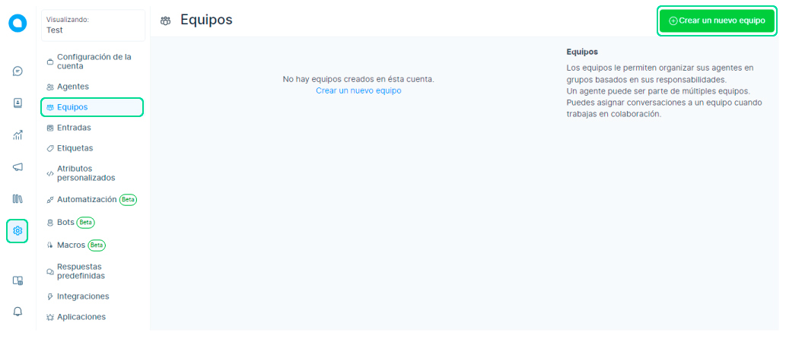
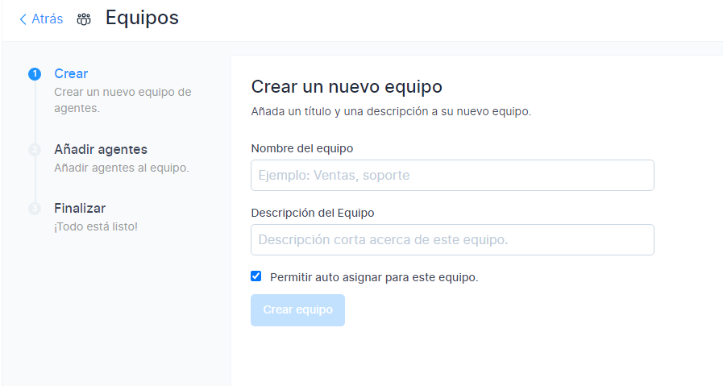
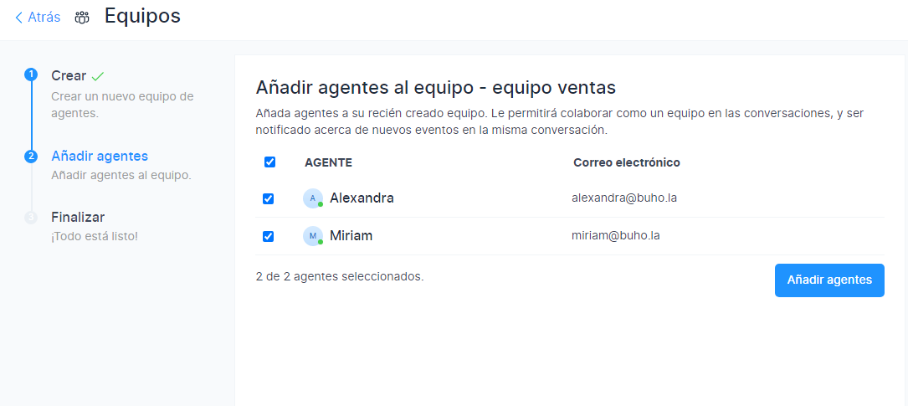
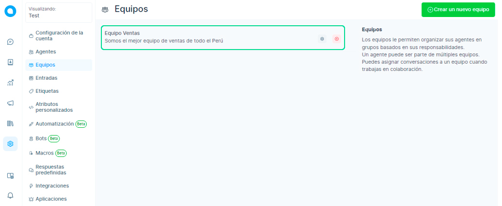

# Equipos

Los equipos le permiten organizar a sus agentes en grupos según sus responsabilidades. Un usuario puede formar parte de varios equipos. Puede asignar conversaciones a un equipo cuando trabaje en colaboración.

Para empezar a añadir equipos, vaya a **Ajustes → Equipos → Crear nuevo equipo.**

## Crear equipos
Verá la pantalla que se muestra a continuación:

* Añada equipos según sus necesidades.
* Cree equipos.
* Agrupe las **incidencias/tickets** en varios grupos de forma que los agentes asignados tengan que trabajar únicamente en los equipos correspondientes.

|     Nombre del campo    	|                                          Valor                                         	|                                        Observaciones                                       	|
|:-----------------------:	|:--------------------------------------------------------------------------------------:	|:------------------------------------------------------------------------------------------:	|
| Nombre del equipo       	| Casilla de verificación                                                                	| **Por ejemplo:** Ventas, Soporte                                                               	|
| Descripción del equipo  	| Dé una breve descripción del equipo                                                    	| **Por ejemplo:** Equipo para resolver consultas relacionadas con la venta de productos Hopkins 	|
| Casilla de verificación 	| Marque esta casilla si desea asignar automáticamente las conversaciones en este equipo 	| Si no se marca, la conversación permanecerá como no asignada.                              	|                                 	|   	|   	|

Haga clic en **"Crear equipo".**

## Añadir Agentes
* Cada vez que se asigne una conversación a este equipo, se notificará a todos los agentes añadidos.
* Seleccione las casillas de verificación de los agentes necesarios para este equipo.
* Haga clic en **"Añadir agentes"**. Sólo estos agentes podrán ver estos equipos en su pantalla.

## Finalizar

Haga clic en **"Finalizar"** en la siguiente pantalla. Asimismo podrás ver el equipo añadido a tu lista de equipos.
Además también podrás editar o eliminar este equipo cuando quieras.

