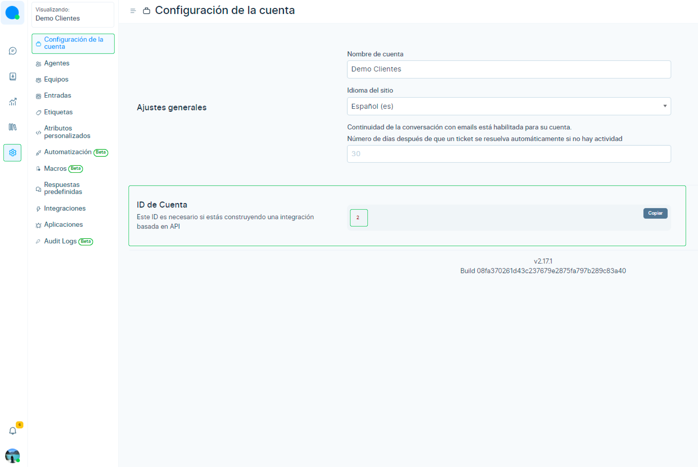
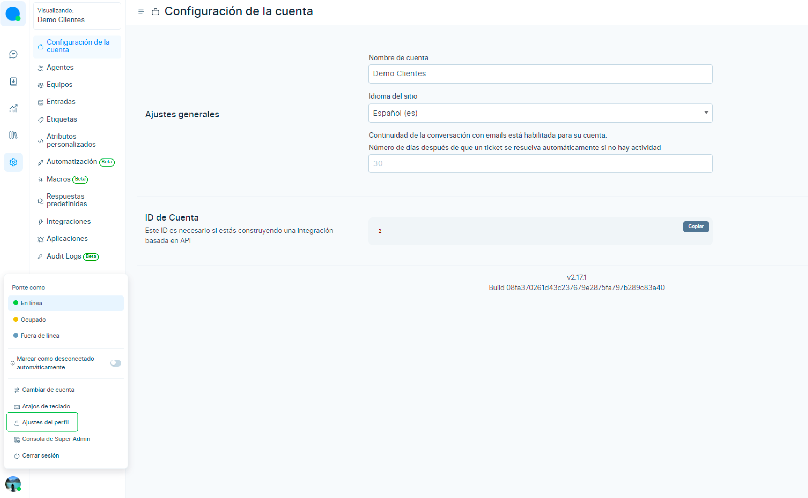
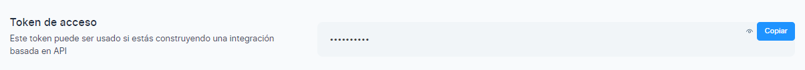
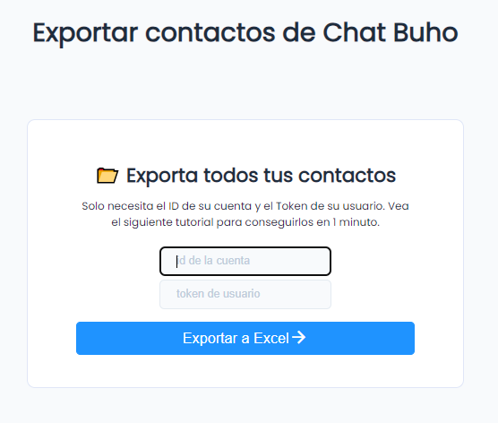

# Exportar contactos
 En este artículo te enseñaremos a cómo exportar tus contactos de manera masiva, usando nuestra plataforma de mensajería de **[Chatbuho](https://buho.la/chat)**

 <iframe width="100%" height="505" src="https://www.youtube.com/embed/HdropynsFcQ" title="YouTube video player" frameborder="0" allow="accelerometer; autoplay; clipboard-write; encrypted-media; gyroscope; picture-in-picture; web-share" allowfullscreen></iframe>

 ## Obtén datos de la cuenta
 Primero deberas obtener los siguientes datos:
- ID de la cuenta
- Token del Usuario

:::danger Importante
Recuerda guardar estos 2 datos, los volverás a usar cuando desees exportar contactos.
:::

### ID de la cuenta
 Para obtener este dato, dirígete a tu plataforma de Chatúho , e ingresa a **Ajustes ⚙️ > Configuración de la cuenta**, ubícate en la sección **ID de la cuenta** y selecciona el botón **Copiar**.

 
### Token de acceso
 Posteriormente, para obtener el **Token de acceso**, dirígete a **Ajustes de Perfil > Token de acceso ** 

 

Luego seleccionas el botón **Copiar**.

## Ahora sí, a exportar!

Luego de obtener todos los datos de la cuenta, dirígete a **https://chat.buho.la/export** y llena los campos de **ID de la cuenta** y **Token de usuario.**

Una vez ingresados los datos, selecciona el botón **Exportar a Excel** y se descargará automáticamente el archivo**(.xlsx)**.

:::info Recuerda
Solo se descargarán los contactos que estén guardados en el módulo **[Contactos](/docs/configuracion-adicional/Modulo-de-contactos.md)** y que tengan un número celular asociado.
:::