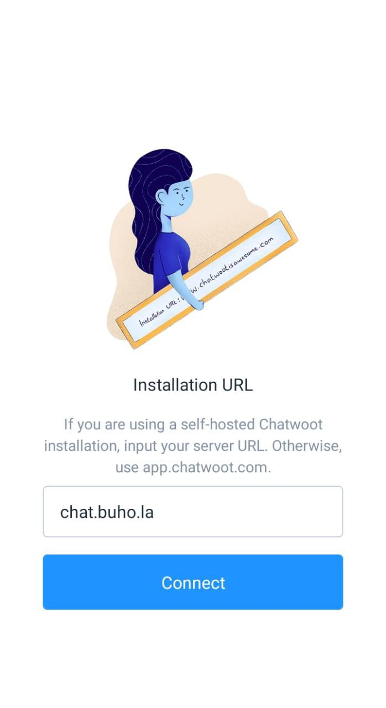
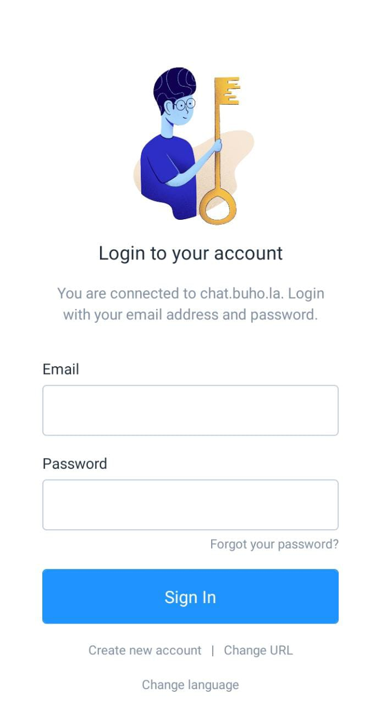

#  Instalar App

En este artículo aprenderás a como instalar la aplicación móvil de **[ChatBúho](https://buho.la/chat)**.

## 1.  Identificar tu sistema operativo
Nuestro aplicativo móvil está disponible para **Ios y Android**, identifica tu sistema operativo y descárgalo en las siguientes opciones:

* **Android:** Descárgalo en **[Google Play](https://play.google.com/store/apps/details?id=com.chatwoot.app&hl=en)**.
* **iOS:** Descárgalo en **[Apple Store](https://apps.apple.com/app/id1495796682)**.

:::info NOTA:

La App está optimizada sólo para celulares de gama media-alta.

:::

## 2.  Ingresa el URL
Para conectarte con la plataforma de **ChatBúho**, ingresa el siguiente URL: **chat.buho.la**, luego selecciona el botón **Conectar**.

## 3.  Ingresa a tu cuenta
Para conectarte con la plataforma de ChatBúho, ingresa tu correo eléctronico y contraseña, estos accesos se habrán creado previamente por nuestro equipo de soporte. Luego selecciona el botón Ingresar.

## 4.  Listo, comienza a gestionar tus conversaciones
Ahora podrás responder a tus clientes desde cualquier sitio en donde estés.

:::info NOTA:

El aplicativo móvil se encuentra aún en desarrollo, por lo que sólo cuenta con funcionalidades esenciales, asimismo sugerimos priorizar el uso de nuestra plataforma web **https://chat.buho.la.**

:::

