# Mensajes masivos usando el API de WhatsApp

WhatsApp Marketing con **Chat Buho (WAM)** es un servicio gratuito diseñado exclusivamente para nuestros clientes de **Chat Búho.** Esta solución práctica te permitirá aprovechar al máximo el envío de campañas de WhatsApp marketing a través del **API oficial de WhatsApp**, el cual ya está integrado en Chat Buho.

## Obtén los datos del API de WhatsApp

Para obtener los datos del API de WhatsApp, previamente debes tener creado el app y agregado el número celular, para saber como crearlo, visita el siguiente **[artículo](/docs/whatsapp-api-facebook/Pasos-para-la-integracion-de-WhatsApp-API.md)**.

Deberás obtener los siguientes datos:

* **ID número de teléfono** (ID del número), 
* **ID de la cuenta de WhatsApp Business**(ID de la cuenta de WhatsApp Cloud API)
* **Token** (que podrás encontrar dentro de tu cuenta de Chat Buho, accediendo a la bandeja de WhatsApp).

Primero ingresa a **[facebook developer](https://developers.facebook.com/)** con la cuenta relacionada a su **Página de Facebook**. y dirígete a la sección de **WhatsApp > Configuración de la API**

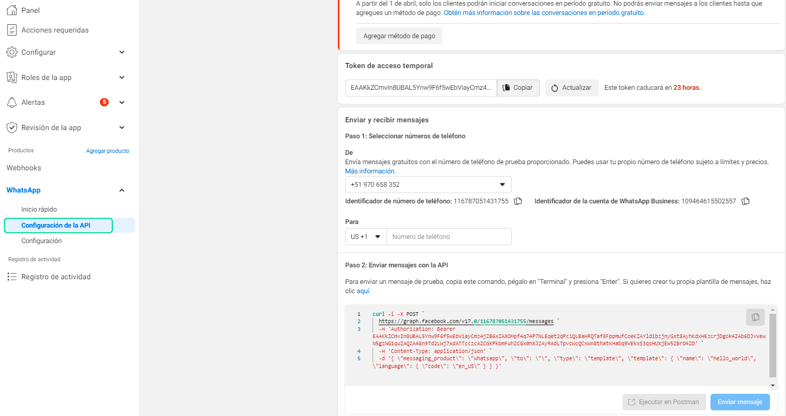

Posteriormente selecciona el número asociado a tu **WhatsApp API** y  aparecerá en la parte inferior el **ID del numero de teléfono**, como el **ID de la cuenta de WhatsApp Business.**

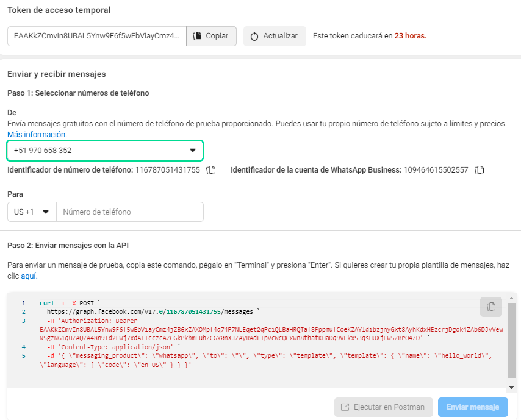

### ID número de teléfono

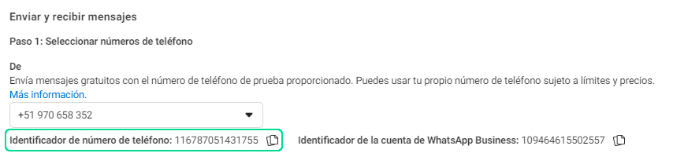

### ID de la cuenta de WhatsApp Business

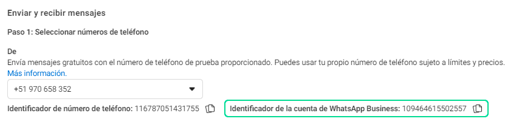

### Token

Para obtener el token, dirígete a nuestra plataforma **[chat.buho.la](https://chat.buho.la/)** e Inicia Sesión.
Después ingresa a **Ajustes ⚙️ > Entradas **

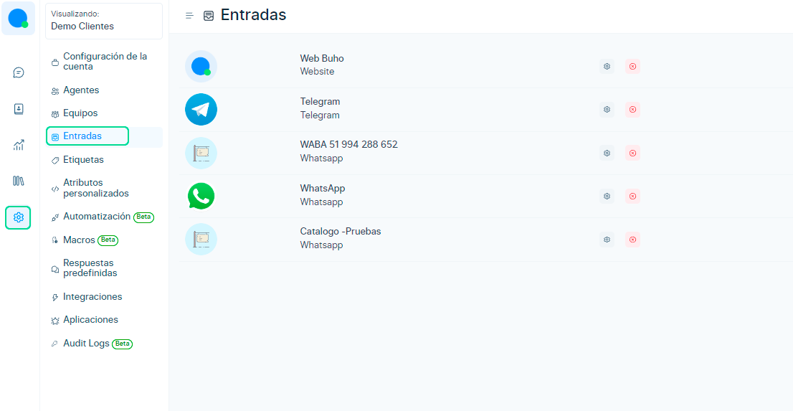

Luego selecciona tu bandeja de WhatsApp y haz click en **Ajustes** ⚙️

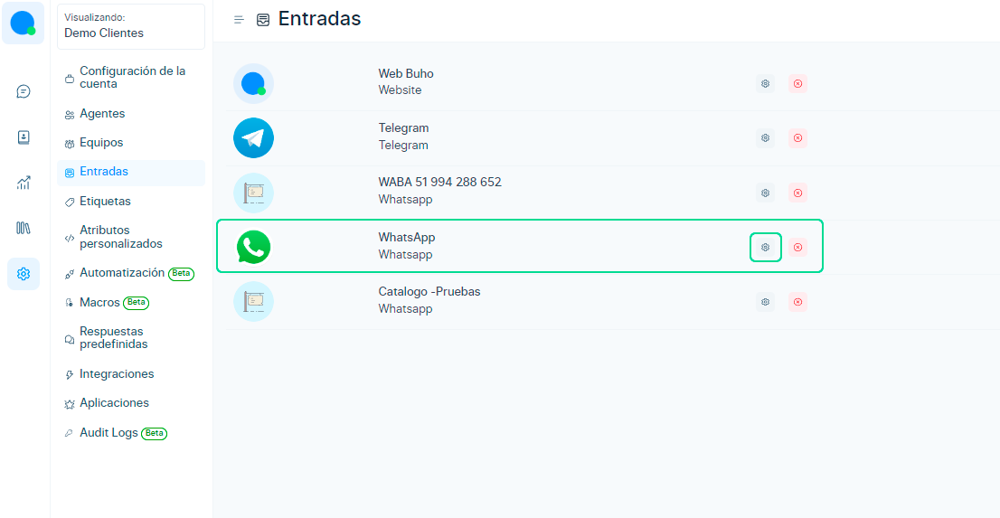

Una vez ingresado a la bandeja de entrada, selecciona la pestaña **Configuración > Clave API** y copia.

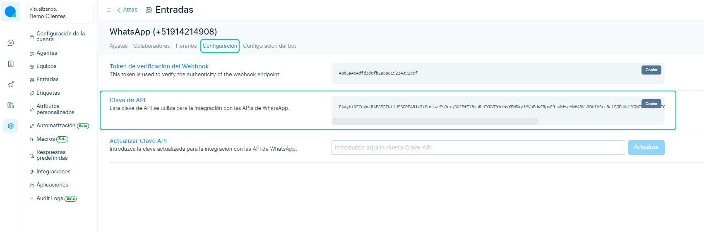

## Prepara tu base de datos
Posteriormente **crea un archivo de Excel** con los campos **name** (nombres) y **phone_number** (números de WhatsApp de tus destinatarios). Asegúrate de incluir el **código del país** **51XX-XXX-XXX** en el número y de eliminar cualquier signo o carácter especial.

La plantilla solo **aceptará 1 sola variable** que es el nombre del receptor.

**Ejemplo:**
**[Descargar excel de ejemplo](img/excel_ejemplo.xlsx)**

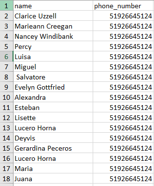

:::info NOTA
Para facilitarte el proceso, te ofrecemos la opción de **descargar** un ejemplo de Excel que puedes utilizar como referencia.

**[Descargar excel de ejemplo](img/excel_ejemplo.xlsx)**
:::

## Crea tu plantilla de WhatsApp
 * Es fundamental contar con una plantilla en idioma **SPANISH/ESPAÑOL** de WhatsApp aprobada antes de enviar tus campañas. 
 * Crea tu plantilla de WhatsApp, viendo este **[artículo](/docs/mas-articulos/Plantillas-para-mensajes-masivos.md)**.
 * La plantilla solo aceptará 1 sola variable que es el nombre del campo name en el excel de ejemplo.
  

:::info RECUERDA

 Que usarás el **nombre de la plantilla** que hayas creado previamente, para ingresarlo posteriormente en el formulario de Mensajes masivos.

:::
**Ejemplo:**
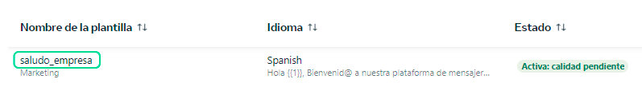

 ## ¡Es hora de comenzar a utilizar WAM! 
 Una vez realizado los puntos anteriores,sigue los siguientes pasos.

 1. Ingresa a **[chat.buho.la/wam](https://chat.buho.la/wam)**.

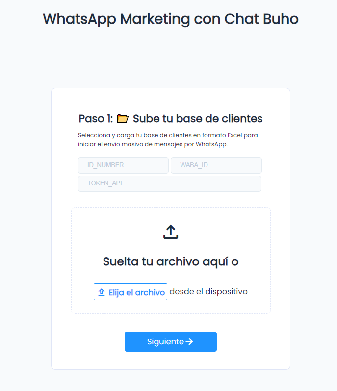

 2. Completa los datos solicitados 
   - **ID número de teléfono** = **ID_NUMBER**
   - **ID de la cuenta de WhatsApp Business**  = **WABA_ID**
   - **Token** = **TOKEN_API**

  Y sube tu base de datos de excel.

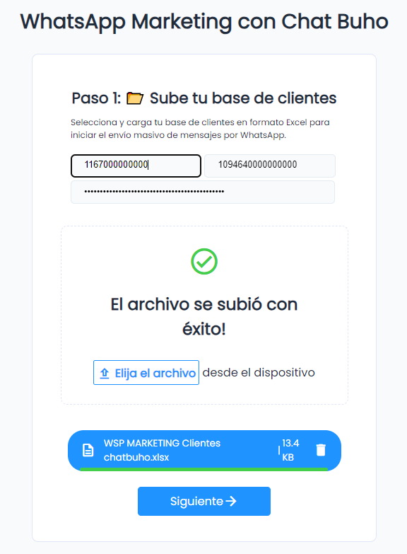

 1. Ingresa el nombre de la **plantilla** que has creado previamente, si desea añadir más texto a tu plantilla ingresalo en la sección **redacta tu mensaje**.

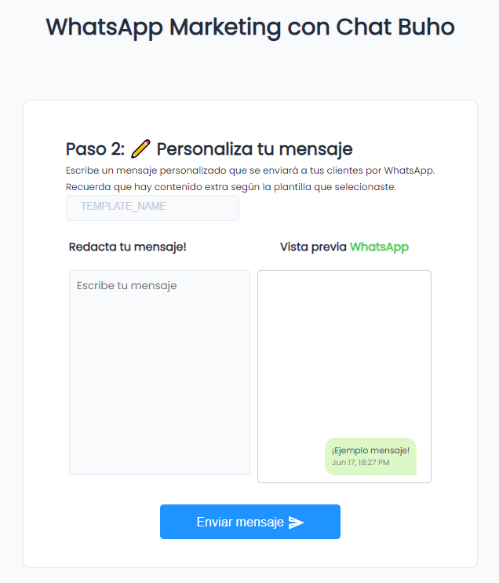

## Puntos importantes a considerar
* **Envío de Mensajes en Grupos:** Los mensajes se envían en grupos de 50 mensajes cada 2 segundos. Esta configuración garantiza una entrega eficiente y segura de tus campañas de WhatsApp Marketing.
* **Seguimiento de Entrega:** Dado que nuestro servicio está parcialmente integrado en Chat Buho, no es posible conocer el número exacto de mensajes que no llegaron a su destino. Sin embargo, si tu base de contactos está correctamente configurada y no envías spam, puedes tener la tranquilidad de que tu mensaje será entregado a todos tus contactos reales.
* **Registro de Respuestas:** Aunque no podrás ver los mensajes enviados directamente en Chat Buho, las respuestas de tus clientes seguirán llegando como de costumbre a Chat Buho. De esta manera, podrás dar seguimiento a las interacciones y mantener una comunicación fluida con tus clientes.
* **Costo por Mensaje:** Es importante tener en cuenta que WhatsApp **cobra aproximadamente S/0.20 por cada mensaje enviado**. Te recomendamos considerar este costo al planificar tus campañas de WhatsApp Marketing. Consulta las **[tarifas de plantillas de mensajes](https://developers.facebook.com/docs/whatsapp/updates-to-pricing)**.

:::danger IMPORTANTE
 Política de Uso Responsable de Mensajes Masivos por WhatsApp API, herramienta para enviar mensajes masivos por WhatsApp de manera eficiente y efectiva. Sin embargo, **es fundamental que todos los usuarios comprendan y respeten las políticas y restricciones establecidas por WhatsApp**.

WhatsApp tiene una política de tolerancia cero con respecto al envío de spam y mensajes no deseados. **No se permite el uso de nuestra plataforma para enviar mensajes masivos con fines de spam o para molestar a los destinatarios.** El envío de spam puede tener consecuencias graves y perjudicar tanto a los usuarios como a nuestra empresa.

Nosotros no respaldamos ni fomentamos el envío de spam en ninguna forma. Es responsabilidad de cada usuario utilizar nuestra plataforma de manera adecuada y ética, cumpliendo con las políticas de uso responsable.

Por favor, ten en cuenta que cualquier mal uso de nuestra plataforma será responsabilidad exclusiva del usuario. Nosotros no nos hacemos responsables por el uso inadecuado de la herramienta ni por las consecuencias legales o de otra índole que puedan derivarse.

**¡Gracias por ser parte de nuestra plataforma y por utilizarla de manera responsable!**
:::

