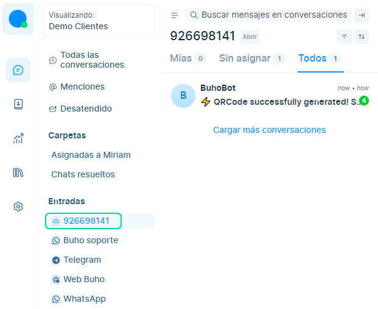
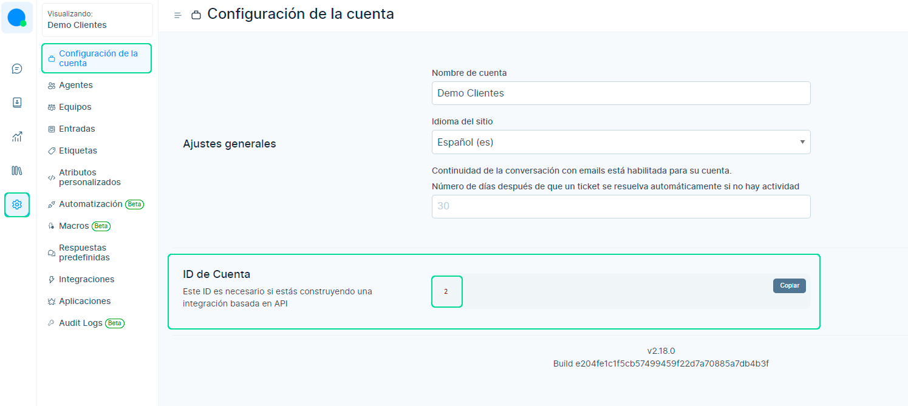
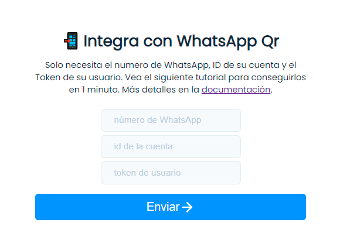
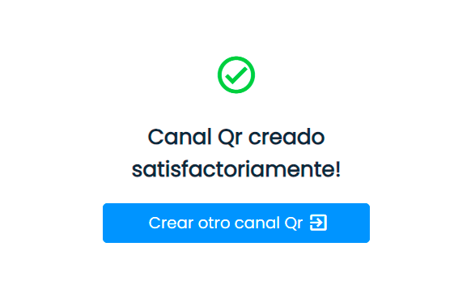
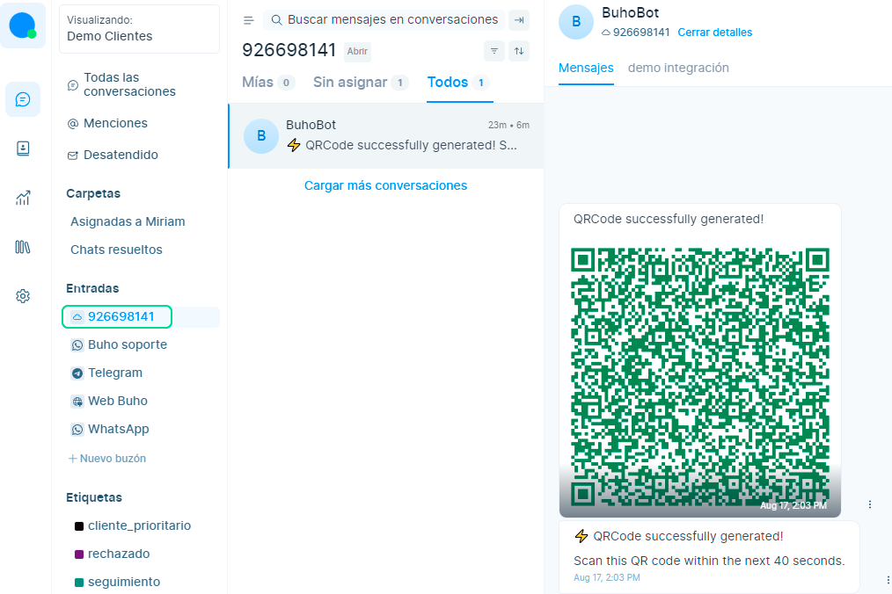

# WhatsApp Qr
En este artículo te enseñaremos a como conectar tu cuenta de WhatsApp con el código Qr.

 <iframe width="100%" height="505" src="https://www.youtube.com/embed/OWBae5VsZoc" title="YouTube video player" frameborder="0" allow="accelerometer; autoplay; clipboard-write; encrypted-media; gyroscope; picture-in-picture; web-share" allowfullscreen="allowfullscreen"></iframe>

## Obtén datos de la cuenta
Primero deberás obtener los siguientes datos:
* Numero de WhatsApp.
* ID de la cuenta.
* Token de usuario.

### Número de WhatsApp
Es el nombre de la bandeja de entrada, sugerimos colocar el número que conectarás. **Ejemplo: 926648515**

### ID de la cuenta
Para obtener este dato, dirígete a tu plataforma de Chatbúho , e ingresa a **Ajustes ⚙️ > Configuración de la cuenta**, ubícate en la sección **ID de la cuenta** y selecciona el botón **Copiar**.

### Token de usuario
Posteriormente, para obtener el **Token de acceso**, dirígete a **Ajustes de Perfil > Token de acceso**.

Luego seleccionas el botón **Copiar**.

## Listo, conéctate con Qr WhatsApp!
Luego de obtener todos los datos de la cuenta, dirígete al **[formulario de integración](https://static.buho.la/chat/qr/)** y llena los campos de **Número de WhatsApp**, **ID de la cuenta** y **Token de usuario.**

Una vez ingresados los datos, selecciona el botón **Enviar** y aparecerá el mensaje de **Conexión Qr Satisfactoria!**

Luego dirígete nuestra plataforma de mensajería **[https://chat.buho.la/](https://chat.buho.la/)**, y visualizarás la **bandeja de entrada** que creaste con el nombre ingresado en la sección número de WhatsApp.

Posteriormente, al seleccionar la bandeja de entrada visualizarás el siguiente mensaje de **BuhoBot**
**"⚡️ QRCode successfully generated!"**.

:::info RECUERDA
El código Qr tiene una vigencia de **40 segundos**, si no escaneaste el cógido durante ese lapso, se creará otro por defecto.
:::

 Escanea el código Qr con el dispositivo que conectarás a WhatsApp y **¡Listo!** aparecerá este mensaje de confirmación **"🚀 Connection successfully established!**.

