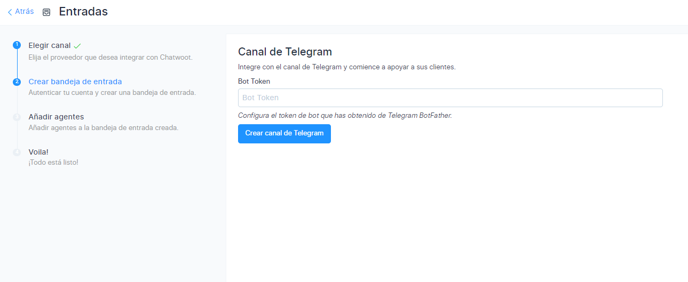
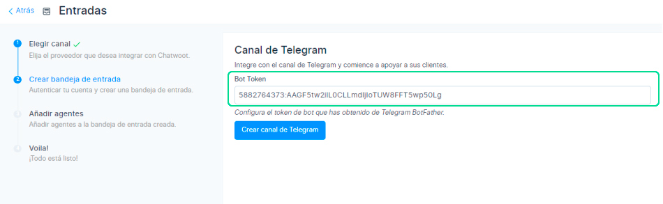
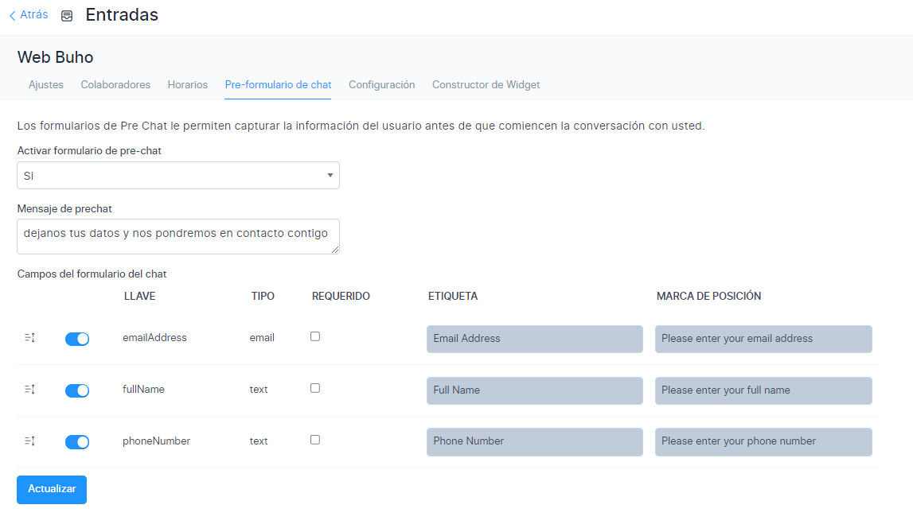

# Canal Website
En este artículo aprenderás como implementar el canal de Website en nuestra plataforma de **[Chat Búho.](https://buho.la/chat)**

## Módulo Ajustes
Primero ingresamos al módulo **Ajustes** ⚙️ luego a **Entradas.**

Después selecciona el botón **Añadir bandeja de entrada.**

## Elegir canal
En esta sección selecciona el canal **Website.**

## Crea bandeja de entrada
Ingrese el nombre de su sitio web, URL y otros detalles como se describe a continuación.

| Nombre del campo            	| Valor                                                       	| Observaciones                                                                       	|
|-----------------------------	|-------------------------------------------------------------	|-------------------------------------------------------------------------------------	|
| Nombre del Sitio Web        	| Ingrese el nombre de su sitio web                           	| **por ejemplo:** Ejemplo Inc.                                                           	|
| Dominio del sitio web       	| Ingrese el enlace a su sitio web                            	| **por ejemplo:** www.ejemplo.com                                                        	|
| Color del widget            	| Seleccione el color haciendo clic en la paleta              	|                                                                                     	|
| Encabezado de bienvenida    	| Dar un Saludo con el que te gustaría dirigirte al cliente   	| **ej.:** ¡Bienvenido!                                                                   	|
| Lema de bienvenida          	| Proporcione un eslogan que represente a su empresa          	| **por ejemplo:** ¡Bienvenido a Ejemplo! Estamos a su servicio 24x7                      	|
| Habilitar saludo de canal   	| Seleccione Activado o Desactivado                           	| Habilite para enviar un mensaje de saludo cuando el cliente inicie una conversación 	|
| Mensaje de saludo del canal 	| Da un saludo con el que te gustaría iniciar la conversación 	| **ej.:** Hola. como podemos ayudarte?     

Una vez ingresados ​​todos los detalles, haga clic en el botón **"Crear bandeja de entrada".**
                                              	|
## Agente
Luego de haber realizado los pasos anteriores, se debe de añadir a los agentes que formarán parte de su equipo de trabajo. Selecciona **Añadir agentes.**

Las conversaciones se enrutarán a los agentes solo si están asociados con la bandeja de entrada. Incluso si es un administrador, debe agregarse como agente a la Bandeja de entrada para ver la Bandeja de entrada en su pantalla.

Seleccione los **Agentes** del menú desplegable y haga clic en **Agregar agentes.** Si no se han agregado agentes, siga los pasos para  **[agregar agentes.](/docs/configuracion-inicial/03-agentes.md)**

## Voila, Todo listo!
La implementación a culminado, puedes dirigirte a más ajustes y podrás configurar las opciones importantes de tu bandeja de **Telegram.** Ahora, agregue el widget a su sitio web.

Copie y pegue el fragmento de código que se muestra en la página en su sitio web y comience a ayudar a sus clientes. Puede hacer clic en el botón **Copiar**  y luego pegar en el archivo raíz  de su sitio web.

## Actualizar Agentes
Selecciona el botón **Mas ajustes**, accederá a la configuración adicional de la bandeja de entrada. Si selecciona el botón Llevame allí, accederá directamente a la bandeja de entrada recién creada.

Si desea actualizar los agentes que tienen acceso a la bandeja de entrada, vaya a **Configuración → Bandejas de entrada → Colaboradores**. Allí podrá añadir o eliminar a los agentes.

## Configuraciones adicionales de la bandeja de entrada
En la pantalla Bandejas de entrada, seleccione el botón de ajustes para acceder a la página **Configuración**. Verá la siguiente pantalla:

## Sección Ajustes

Desplácese hacia abajo para ver más configuraciones, donde puede configurar las diversas notificaciones que le gustaría recibir cuando la bandeja de entrada de su sitio web comience a funcionar

Aquí hay un par de ejemplos para su comprensión:

* **Habilitar el cuadro de recopilación de correo electrónico** está habilitado de forma predeterminada. Esto significa que se mostrará un mensaje automático para recopilar la identificación del correo electrónico una vez que el cliente inicie una conversación. El cliente/usuario final recibirá un aviso para ingresar una identificación de correo electrónico.
* **Habilitar CSAT** . Una vez que habilite esto, su encuesta de satisfacción del cliente se iniciará cada vez que se resuelva un ticket. Los resultados de CSAT se pueden ver más adelante en la sección Informes.
  
Seleccione el botón **Actualizar** para guardar los cambios que ha realizado.

## Sección Horarios
En esta sección, puede establecer las horas de trabajo de su equipo.

Haga clic en la casilla de verificación **"Habilite la disponibilidad de atención para esta bandeja de entrada"** si tiene un horario comercial bien definido.

Una vez que se marca la casilla de verificación, se abre la siguiente sección. Puede escribir su mensaje para que se muestre al cliente fuera del horario comercial.

También puede seleccionar el horario comercial disponible para cada día de la semana, junto con la zona horaria adecuada.

Después seleccione el botón de **Actualizar.**

## Sección formulario previo al chat
Seleccione el botón Pre-formulario de chat.

Con esto, puede recopilar información sobre sus clientes tan pronto como ingresen a su ventana de chat en vivo/widget de sitio web. Puede usar esto para recopilar información del cliente, como el nombre y la dirección de correo electrónico, antes de comenzar el chat.

|                                             Nombre del campo                                            	|                                                     Valor                                                     	|                             Observaciones                            	|
|:-------------------------------------------------------------------------------------------------------:	|:-------------------------------------------------------------------------------------------------------------:	|:--------------------------------------------------------------------:	|
| Habilitar formulario previo al chat                                                                     	| Seleccione Sí o No                                                                                            	| Sí, si desea utilizar el formulario previo al chat. no si no quieres 	|
| Mensaje previo al chat                                                                                  	| Dar un mensaje para iniciar una conversación con el cliente                                                   	| Hola, necesitamos información para servirle mejor.                   	|
| Los visitantes deben proporcionar su nombre y dirección de correo electrónico antes de iniciar el chat. 	| Marque la casilla de verificación si necesita el nombre y la dirección de correo electrónico obligatoriamente 	| Esto nos ayudará a mantener mejor nuestra lista de contactos.        	|

Seleccione el botón **Actualizar.** El formulario previo al chat está habilitado ahora.

## Sección de configuración
Selecciona la pestaña **"Configuración".** En esta sección puede encontrar el fragmento de código que se copiará en el sitio web.

## Personalizar configuraciones
Puede personalizar el chatweb con la configuración simple que se proporciona en esta página. Podrás ver tus cambios en vivo.

