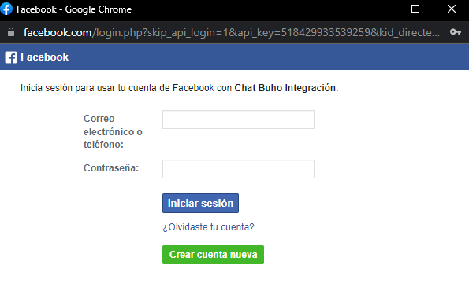

# Facebook Messenger
En este artículo aprenderás como implementar Facebook Messenger a nuestra plataforma de **[Chat Búho.](https://buho.la/chat)**

## Módulo Ajustes
Primero ingresamos al módulo **Ajustes** ⚙️ luego a **Entradas.**

Después selecciona el botón **Añadir bandeja de entrada.**

## Elegir canal
En esta sección selecciona el canal de **Facebook Messenger.**

## Crea bandeja de entrada
Luego selecciona **Continuar con facebook.**

Después ingresa con tu usuario y contraseña e inicia sesión.

Luego selecciona los casilleros de la páginas que añadirás a la plataforma y el botón **Siguiente.**

:::info RECUERDA:
Que puedes seleccionar más de una página para integrar.
:::

Posteriormente deja por defecto todas las opciones activas y seleccionar el botón **Listo.**

Aparecerá el siguiente mensaje y selecciona el botón **Aceptar**

Por consiguiente para culminar la creación de tu bandeja de entrada, deberás elegir la página a integrar seleccionando el botón desplegable, asimismo añade un nombre de la bandeja de entrada y selecciona el botón **Crear Inbox.**

## Agentes
Luego de haber realizado los pasos anteriores, se debe de añadir a los agentes que formarán parte de su equipo de trabajo. Selecciona **Añadir agentes.**

## Voila, Todo listo!
La implementación a culminado, puedes dirigirte a más ajustes y podrás configurar las opciones importantes de tu bandeja de **Facebook Messenger.**

