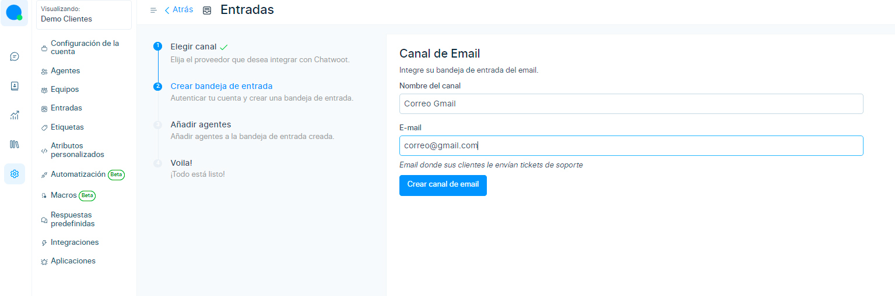
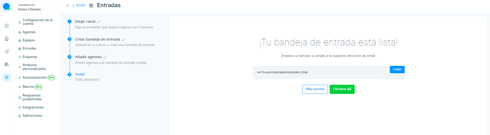

# Gmail/Outlook/Hotmail

En este artículo te enseñaremos a como realizar la implementación del correo **Gmail/Outlook/Hotmail** usando IMAP y SMTP con nuestra plataforma de mensajería de **[Chat Búho.](https://buho.la/chat)**

## Crear bandeja de entrada
Primero ingresamos al módulo **Ajustes** ⚙️ luego a **Entradas.**

Después selecciona el botón **Añadir bandeja de entrada.**

## Elegir canal
En esta sección selecciona el canal **Email.**

## Crea bandeja de entrada
Ingrese el nombre del canal de email, el correo electronico por donde enviará  y recibirá mensajes, y  luego **Crear canal de email.**

## Agentes
Luego de haber realizado los pasos anteriores, se debe de añadir a los agentes que formarán parte de su equipo de trabajo. Selecciona **Añadir agentes.**

## Voila, Todo listo!
Tu bandeja de entrada esta lista, puedes dirigirte a más ajustes y podrás configurar los puertos **IMAP** y **SMTP** de tu bandeja de entrada. 

## Activar IMAP
Luego ingrese a la bandeja de gmail / Configuración, habilite el check azul **IMAP** e ingrese los siguientes datos en los campos:

* **Dirección:** Ingrese **imap.gmail.com**
* **Puerto:** Ingrese el puerto **993** de gmail, si tuvieras outlook ingresa a este **[link](https://support.microsoft.com/es-es/office/configuraci%C3%B3n-del-servidor-que-necesitar%C3%A1-de-su-proveedor-de-correo-electr%C3%B3nico-c82de912-adcc-4787-8283-45a1161f3cc3)** para ver los puertos.
* **Iniciar sesión:** Ingresa tu **correo** donde recibirás los mensajes.
* **Contraseña:** Para **generar la contraseña de app de Gmail, ingresa a este** **[link](/docs/mas-articulos/Crear-contraseña-de%20aplicaciones-para-Gmail.md)** para realizarlo paso a paso. Copia la contraseña e ingresala en el campo. En caso que tengas el proveedor de correo como **Outlook**, deberás solo ingresar tu contraseña normal de inicio de sesión.

* **Activar SSL:** Active el check azul.
Luego de ingresar todos los datos selecciona el botón **Actualizar** ajustes **IMAP** para guardar.

## Activar SMTP
Posteriormente para enviar correos electrónicos debes habilitar **SMTP** e ingresar los siguientes datos en los campos:

* **Dirección:** Ingrese este dato smtp.gmail.com
* **Puerto:** Ingrese el puerto 587 de gmail, si tuvieras outlook ingresa a este **[link](https://support.microsoft.com/es-es/office/configuraci%C3%B3n-del-servidor-que-necesitar%C3%A1-de-su-proveedor-de-correo-electr%C3%B3nico-c82de912-adcc-4787-8283-45a1161f3cc3)** para ver los puertos.
* **Iniciar sesión:** Ingresa tu correo donde recibirás los mensajes.
* **Contraseña:** Ingresa la misma contraseña que se genero para el IMAP.
* **Dominio:** El dominio es gmail.com.
* **Cifrado:** Dejarlo por defecto en **STARTTLS.**
* **Modo de verificación SSL:** none
* **Autenticación:** login
Luego de ingresar todos los datos selecciona el botón **Actualizar ajustes SMTP** para guardar.

