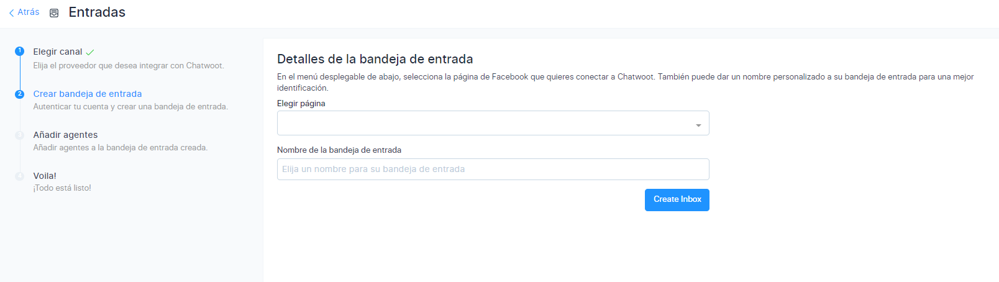

# Instagram Direct

En este artículo aprenderás como implementar Instagram Messenger a nuestra plataforma de mensajería de **[Chat Búho.](https://buho.la/chat)**

## Cuenta Empresarial
Primero, asegúrate que tu cuenta de instagram sea **comercial / profesional** y que la página de Facebook (fanpage) esté conectada a la cuenta de **Instagram**, si tu cuenta no es empresarial mira el siguiente **[artículo](/docs/mas-articulos/Cambiar-a-cuenta-empresarial-en-Instagram-Direct.md)** para realizarlo,caso contrario no se aplicará de forma efectiva la integración y no llegarán los mensajes.

## Conectar Instagram con Facebook
Debes ser administrador de la página de **Facebook**, dirígete a este **[link](https://www.facebook.com/pages/?category=your_pages)** para ver las páginas que administras.

Luego ingresa a la página que deseas conectar con **Instagram** y selecciona **Configuración** ⚙️

Luego a **cuentas vinculadas**

Finalmente, seleccione el botón **Conectar cuenta** y siga los pasos.

## Módulo Ajustes
Ingresa **https://chat.buho.la/** al módulo **Ajustes** ⚙️ luego a **Entradas.**

Después selecciona el botón **Añadir** bandeja de entrada.

## Elegir canal
En esta sección selecciona el canal de **Facebook Messenger.**

## Crea bandeja de entrada
Luego selecciona continuar con **Facebook.**

Después ingresa con tu usuario y contraseña e inicia sesión.

Luego, selecciona los casilleros de la **cuenta de instagram** que añadirás a la plataforma y el botón **Siguiente.**

Asimismo, selecciona los casilleros de la **cuenta de la página de Facebook** relacionada a la de Instagram, que añadirás a la plataforma y el botón **Siguiente.**

:::info RECUERDA:
Que puedes seleccionar más de una página para integrar.
:::

Posteriormente deja por defecto todas las opciones activas y seleccionar el botón **Listo.**

Aparecerá el siguiente mensaje y selecciona el botón **Aceptar.**

Por consiguiente para culminar la creación de tu bandeja de entrada, deberás elegir la página a integrar seleccionando el botón desplegable, asimismo añade un nombre de la bandeja de entrada y selecciona el botón **Crear Inbox.**

## Agentes
Luego de haber realizado los pasos anteriores, se debe de añadir a los agentes que formarán parte de su equipo de trabajo y que contestarán los chats. Selecciona **Añadir agentes**

## Voila, Todo listo!
La implementación a culminado, puedes dirigirte a más ajustes y podrás configurar las opciones importantes de tu bandeja de **Facebook Messenger.**

