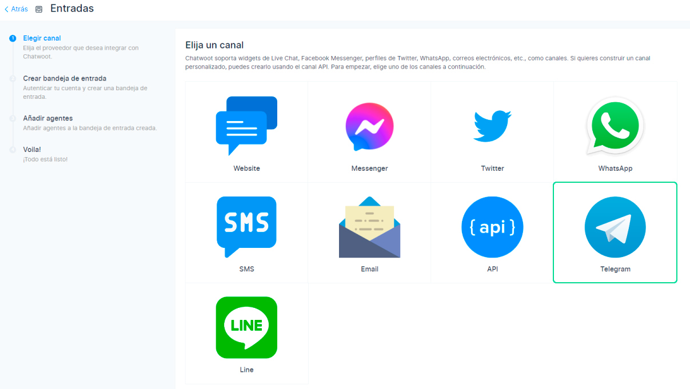
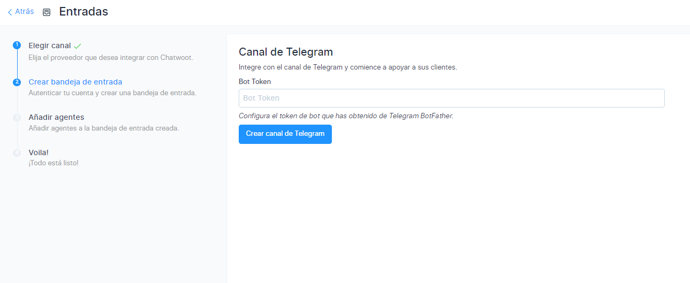
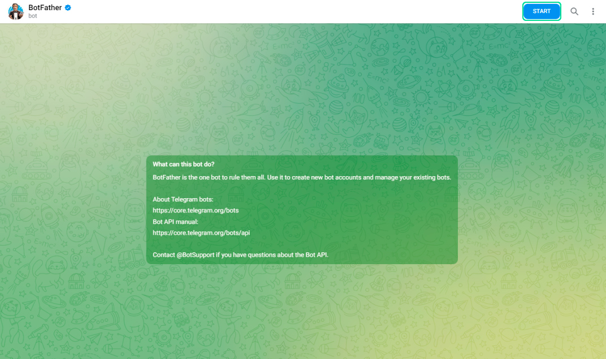
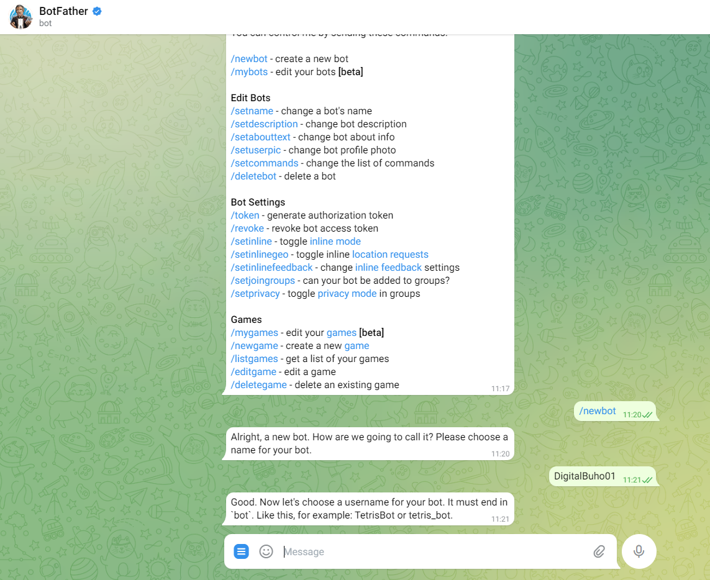
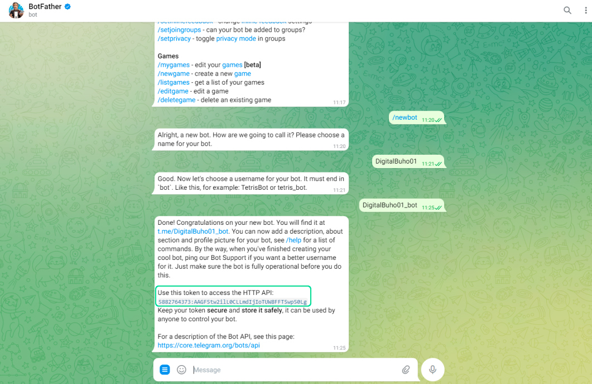
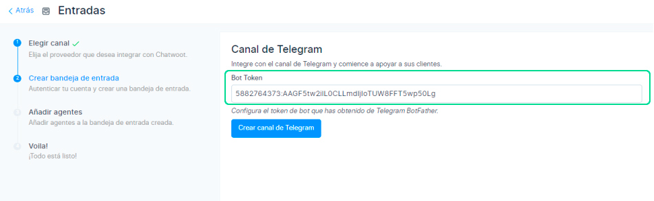
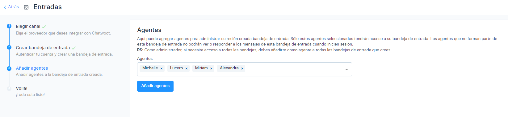
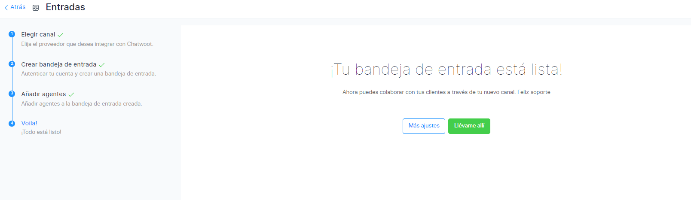

# Telegram
En este artículo aprenderás como implementar Telegram a nuestra plataforma de **[Chat Búho](https://buho.la/chat)**.

## Módulo Ajustes
Primero ingresamos al módulo **Ajustes** ⚙️ luego a **Entradas.**

Después selecciona el botón **Añadir bandeja de entrada.**

## Elegir canal
En esta sección selecciona el canal de **Telegram.**

## Crea bandeja de entrada
Luego crea el canal de **Telegram**, antes deberás ingresar a tu cuenta de Telegram para obtener el **Bot Token.**

## Obtener Token de Telegram con BotFather
Ingresa a tu cuenta de Telegram y busca BotFather que tenga el **check azul** de verificación.

Luego selecciona el botón **Start**, que está en la parte derecha superior.

Posteriormente selecciona **/newbot** para la creación del nombre en la integración de Telegram. Ingresa el nombre de tu empresa.

Ahora al nombre que se ha creado, se deberá colocar **_bot**, ejemplo: **DigitalBuho01_bot**

Luego te brindará el token para la implementación.

Agrega el token en la casilla **Bot Token** y luego selecciona crear canal de Telegram.

## Agentes
Luego de haber realizado los pasos anteriores, se debe de añadir a los agentes que formarán parte de su equipo de trabajo. Selecciona **Añadir agentes.**

## Voila, Todo listo!
La implementación a culminado, puedes dirigirte a más ajustes y podrás configurar las opciones importantes de tu bandeja de Telegram.

