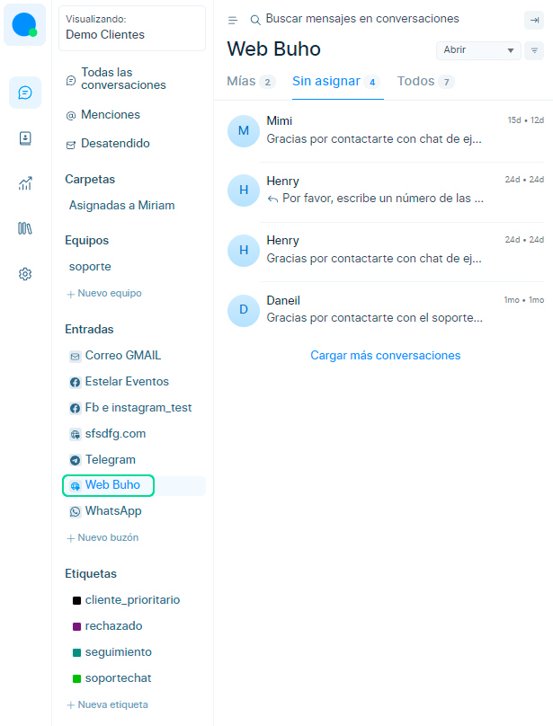
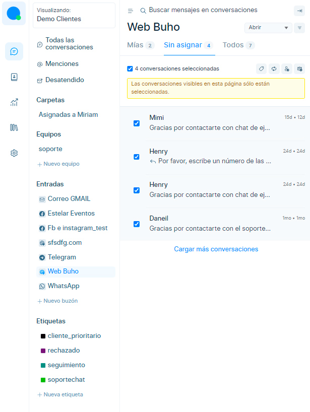
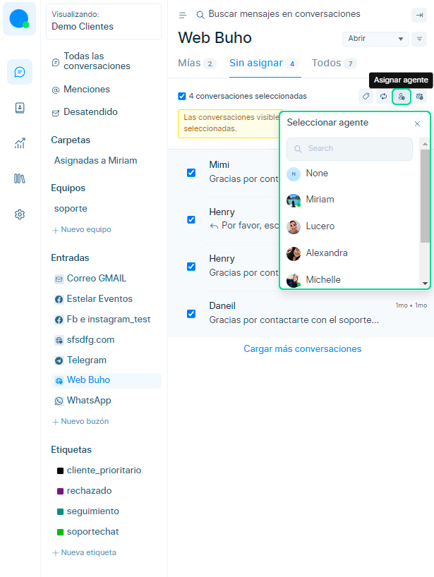

# Asignación masiva de chats

En este artículo aprenderás a como asignar los chats de forma masiva a tu equipo de trabajo y agentes.

## Selecciona el canal de chat
Primero deberás escoger e ingresar al canal de chat.

Dentro de las bandeja de entrada que seleccionaste, visualizarás 3 pestañas: **Mías / Sin Asignar / Todos.** Ingresa a la sección donde deseas aplicar la **asignación masiva.**

## Haz click en el cuadro de selección
Luego coloca el cursor encima de los chats y aparecerá un cuadro de selección, **haz check** en todos los chats que desees asignar de manera masiva.

## Selecciona al Agente
Posteriormente selecciona el **botón asignar y escoge al agente** que recibirá todos los chats de forma masiva.

:::info NOTA:

Se sugiere que esta función se utilice cuando los chats estan en la pestaña **Sin Asignar**, por ejemplo, en caso que los fines de semana o días no laborables, **no esten los agentes disponibles o en línea**, los chats ingresarán a la bandeja de entrada pero se ubicarán en la pestaña **"Sin Asignar"**, por ello sugerimos usar esta función cuando suceda esta casuística.

:::