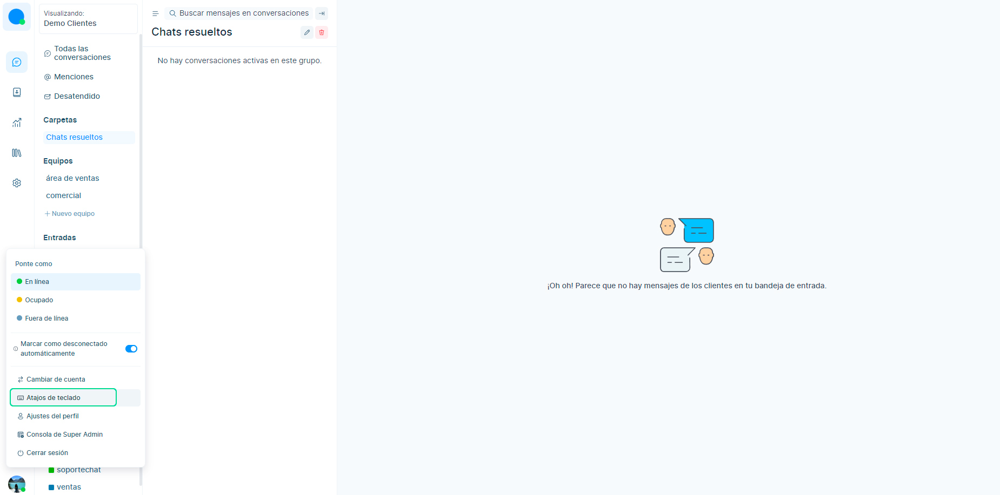

# Atajos de teclado
Chatbúho tiene varios atajos de teclado que realizan operaciones que te ayudan a navegar por los diferentes paneles y hacer que algunas acciones sean más eficientes con la ayuda del teclado.

Para mostrar una lista de atajos de teclado disponibles dirígete al menú desplegablen y selecciona **Atajos de Teclado**.

Aquí hay algunos atajos de teclado que usamos en Chatwoot:

|     **En Mac**     |     **En Windows**    |                                   **Descripción**                                  |
|:--------------:|:-----------------:|:------------------------------------------------------------------------------:|
| **⌥+J / ⌥+K**      | **Alt + J / Alt + K** | Abra una conversación o alterne (arriba y abajo) una conversación de la lista. |
| **⌘ + ⌥ + mi**     | **Ganar + Alt + E**   | Resuelve la conversación actual y abre la siguiente conversación.              |
| **Arriba / Abajo** | **Arriba / Abajo**    | Ayuda a navegar por los elementos desplegables hacia arriba y hacia abajo.     |
| **Opción + E**     | **Alt + E**           | Resuelve la conversación abierta actualmente.                                  |
| **Opción + C**     | **Alt + C**           | Vaya a la página del panel de conversación.                                    |
| **Opción + V**     | **Alt+V**             | Vaya a la página del panel de Contactos.                                       |
| **Opción + R**     | **Alt + R**           | Vaya a la página del panel de Informes.                                        |
| **Opción + S**     | **Alt + S**           | Vaya a la página del panel de Configuración.                                   |
| **Opción + A**     | **Alt + A**           | Agregue un archivo adjunto al editor.                                          |
| **Opción + O**     | **Alt + O**           | Alternar (abrir y cerrar) la barra lateral de conversación.                    |
| **Opción + N**     | **Alt + N**           | Pase a la siguiente pestaña en la lista de conversaciones.                     |
| **Opción + B**     | **Alt + B**           | Cambie al siguiente estado de conversación.                                    |
| **Opción + P**     | **Alt + P**           | Cambie a Nota privada en el editor.                                            |
| **Opción + L**     | **Alt + L**           | Cambie al editor de respuestas.                                                |
| **Opción + W**     | **Alt + W**           | Alternar editor de contenido enriquecido.                                      |
| **Opción + M**     | **Alt + M**           | Alternar (abrir y cerrar) el menú desplegable de repetición.                   |