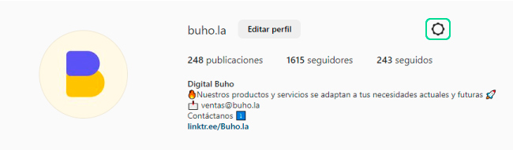
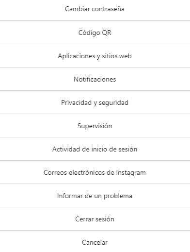
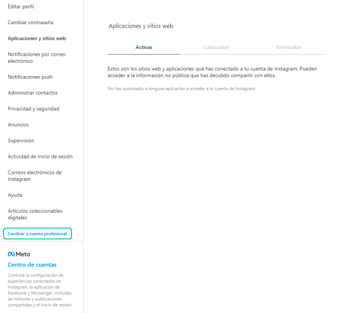
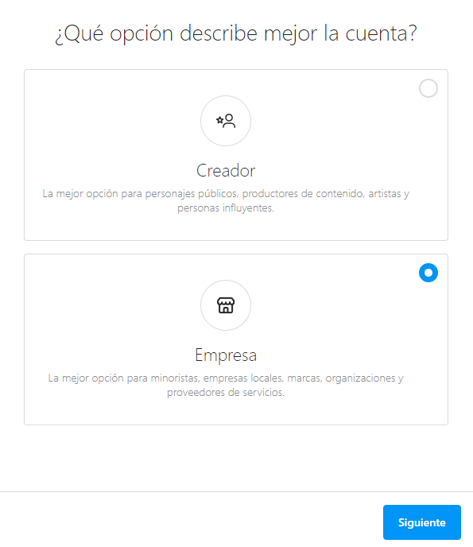
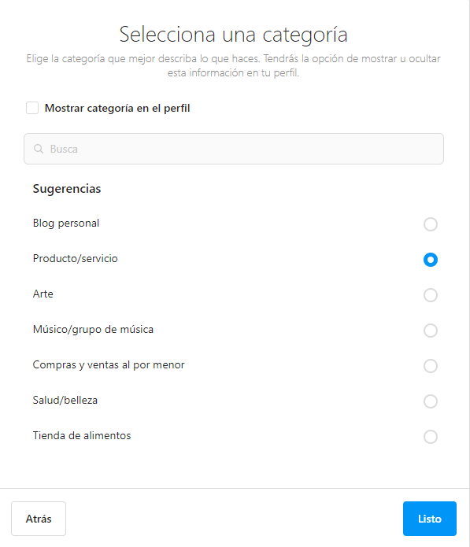
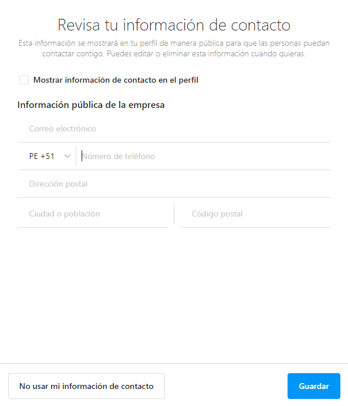
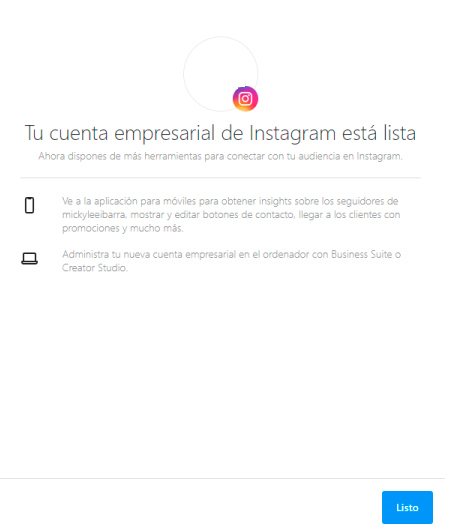

# ¿Cómo cambiarme a cuenta empresarial en Instagram Direct?

## Cuenta Empresarial

Primero, asegúrate que tu cuenta de instagram sea **comercial / profesional**, visualice esta **[guía detallada](https://help.instagram.com/502981923235522)** de instagram para realizarlo o siga estos pasos:

1. Sólo deberás ingresar al ícono de **configuración** ⚙️.

2. Después ingresar a **Aplicaciones y Sitios Web**.

3. Luego selecciona **Cambiar a cuenta profesional**.

4. Selecciona la cuenta de **Empresa**.

5. Selecciona la **Categoría** de tu empresa.

6. Agrega **información de contacto**.

7. **¡Listo!** Tu cuenta empresarial de Instagram ya está Lista.

:::info NOTA:
Puedes integrar tu canal de Instagram en nuestra plataforma de mensajería **[ChatBúho](https://buho.la/chat)**, realizándolo paso a paso en nuestro **[artículo](/docs/integraciones/instagram-direct.md)**.

:::
