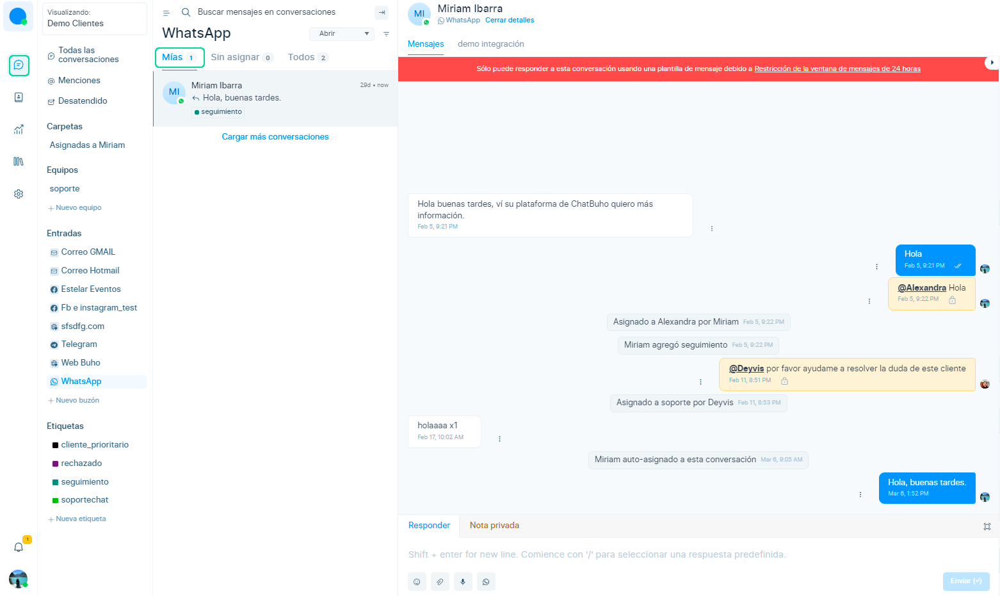
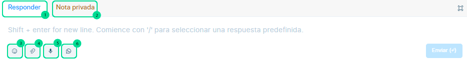
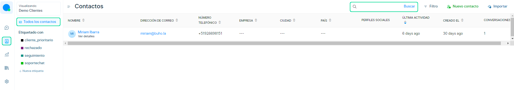
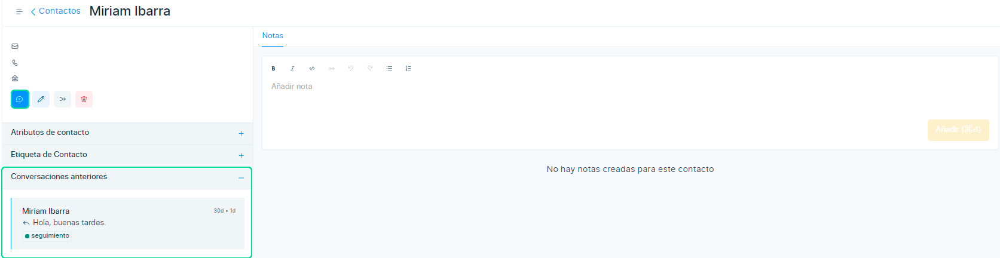
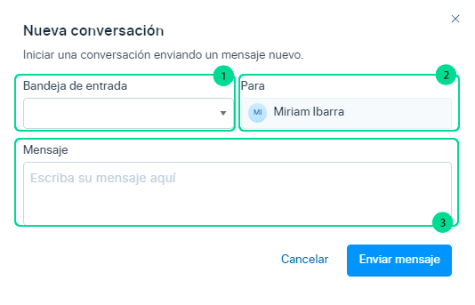
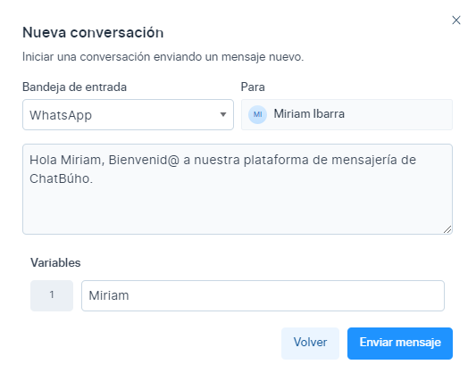
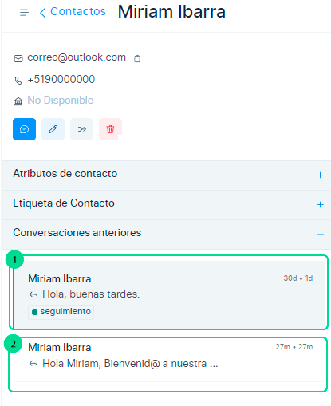
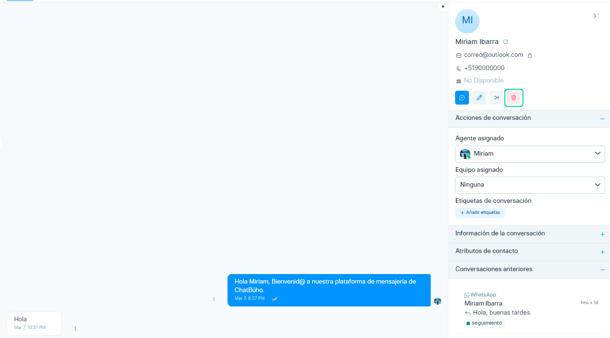

# Cómo funcionan las conversaciones: Características

En este artículo te enseñaremos como funciona el uso de las conversaciones y sus características.

## Conversación desde la sección del chat:

Las conversaciones que ingresan desde el chat y están asignadas a uno mismo, se verán en el módulo **Conversaciones > Mías**.

Cuando ingresamos a la sección **chat del cliente**, observaremos las siguientes opciones:

1. **Responder:** Escribe el mensaje que enviarás a tus clientes.
2. **Nota privada:** Etiqueta a tus compañeros de trabajo y envia un mensaje que solo lo visualizarán entre ustedes.
3. **Emoji:** Selecciona el emoji que añadirás a tu conversación.
4. **Adjuntar archivos:** Envía archivos(imágenes,documentos).
5. **Grabar audio:** Envía un mensajes de voz.
6. **Plantilla de WhatsApp:** Selecciona la plantilla para iniciar una conversación de WhatsApp que se haya cerrado pasada las 24 horas sin interacción. Revisa nuestro **[artículo](/docs/configuracion-inicial/05-Plantillas-de-mensajes.md)** para crear una plantilla.

## Conversación desde la sección del contacto:

Para crear la conversación con el cliente, seleccionamos el módulo **Contactos > Todos los contactos > Buscamos el contacto.**

:::info RECUERDA:

Un contacto se guardará dentro del módulo de contactos, solo sí se le añade un **correo electrónico o número telefónico**.

:::

Posteriormente selecciona el nombre el contacto, te aparecerán los datos del contacto y el historial de conversaciones anteriores.

Luego selecciona el ícono azul de **Nueva conversación**.

Y visualizarás un formulario y las siguientes secciones enumeradas:

1. **Bandeja de entrada:** Selecciona el canal de correo electrónico o WhatsApp (Selecciona la plantilla de mensaje).
2. **Para/Destinatario:** A quien enviarás el mensaje.
3. **Mensaje:** Ingrese el texto a enviar.

Luego seleccione el botón **Enviar Mensaje** y se habrá creado una nueva conversación.

Visualizaremos las siguientes secciones enumeradas:

1. Esta es la conversación antigua iniciada por el cliente y se mantendrá dentro del historial de conversaciones.

2. Esta en la nueva conversación creada,  y es donde se recibirán las nuevas conversaciones a partir de ahora.

:::info NOTA:

El historial de conversaciones no se podrá eliminar, en excepción que desee **eliminar** el contacto, borrando en su totalidad la información y conversacion con el cliente.

:::

