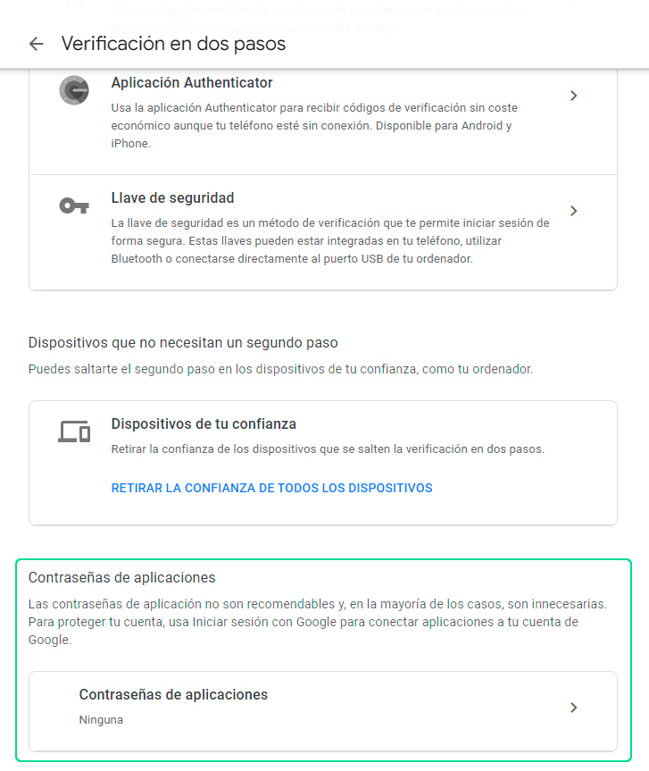
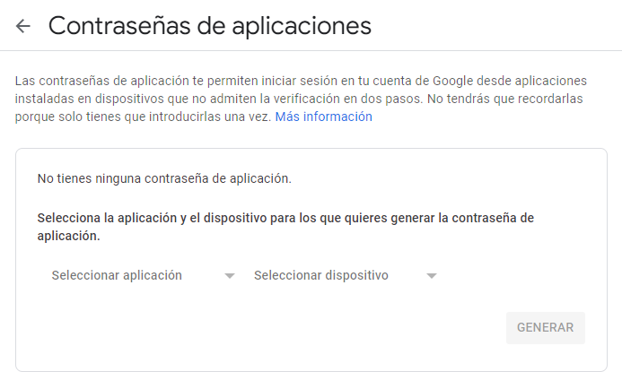
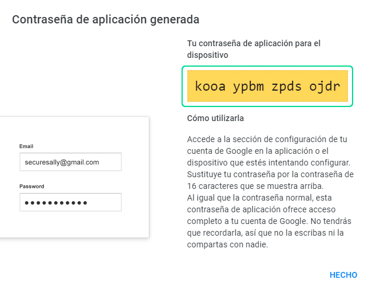

# Cómo crear contraseña de aplicaciones para Gmail

En este artículo te enseñaremos a como crear la contraseña de aplicaciones para Gmail, asimismo podrás integrar tu correo con nuestra de plataforma mensajería de **[Chat Búho](#https://buho.la/chat)**.

## Ingresa a tu cuenta de google

Primero deberás ingresar a tu cuenta de google relacionado al Gmail que deseas integrar, ingresando a este link **[https://myaccount.google.com/]( https://myaccount.google.com/)**

Después selecciona la sección de **Seguridad**.

## Verificación en dos pasos

Para crear la contraseña de aplicación es muy importante activar la verificación de dos pasos, por defecto esta desactivada.

Luego te aparecerá esta ventana, selecciona el botón **Empezar**.

Después deberás verificar tu cuenta, ingresando la contraseña del correo electrónico para poder continuar.

Posteriormente, deberás añadir un número celular ejemplo  **(+51) XXX XXX** como opción de seguridad, luego selecciona como quieres obtener el código de seguridad, mediante **mensaje de texto o llamada telefónica**. Luego selecciona el botón **Envíar**.

Después, te llegará el codigo de verificación y deberás ingresarlo. Selecciona el botón **Siguiente**.

Finalmente, selecciona el botón **Activar**.

## Crea la contraseña de aplicación

Luego de haber realizado los pasos anteriores y haber activado la verificación de 2 pasos, te redirigirá a esta página, donde encontrarás la sección **Contraseña de aplicaciones**. Selecciona la opción.

Después, te aparecerá esta ventana, con los siguientes campos:

- Seleccionar aplicación: Coloca la opción **Otro (Nombre personalizado)**

Posteriormente ingresa el nombre de la aplicación, que es **ChatBúho** y selecciona el botón **Generar**.

Finalmente se habrá creado la contraseña de la aplicación en Gmail, copia el código que esta en el recuadro amarillo y utilizalo para la [integración de email](/docs/integraciones/gmail-outlook-hotmail.md) con ChatBúho.

:::info NOTA

Conoce cómo integrar tu correo gmail a nuestra plataforma de **[Chatbúho](https://buho.la/chat)**. Lee nuestro **[artículo](#)**.

:::
