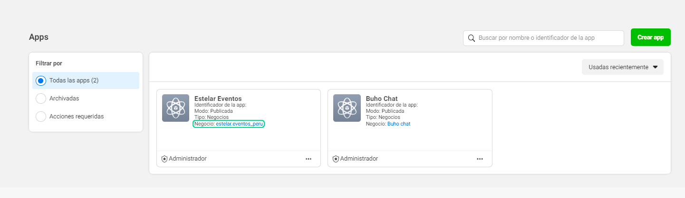
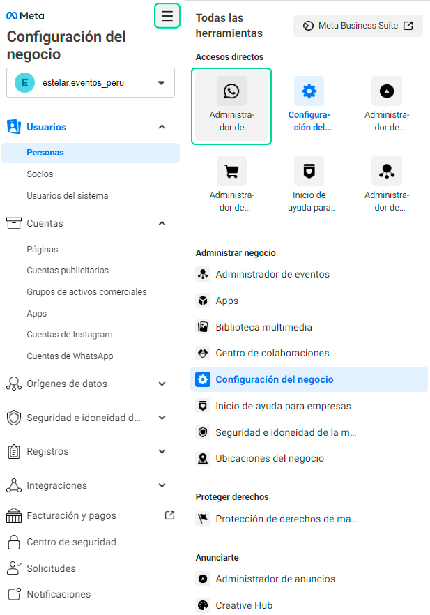
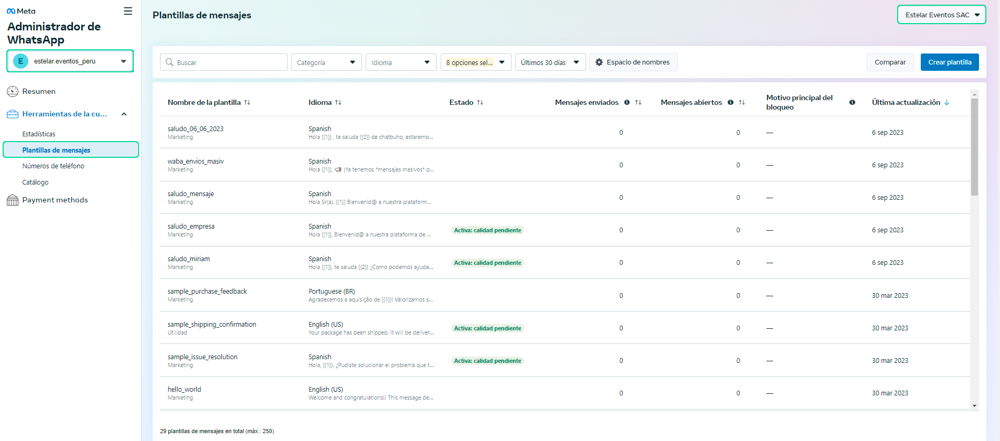
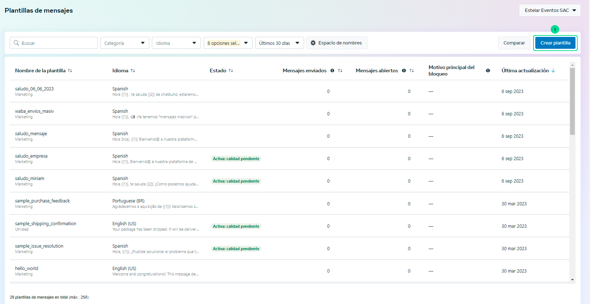
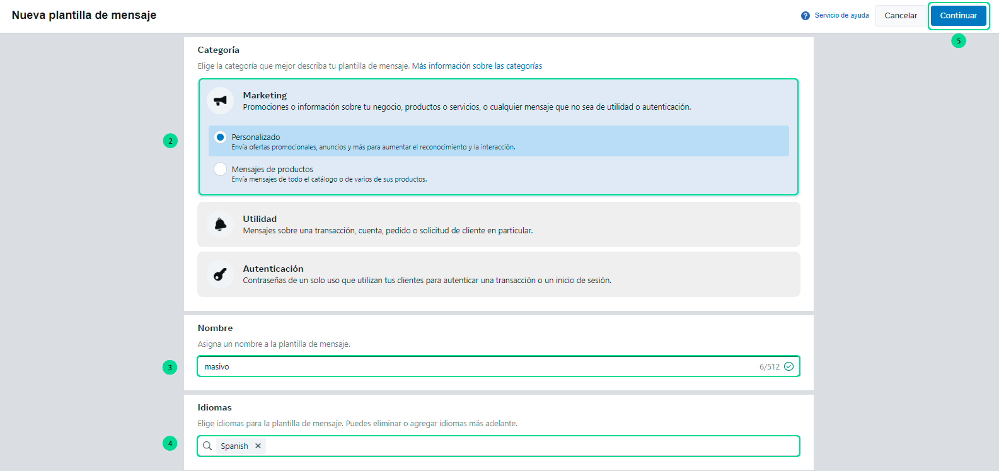
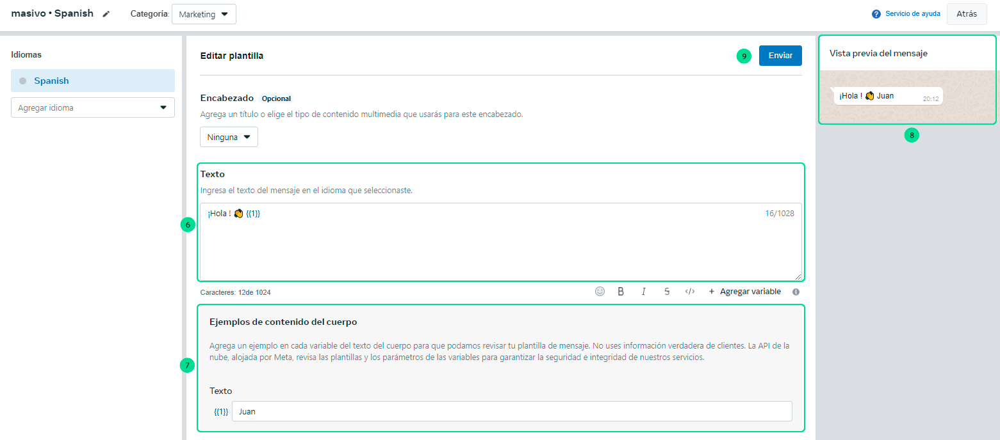
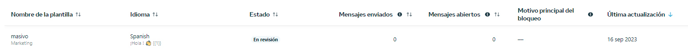
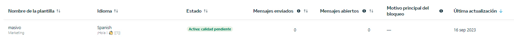

# Plantillas para mensajes masivos

En este artículo te enseñaremos a como crear tu plantilla de mensajes que utilizarás para enviar mensajes masivos en **[https://chat.buho.la/wam](https://chat.buho.la/wam)**

### 1. Ingresar a Facebook Developers

Ingresa a este link **[Facebook developer](https://developers.facebook.com/?locale=es_ES)**.
Visualizarás la página de Facebook Developers y se ingresará a My Apps, en caso de no tener una cuenta creada, en la misma ubicación aparecerá un botón de **Iniciar, Empezar o GeT Started**, que se deberá seleccionar para crear la cuenta de facebook developers.

Regístrese con su cuenta de Facebook relacionada a su Página de Facebook.

### 2. Ingresa al negocio

Luego ingresa al negocio de tu aplicativo que esta en **texto azul**.

### 3. Ingresa al administrador de WhatsApp

Luego redigirá a la configuración del negocio y deberás ingresar al icono de todas las herramientas **>** **Administrador de WhatsApp**

### 4. Selecciona el negocio
Primero deberá seleccionar el negocio **>** luego ubicarte en **plantillas de mensajes** **>** después selecciona la **cuenta de whatsapp (número de integración)**

### 5. Crear plantilla

Por consiguiente para crear la plantilla, sigue estos pasos:

1. Selecciona el botón **Crear plantillas**.

2. Selecciona la categoría **Marketing > Personalizado**.
3. Ingresa el nombre de la plantilla, sugerencia: **masivo**
4. Selecciona el idioma **Spanish**, no otro tipo de español.
5. Seleciona el botón **Continuar**.

6. En la sección de texto, te sugerimos añadas lo siguiente, un saludo y una variable : **¡Hola ! 👋 {{1}}**
7. En ejemplos de contenido del cuerpo, coloca un nombre para previsualizar el uso de la plantilla.
8. En vista previa del mensaje visualizarás el ejemplo.
9. Luego selecciona el boton **Enviar**.

:::info ¿QUÉ ES UNA VARIABLE?
Una variable se utiliza para almacenar información, el  **{{1}}** será reemplazado por el texto que coloque ahí y es modificable.
:::
    

1.  Confirma el idioma **Spanish**.
    

11.  La plantilla estará en **estado de revisión**.

12.  Finalmente en un tiempo aproximado de **24 horas** visualizará el estado de la plantilla en activo.
    
    
  

Listo, ya puedes usar la plantilla para tus **[mensajes masivos](/docs/herramientas-adicionales/Mensajes-masivos.md )**.

