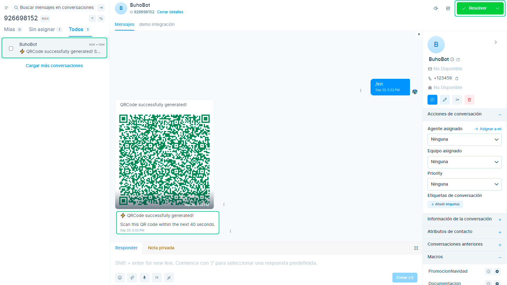
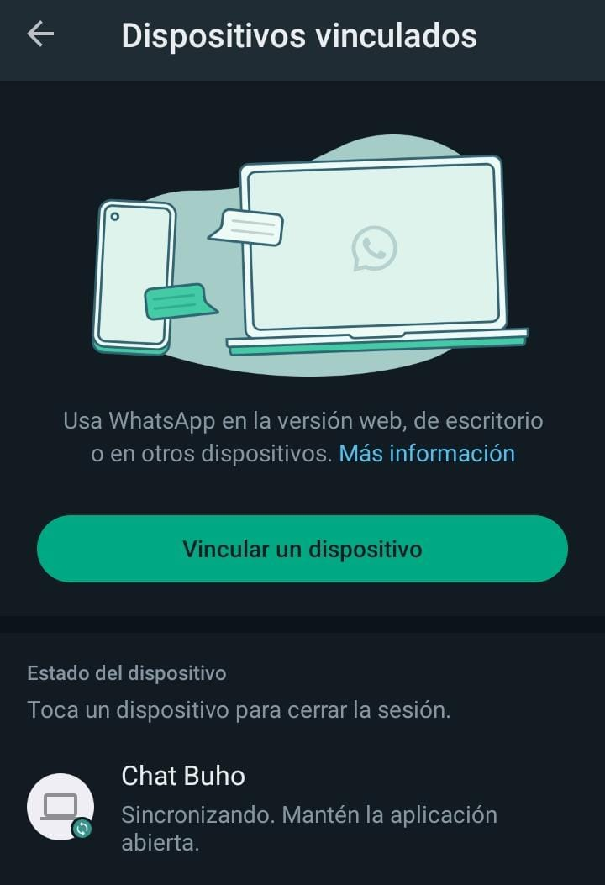
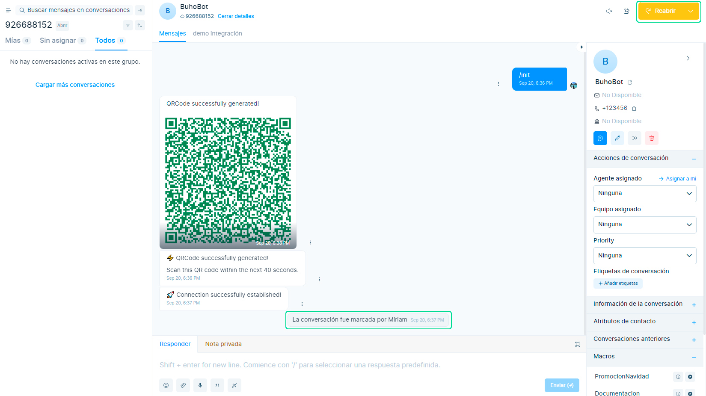
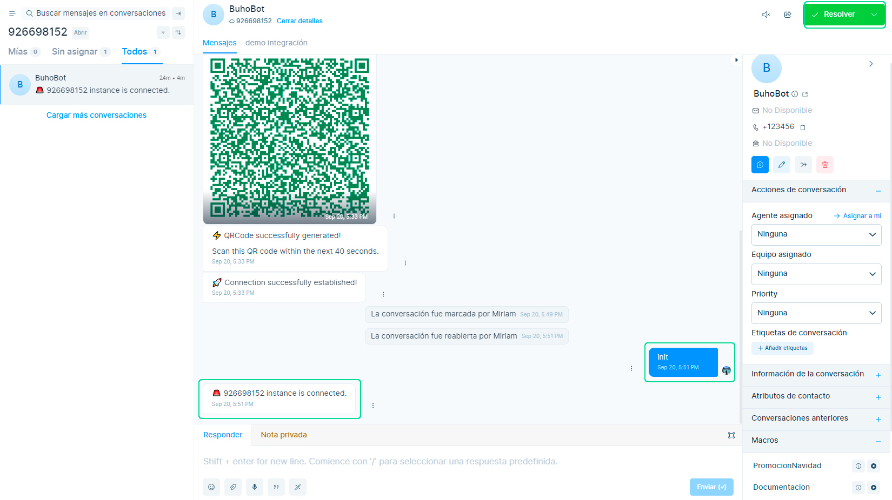

# Reconexión WhatsApp Qr

Si se desconectó la conexión con whatsapp qr, pueden ser por diferentes motivos, pero lo más probable es porque le diste resolver al chat de **BuhoBot** que es el generador de qr y quien mantiene la conexión. En este artículo te indicaremos los pasos para volver a conectarte.

Al momento de crear la bandeja de conexión Qr, se crea el primer chat  de **BuhoBot** donde se generará el código QR y se verá así como en la imagen, el mensaje de **Connection successfully established!**  y el chat abierto con el botón verde.

Así se verá en el celular **"Sesión Activa"**

Si seleccionas el botón de **Resolver** , se colocará de color mostaza y se desconectará la **conexión QR**.

Entonces lo que tienes que realizar primero es seleccionar el botón **Reabrir**, luego colocar el siguiente mensaje **init** y te aparecerá el siguiente mensaje **"instance is connected"**. De esta manera es como nos abremos conectado nuevamente.

