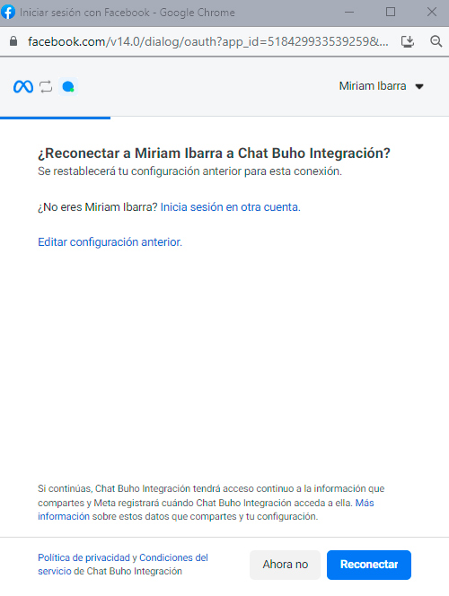

# Reconexión con páginas de Facebook
En este artículo te enseñaremos a reconectar tus páginas de facebook e instagram.

### Módulo Ajustes

Primero ingresamos al módulo **Ajustes** ⚙️ luego a **Entradas**.

Luego ubícate en la **página de facebook** que desees reconectar y selecciona la tuerca ⚙️

Después selecciona la pestaña **Ajustes**, ubícate en la sección **Reautorizar** y seleccione el botón **Continue with Facebook**

Le aparecerá una ventana de reconexión, seleccione el botón **Editar configuración anterior**

Posteriormente le redigirá en la ventana de selección de páginas de facebook. Escoge la opción **Activar todas las páginas actuales y futuras**.

Seguidamente le redigirá en la ventana de selección de cuentas de instagram que estan conectadas con las páginas de facebook. Escoge la opción **Activar todas las cuentas de Instagram actuales y futuras**

Después seleccione el botón **Guardar**.

Finalmente seleccione el botón **De acuerdo**, para culminar con la reconexión.

