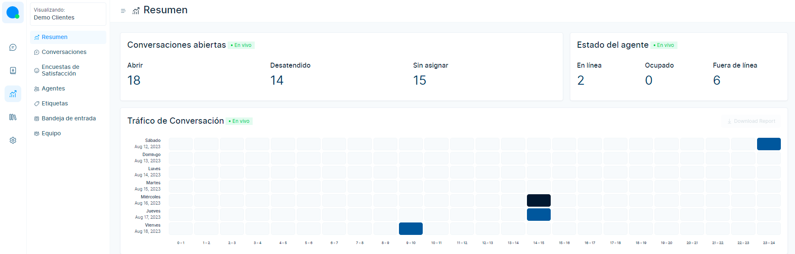

# Conceptos principales

**1. Tiempo de primera respuesta:**
Tiempo necesario para enviar el mensaje de primera respuesta al cliente.

**2. Tiempo de resolución:**
Tiempo necesario para resolver una conversación.  

**3. Conversaciones desatendidas:**
Conversaciones que no tienen un mensaje de primera respuesta.

**4. Conversaciones no asignadas**
Conversaciones que no tienen un agente asignado.