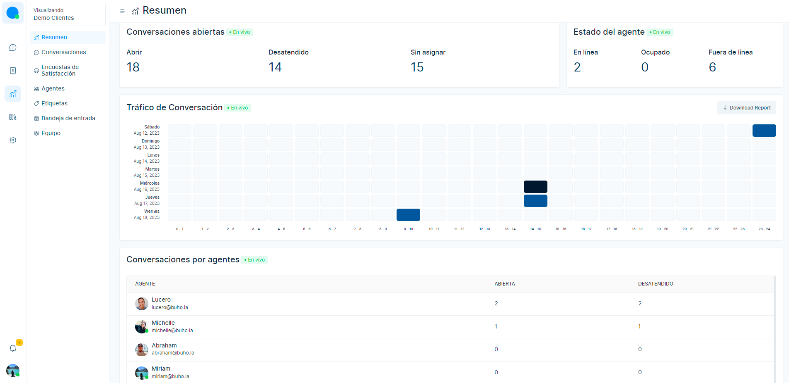

# Resumen
La página de descripción general es una vista en vivo. Se muestra debajo de las métricas en vivo.

**1.** Conversaciones abiertas.

**2.** Estado del agente.

**3.** Conversaciones de agentes.

### Conversaciones abiertas

Las conversaciones abiertas muestran 3 tipos de métricas en el nivel de cuenta.

* **Abierto:** número total de conversaciones abiertas en la cuenta.
* **Desatendida:** número total de conversaciones desatendidas en la cuenta.
* **Sin asignar:** número total de conversaciones sin asignar en la cuenta.

### Estado del agente

Muestra el número de agentes en estado en línea, ocupado y fuera de línea.

### Tráfico de conversación

El mapa de calor del tráfico de conversaciones muestra qué momentos del día son los más ocupados durante los últimos siete días. Cada celda representa el número de conversaciones recibidas como un tono de color; al pasar el cursor sobre una celda, se mostrará la cantidad de conversaciones recibidas para esa hora del día.

### Conversaciones por agente

Esta es una métrica de conversación a nivel de agente. Esta métrica muestra la cantidad de conversaciones abiertas y desatendidas para cada agente en la cuenta.
