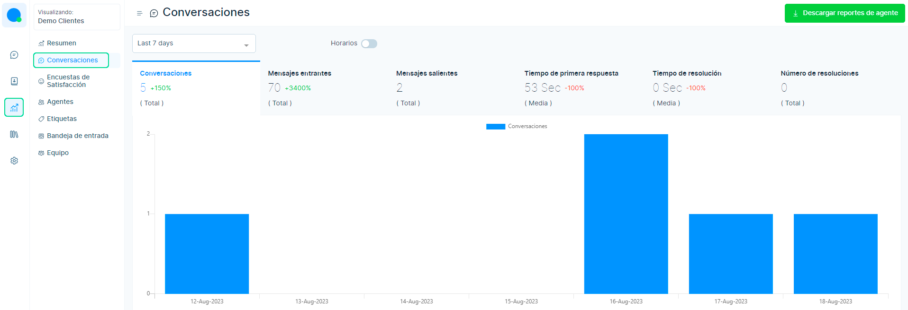
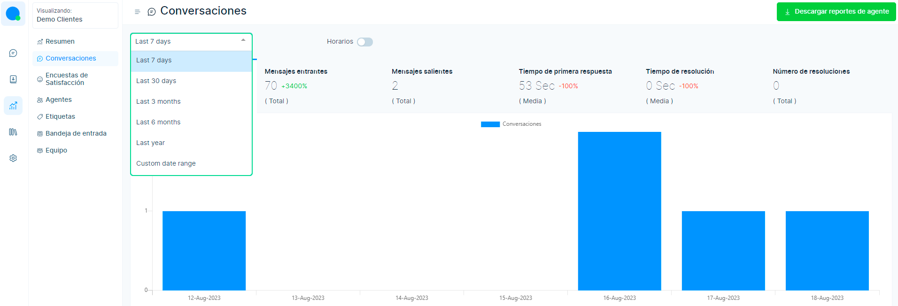
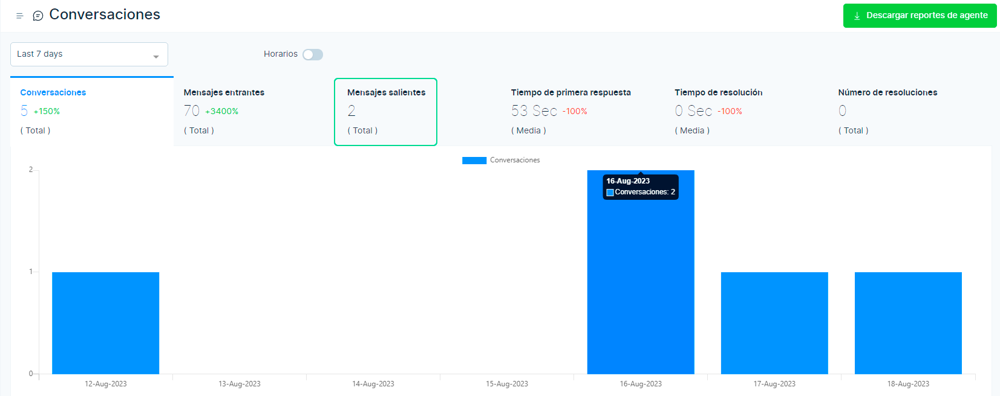
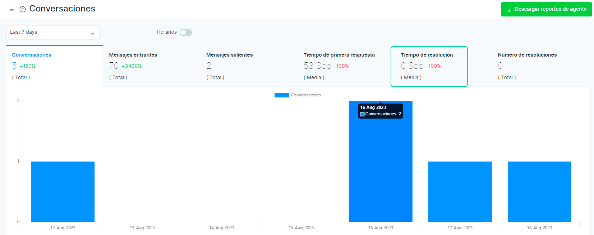
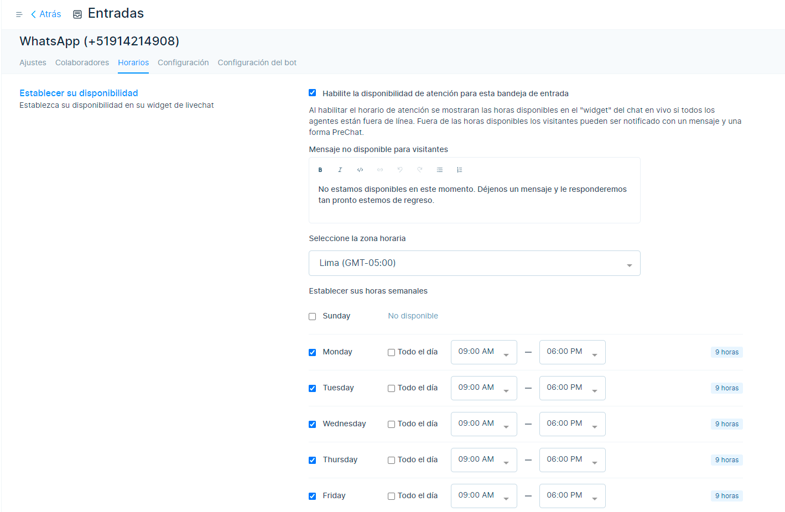
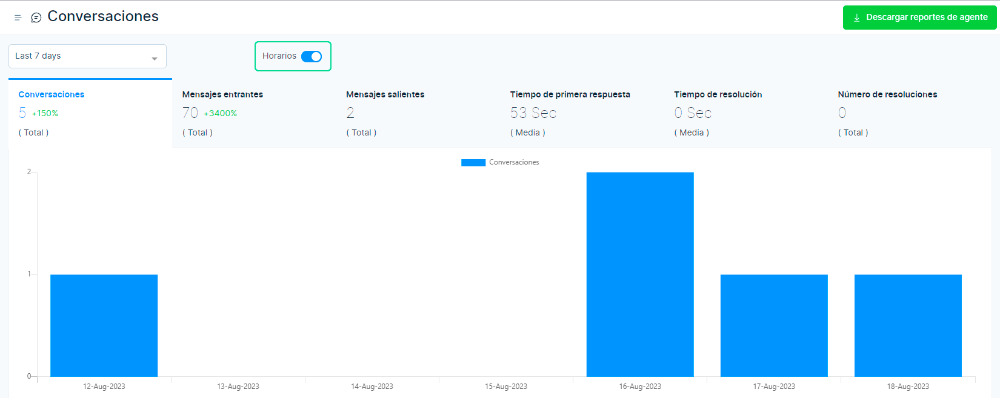

# Conversación

El historial de las conversaciones que se han producido a los largo del tiempo, se pueden visualizar en el módulo de **Reportes**.
Luego selecciona la sección de **conversaciones**.

El informe se puede generar para varios periodos. Esto se puede hacer seleccionando el período de tiempo en la lista desplegable como se muestra a continuación. Por defecto, es para los últimos 7 días.

El informe se puede agrupar utilizando el grupo por filtro. Cada intervalo de fechas tiene un grupo diferente por filtro. El rango de fechas para agrupar por mapeo de filtro se indica a continuación.

|          **Rango de fechas**          |     **Agrupar por**    |
|:---------------------------------:|:------------------:|
| Los últimos 7 días                | Día                |
| últimos 30 días                   | Día, Semana        |
| últimos 3 meses                   | Día, Semana, Mes   |
| últimos 6 meses                   | Día, Semana, Mes   |
| El año pasado                     | Día, Semana, Mes   |
| Intervalo de fechas personalizado | Día semana mes año |

## Gráficos generales
Visualizaremos las métricas divididas en estas secciones.

### Conversaciones

Seleccione la pestaña **Conversaciones en Informes**. El gráfico mostrará la conversación que tuvo lugar en los días seleccionados. Al apuntar con el mouse a un gráfico particular del día, se pueden conocer los detalles de las conversaciones que tuvieron lugar ese día. A continuación se proporciona un ejemplo.

### Mensajes entrantes

Seleccione la pestaña **Mensajes entrantes en Informes**. El gráfico mostrará la cantidad de mensajes entrantes ocurridos en los días seleccionados. Al apuntar el mouse a un gráfico particular del día, se pueden encontrar los detalles de la cantidad de mensajes entrantes ocurridos ese día. 

### Mensajes salientes

Seleccione la pestaña **Mensajes salientes en Informes**. El gráfico mostrará la cantidad de mensajes salientes ocurridos en los días seleccionados. Al apuntar el mouse a un gráfico particular del día, se pueden encontrar los detalles de la cantidad de mensajes salientes ocurridos ese día. 

### Tiempo de primera respuesta

Seleccione la pestaña **Tiempo de primera respuesta en Informes**. El gráfico mostrará el tiempo medio que se tarda en dar la primera respuesta a una conversación con un cliente. Al apuntar el mouse a un gráfico particular del día, se puede averiguar el tiempo promedio que se tomó para la primera respuesta y el número de conversaciones utilizadas para el cálculo de la primera respuesta en ese día en particular. 

### Tiempo de resolución

Seleccione la pestaña **Tiempo de resolución en Informes**. El gráfico mostrará el tiempo promedio que se tarda en resolver una conversación en particular con un cliente. Al apuntar con el mouse a un gráfico particular del día, se puede averiguar el tiempo promedio que se tomó para resolver las conversaciones y el número de conversaciones utilizadas para el cálculo del tiempo de resolución en ese día en particular. 

### Número de resoluciones

Seleccione la pestaña **Número de resoluciones en Informes**. El gráfico mostrará el número de conversaciones resueltas en los días seleccionados. Al apuntar con el ratón a una determinada gráfica del día, se puede conocer el detalle del número de conversaciones resueltas en ese día.

## Descargar informes de agentes

Los detalles del rendimiento de los agentes se pueden obtener seleccionando en el botón **Descargar informes de agentes** que se encuentra en la parte superior derecha de la página. El informe se descargará en formato **csv**.

## Horario comercial

El horario comercial se utiliza para configurar la disponibilidad de cada canal. Si se configura el horario comercial, los datos del informe se calcularán en función del horario comercial.

Vaya a **Configuración de la bandeja de entrada**. Elija la pestaña **Horario** y **actualice la disponibilidad**.

Alterne el horario comercial para ver el informe basado en el **horario comercial**.

