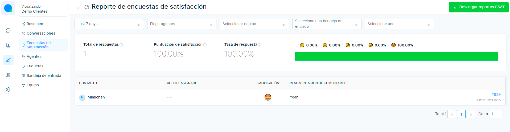
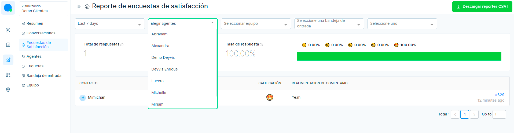

# CSAT

Todas las encuestas de satisfacción del cliente que se han recopilado de los clientes durante el final de la conversación se pueden ver aquí.

Primero ingrese al módulo **Informes**, luego seleccione la sección **Encuestas de satisfacción**.  La pantalla mostrará los detalles de las encuestas de clientes de los últimos 7 días.

El intervalo de fechas predeterminado es los **últimos 7 días**.

CSAT se puede filtrar usando el **nombre del agente**. Se pueden seleccionar múltiples agentes del menú desplegable.

